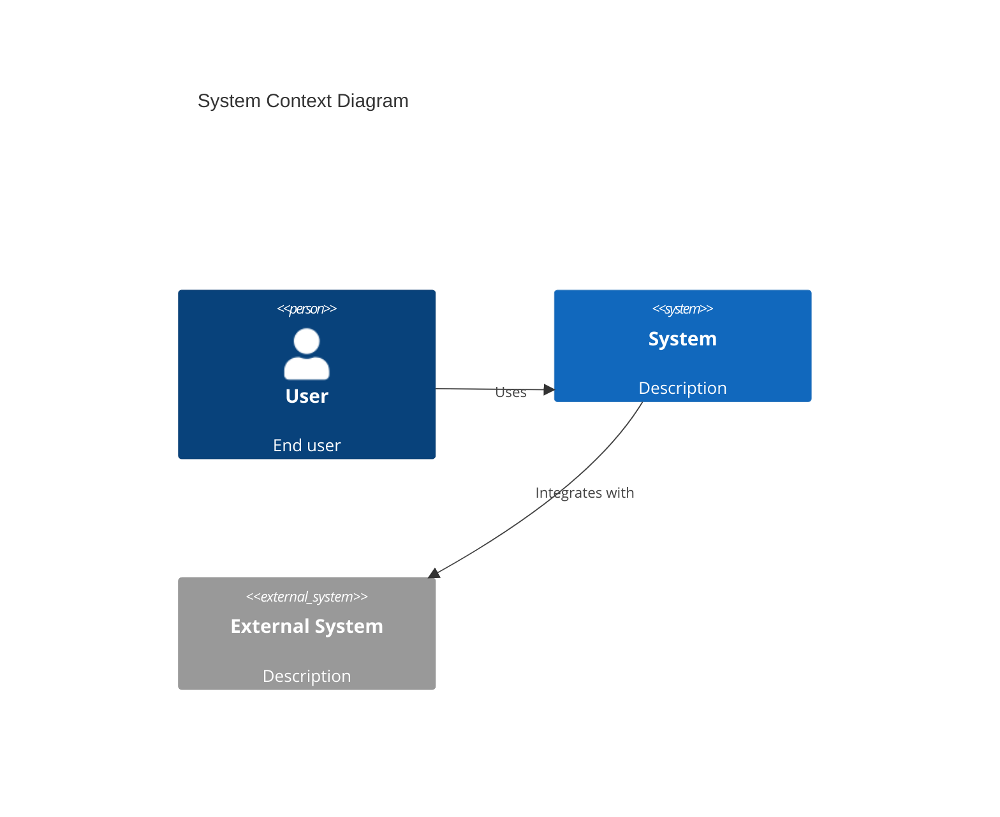
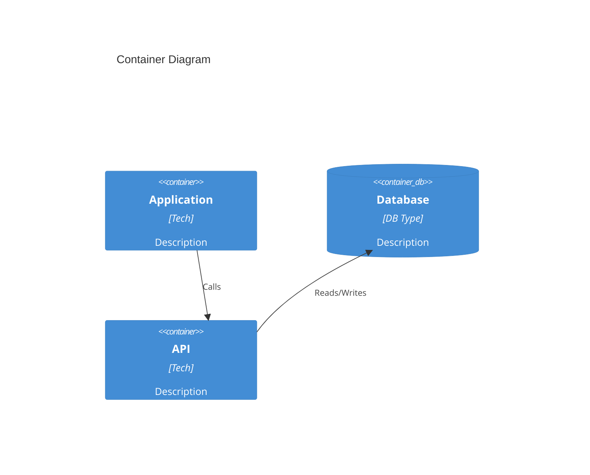
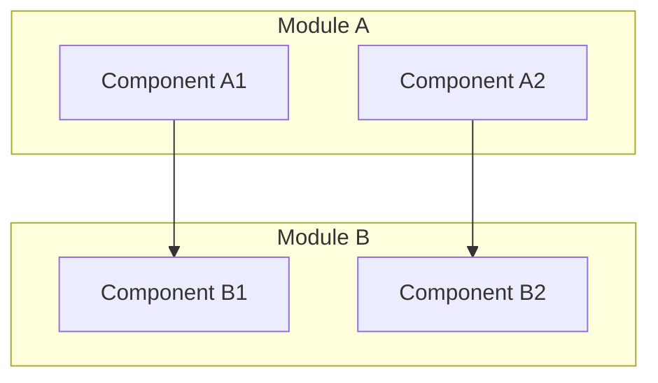

# Project Documentation Workflow

Complete end-to-end workflow orchestrating project analysis, requirements extraction, and comprehensive documentation generation.

## What This Power Does

This power combines three specialized workflows into a single, cohesive process:

1. **Project Analysis** - Understand codebase structure, tech stack, and architecture
2. **Requirements Extraction** - Reverse-engineer requirements using EARS format
3. **Documentation Generation** - Create comprehensive technical docs with C4 model diagrams

## When to Use This Power

Activate this power when you need to:
- 📚 Document an existing project without documentation
- 🔄 Reverse-engineer requirements from legacy code
- 🎯 Prepare comprehensive handover documentation
- 🏗️ Plan major refactoring or migration
- 🔍 Conduct technical due diligence
- 👥 Onboard new team members to complex projects

## Quick Start

### Option 1: Full Workflow (Recommended)
```
Execute the complete project documentation workflow for [project-name]
```

### Option 2: Step-by-Step
```
Phase 1: Analyze the [project-name] project
Phase 2: Extract requirements from [project-name]
Phase 3: Generate documentation for [project-name]
Phase 4: Organize documentation for [project-name]
```

### Option 3: Individual Phases
```
Run Phase 1 only: project analysis
Run Phase 2 only: requirements extraction
Run Phase 3 only: documentation generation
Run Phase 4 only: documentation organization
```

---

## Workflow Overview

```
┌─────────────────────────────────────────────────────────────┐
│                    PHASE 1: PROJECT ANALYSIS                 │
│  Goal: Understand what exists (codebase, architecture)      │
│  Time: 15-30 minutes                                        │
│  Output: Project analysis reports                           │
└─────────────────────────────────────────────────────────────┘
                            ↓
┌─────────────────────────────────────────────────────────────┐
│                 PHASE 2: REQUIREMENTS EXTRACTION             │
│  Goal: Document what the system does (requirements)         │
│  Time: 30-60 minutes                                        │
│  Output: SRS, functional/non-functional requirements        │
└─────────────────────────────────────────────────────────────┘
                            ↓
┌─────────────────────────────────────────────────────────────┐
│                 PHASE 3: DOCUMENTATION GENERATION            │
│  Goal: Create comprehensive technical documentation         │
│  Time: 45-90 minutes                                        │
│  Output: Architecture docs with C4 diagrams                 │
└─────────────────────────────────────────────────────────────┘
                            ↓
┌─────────────────────────────────────────────────────────────┐
│                 PHASE 4: DOCUMENTATION ORGANIZATION          │
│  Goal: Organize all documents in standard structure         │
│  Time: 10-15 minutes                                        │
│  Output: Complete documentation repository                  │
└─────────────────────────────────────────────────────────────┘
```

**Total Time**: 2-4 hours for medium-sized projects

---

## Phase 1: Project Analysis

**Objective**: Understand the existing codebase, technology stack, and architecture patterns.

### What Gets Analyzed

- ✅ Project structure and organization
- ✅ Technology stack (languages, frameworks, tools)
- ✅ Architecture patterns (DDD, MVC, microservices, etc.)
- ✅ Key components and their relationships
- ✅ Entry points and main workflows
- ✅ Development and deployment setup

### Deliverables

```
./docs/analysis/
├── project-overview.md       # High-level project summary
├── tech-stack.md            # Complete technology inventory
└── architecture-summary.md  # Architecture patterns and decisions
```

### Key Activities

1. **Quick Overview**
   - Read README and root files
   - Identify project type and purpose

2. **Tech Stack Detection**
   - Identify package managers (package.json, go.mod, Cargo.toml, etc.)
   - List frameworks and libraries
   - Check infrastructure files (Docker, Kubernetes, Terraform)

3. **Architecture Mapping**
   - Map directory structure with annotations
   - Identify architectural patterns
   - Document key components
   - Find entry points

4. **Generate Analysis Report**
   - Consolidate findings
   - Create structured documentation
   - Validate completeness

### Validation Checklist

- [ ] README.md analyzed
- [ ] Tech stack identified and documented
- [ ] Architecture patterns recognized
- [ ] Key components mapped
- [ ] Entry points documented
- [ ] Development workflow understood

---

## Phase 2: Requirements Extraction

**Objective**: Reverse-engineer requirements from the existing codebase using EARS format.

### What Gets Extracted

- ✅ Functional requirements (what the system does)
- ✅ Non-functional requirements (performance, security, scalability)
- ✅ User stories (user-centric feature descriptions)
- ✅ Acceptance criteria (testable conditions)
- ✅ Traceability matrix (requirements to code mapping)

### Deliverables

```
./docs/requirements/
├── srs/
│   └── srs-[project]-v1.0.md              # Software Requirements Specification
├── functional/
│   └── functional-requirements-[date].md   # Functional requirements (EARS)
├── non-functional/
│   └── non-functional-requirements-[date].md  # Non-functional requirements
├── user-stories/
│   └── user-stories-[date].md             # User stories with acceptance criteria
└── traceability-matrix-[date].md          # Requirements traceability
```

### EARS Format

All requirements use **EARS (Easy Approach to Requirements Syntax)**:

**Pattern 1 - Ubiquitous**: `The [system] SHALL [action]`
```
REQ-001: The system SHALL encrypt all passwords using bcrypt.
```

**Pattern 2 - Event-Driven**: `WHEN [event], the [system] SHALL [action]`
```
REQ-010: WHEN user submits login form, the system SHALL validate credentials within 2 seconds.
```

**Pattern 3 - State-Driven**: `WHILE [state], the [system] SHALL [action]`
```
REQ-020: WHILE user is authenticated, the system SHALL display user dashboard.
```

**Pattern 4 - Optional**: `WHERE [feature enabled], the [system] SHALL [action]`
```
REQ-030: WHERE two-factor authentication is enabled, the system SHALL require OTP.
```

**Pattern 5 - Error Handling**: `IF [error], THEN the [system] SHALL [response]`
```
REQ-040: IF login fails 5 times, THEN the system SHALL lock account for 30 minutes.
```

### Key Activities

1. **Identify Core Features**
   - List main features from code analysis
   - Map API endpoints to features
   - Document database models

2. **Extract Functional Requirements**
   - Define what each feature does
   - Write acceptance criteria in EARS format
   - Assign requirement IDs (REQ-XXX)

3. **Extract Non-Functional Requirements**
   - Document performance characteristics
   - Identify security measures
   - Note scalability patterns

4. **Create User Stories**
   - Format: As a [user], I want [action], So that [goal]
   - Add EARS acceptance criteria
   - Link to functional requirements

5. **Build Traceability Matrix**
   - Map requirements to code components
   - Link user stories to requirements
   - Document dependencies

### Validation Checklist

- [ ] All features identified
- [ ] Functional requirements in EARS format
- [ ] Non-functional requirements documented
- [ ] User stories created
- [ ] Traceability matrix complete
- [ ] Requirements validated for completeness

---

## Phase 3: Documentation Generation

**Objective**: Create comprehensive technical documentation with C4 model architecture diagrams.

### What Gets Generated

- ✅ Project overview document
- ✅ Architecture documentation with C4 diagrams (3 levels)
- ✅ Workflow documentation with sequence diagrams
- ✅ Component deep-dive documents
- ✅ All diagrams in Mermaid format

### Deliverables

```
./docs/
├── 1. Project Overview.md           # What, why, and how to get started
├── 2. Architecture Overview.md      # C4 diagrams and architecture patterns
├── 3. Workflow Overview.md          # Core workflows and data flows
└── 4. Deep Dive/                    # Component-specific documentation
    ├── [Component-1].md
    ├── [Component-2].md
    └── [Component-N].md
```

### C4 Model Diagrams

**Level 1 - System Context**


**Level 2 - Container Architecture**


**Level 3 - Component Architecture**


### Key Activities

1. **Project Overview Document**
   - What is the project?
   - Core purpose and features
   - Technology stack
   - Getting started guide

2. **Architecture Overview Document**
   - System Context (C4 Level 1)
   - Container Architecture (C4 Level 2)
   - Component Architecture (C4 Level 3)
   - Architectural patterns
   - Key design decisions

3. **Workflow Overview Document**
   - Core workflows with sequence diagrams
   - Data flow diagrams
   - State management
   - Error handling

4. **Component Deep-Dive Documents**
   - Overview and responsibilities
   - Architecture with class diagrams
   - Key files and implementation
   - Dependencies and API
   - Testing approach

### Validation Checklist

- [ ] Project overview document created
- [ ] C4 Level 1 diagram (System Context)
- [ ] C4 Level 2 diagram (Containers)
- [ ] C4 Level 3 diagram (Components)
- [ ] Workflow sequence diagrams
- [ ] Component deep-dive documents
- [ ] All Mermaid diagrams validated

---

## Phase 4: Documentation Organization

**Objective**: Organize all generated documents into a standardized, maintainable structure.

### What Gets Organized

- ✅ Standard directory structure
- ✅ Documentation index with navigation
- ✅ Updated project README
- ✅ Maintenance guide
- ✅ Cross-document links validated

### Final Directory Structure

```
project-root/
├── docs/
│   ├── README.md                          # Documentation index
│   ├── MAINTENANCE.md                     # Maintenance guide
│   │
│   ├── 1. Project Overview.md             # Phase 3 output
│   ├── 2. Architecture Overview.md        # Phase 3 output
│   ├── 3. Workflow Overview.md            # Phase 3 output
│   │
│   ├── 4. Deep Dive/                      # Phase 3 output
│   │   ├── Backend-Services.md
│   │   ├── Frontend-Components.md
│   │   ├── Database-Layer.md
│   │   └── API-Layer.md
│   │
│   ├── requirements/                      # Phase 2 output
│   │   ├── srs/
│   │   │   └── srs-project-v1.0.md
│   │   ├── functional/
│   │   │   └── functional-requirements-[date].md
│   │   ├── non-functional/
│   │   │   └── non-functional-requirements-[date].md
│   │   ├── user-stories/
│   │   │   └── user-stories-[date].md
│   │   └── traceability-matrix-[date].md
│   │
│   └── analysis/                          # Phase 1 output
│       ├── project-overview.md
│       ├── tech-stack.md
│       └── architecture-summary.md
│
└── README.md                              # Updated with doc links
```

### Key Activities

1. **Create Standard Directory Structure**
   - Organize all documents
   - Ensure consistent naming

2. **Create Documentation Index**
   - Overview of all documentation
   - Quick navigation links
   - Document update history

3. **Update Project README**
   - Link to documentation
   - Quick start guide
   - Architecture summary

4. **Create Maintenance Guide**
   - How to update documentation
   - Documentation standards
   - Review process

### Validation Checklist

- [ ] Standard directory structure created
- [ ] All documents organized
- [ ] Documentation index created
- [ ] Project README updated
- [ ] Maintenance guide created
- [ ] All links verified

---

## Best Practices

### During Execution

1. **Work Incrementally**: Complete each phase before moving to the next
2. **Validate Outputs**: Review each phase's deliverables
3. **Maintain Consistency**: Use consistent terminology across all documents
4. **Cross-Reference**: Link related documents together
5. **Version Control**: Commit after each phase completion

### Documentation Standards

1. **Use Markdown**: All documents in Markdown format
2. **EARS Format**: All requirements in EARS format
3. **Mermaid Diagrams**: All diagrams in Mermaid syntax
4. **Clear Headings**: Use hierarchical heading structure (# ## ###)
5. **Code Examples**: Include code blocks with language tags

### Quality Assurance

1. **Completeness**: All sections filled out
2. **Accuracy**: Information matches codebase
3. **Clarity**: Easy to understand for new team members
4. **Consistency**: Terminology used consistently
5. **Maintainability**: Easy to update when code changes

---

## Troubleshooting

### Issue: Phase 1 - Cannot identify tech stack
**Solution**: 
- Check for hidden config files (.env, .config/)
- Look in subdirectories
- Search for import/require statements in code

### Issue: Phase 2 - Unclear requirements
**Solution**:
- Review code comments and docstrings
- Check test files for expected behavior
- Examine API documentation if available
- Interview developers if possible

### Issue: Phase 3 - Diagrams too complex
**Solution**:
- Break into multiple diagrams
- Focus on one subsystem at a time
- Use abstraction layers
- Limit to 10-12 nodes per diagram

### Issue: Phase 4 - Too many documents
**Solution**:
- Consolidate related documents
- Create summary documents
- Use clear navigation structure
- Consider a documentation website

---

## Example Usage

### Full Workflow Example

```
User: "Execute the complete project documentation workflow for huobao-drama"

Agent Response:
"Starting complete documentation workflow for huobao-drama...

✅ Phase 1: Project Analysis (20 minutes)
   - Analyzed README.md and project structure
   - Identified tech stack: Go 1.23 + Vue 3.4 + TypeScript
   - Mapped DDD architecture with 4 layers
   - Generated 3 analysis reports in ./docs/analysis/

✅ Phase 2: Requirements Extraction (45 minutes)
   - Extracted 15 functional requirements (EARS format)
   - Documented 8 non-functional requirements
   - Created 23 user stories with acceptance criteria
   - Built traceability matrix
   - Generated 5 requirements documents in ./docs/requirements/

✅ Phase 3: Documentation Generation (60 minutes)
   - Created Project Overview document
   - Generated 3 C4 model diagrams (System, Container, Component)
   - Created 5 workflow sequence diagrams
   - Generated 5 component deep-dive documents
   - All documentation saved in ./docs/

✅ Phase 4: Documentation Organization (15 minutes)
   - Created standard directory structure
   - Generated documentation index (README.md)
   - Updated project README with doc links
   - Created MAINTENANCE.md guide
   - Validated all cross-document links

🎉 Complete documentation workflow finished!
📁 All documents available in ./docs/
📊 Total: 28 documents, 15 diagrams, ~12,000 lines
⏱️  Time: 2 hours 20 minutes
"
```

### Step-by-Step Example

```
User: "Phase 1: Analyze the huobao-drama project"

Agent Response:
"Starting Phase 1: Project Analysis for huobao-drama...

Step 1: Quick Overview
✓ Read README.md - AI-powered short drama production platform
✓ Identified project type: Full-stack web application
✓ Purpose: Automate video production workflow

Step 2: Tech Stack Detection
✓ Backend: Go 1.23 with Gin framework
✓ Frontend: Vue 3.4 + TypeScript + Vite
✓ Database: SQLite with GORM
✓ Infrastructure: Docker, Docker Compose
✓ Video Processing: FFmpeg

Step 3: Architecture Mapping
✓ Architecture Pattern: Domain-Driven Design (DDD)
✓ Layers: API → Application → Domain → Infrastructure
✓ Key Components: 20+ handlers, 20+ services, 10+ models
✓ Entry Points: main.go (backend), main.ts (frontend)

Step 4: Generate Analysis Report
✓ Created ./docs/analysis/project-overview.md
✓ Created ./docs/analysis/tech-stack.md
✓ Created ./docs/analysis/architecture-summary.md

✅ Phase 1 Complete! Ready for Phase 2.
"
```

---

## Tips for Success

### Before Starting

1. **Ensure Clean Working Directory**: Commit or stash changes
2. **Have Project Running**: Helps understand functionality
3. **Access to Documentation**: README, wikis, etc.
4. **Time Allocation**: Block 2-4 hours for full workflow

### During Execution

1. **Review Each Phase**: Don't rush through phases
2. **Ask Questions**: Clarify unclear aspects
3. **Take Notes**: Document assumptions and decisions
4. **Validate Diagrams**: Ensure Mermaid syntax is correct

### After Completion

1. **Review with Team**: Get feedback on documentation
2. **Update Regularly**: Keep docs in sync with code
3. **Share Widely**: Make documentation accessible
4. **Iterate**: Improve based on usage and feedback

---

## Integration with Development Workflow

### CI/CD Integration

```yaml
# .github/workflows/docs.yml
name: Documentation Check

on: [pull_request]

jobs:
  docs-check:
    runs-on: ubuntu-latest
    steps:
      - uses: actions/checkout@v2
      - name: Check documentation is up to date
        run: |
          # Check if docs/ directory exists
          # Validate Mermaid diagrams
          # Check for broken links
```

### Pre-commit Hook

```bash
#!/bin/bash
# .git/hooks/pre-commit

# Check if code changes require documentation updates
if git diff --cached --name-only | grep -q "^src/"; then
  echo "Code changes detected. Consider updating documentation."
  echo "Run: 'Update documentation for recent changes'"
fi
```

---

## Summary

This power provides a **complete, systematic approach** to documenting any project:

1. **Understand** existing codebases (Project Analysis)
2. **Document** what they do (Requirements Extraction with EARS)
3. **Explain** how they work (Technical Documentation with C4)
4. **Organize** everything properly (Documentation Organization)

**Key Benefits**:
- ✅ Comprehensive documentation from existing code
- ✅ Standardized format across all documents
- ✅ EARS-compliant requirements (testable, unambiguous)
- ✅ C4 model architecture diagrams (industry standard)
- ✅ Organized, maintainable documentation repository
- ✅ Repeatable process for any project

**Perfect For**:
- Legacy systems without documentation
- Onboarding new team members
- Technical due diligence
- Refactoring planning
- Knowledge transfer
- Compliance requirements

---

**To activate this power, simply mention relevant keywords like:**
- "document this project"
- "analyze and document"
- "create project documentation"
- "reverse engineer requirements"
- "generate C4 diagrams"

Or explicitly:
```
Execute the project documentation workflow for [project-name]
```
