# Phase 3: Documentation Generation

Detailed workflow for generating comprehensive technical documentation with C4 diagrams.

## Workflow Steps

### Step 1: Project Overview Document (15 minutes)

**Content Structure:**

```markdown
# Project Overview

## What is [Project Name]?
[2-3 sentence description]

## Core Purpose
[Main goals and objectives]

## Technology Stack
[Table from Phase 1 analysis]

## Key Features
[List from Phase 2 requirements]

## Project Structure
[Annotated directory tree from Phase 1]

## Getting Started
[Quick start instructions]

## Architecture Summary
[High-level overview, detailed in next doc]
```

**Output:** `./docs/1. Project Overview.md`

### Step 2: Architecture Overview Document (30 minutes)

**Content Structure:**

```markdown
# Architecture Overview

## System Context (C4 Level 1)
[Description of system boundaries]

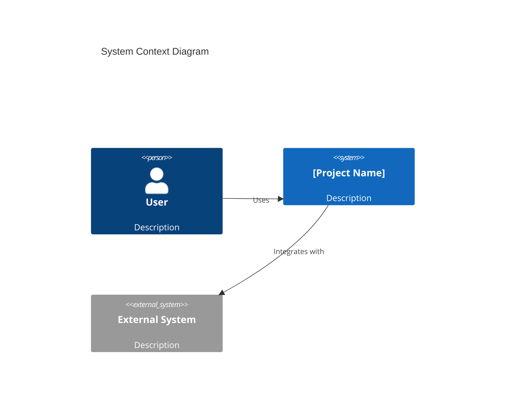

## Container Architecture (C4 Level 2)
[Description of major containers/services]

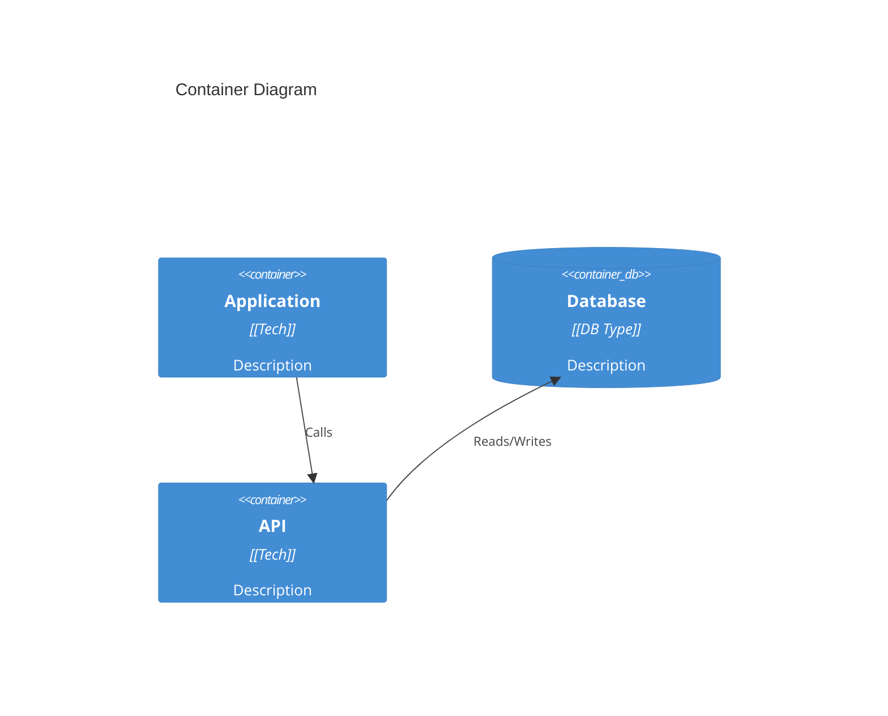

## Component Architecture (C4 Level 3)
[Breakdown of major modules]

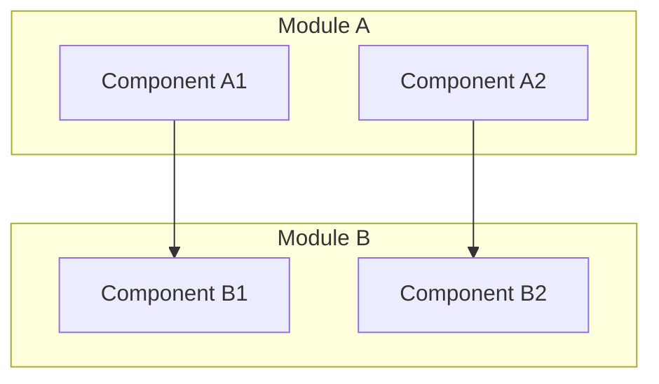

## Architectural Patterns
[DDD, MVC, etc. from Phase 1]

## Key Design Decisions
[Important architectural choices]

## Module Breakdown
[Detailed module descriptions]
```

**Diagram Best Practices:**
- Keep diagrams focused (max 10-12 nodes)
- Use clear, descriptive labels
- Test Mermaid syntax before including
- Provide context before each diagram

**Output:** `./docs/2. Architecture Overview.md`

### Step 3: Workflow Overview Document (25 minutes)

**Content Structure:**

```markdown
# Workflow Overview

## Core Workflows

### Workflow 1: [Name]
[Description]

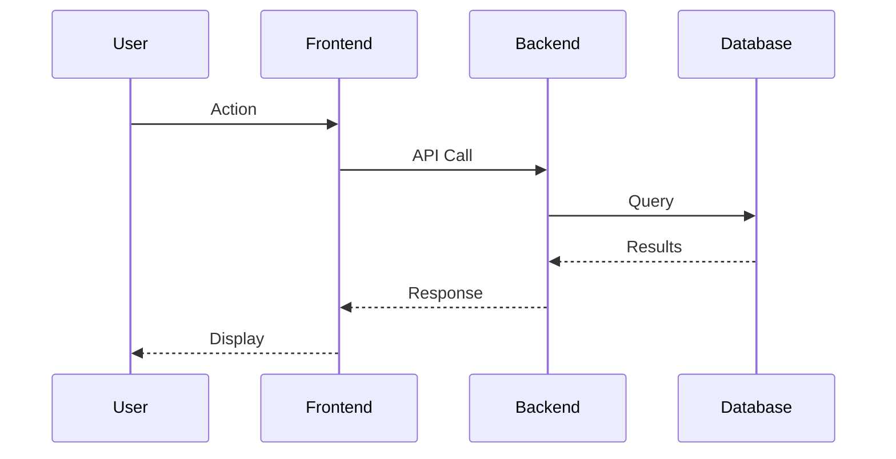

**Steps:**
1. [Step description]
2. [Step description]

### Workflow 2: [Name]
[Similar structure]

## Data Flow

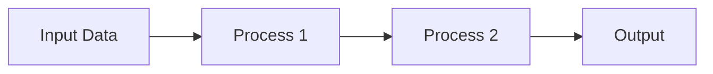

## State Management
[How state is managed]

## Error Handling
[Error handling approach]
```

**Output:** `./docs/3. Workflow Overview.md`

### Step 4: Component Deep-Dive Documents (30 minutes)

**For Each Major Component:**

```markdown
# Deep Dive: [Component Name]

## Overview
[Detailed description]

## Responsibilities
- [Responsibility 1]
- [Responsibility 2]

## Architecture

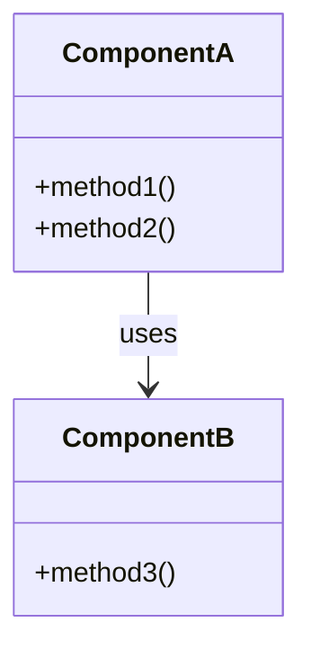

## Key Files
- **`file1.ext`**: [Description]
- **`file2.ext`**: [Description]

## Implementation Details

### Feature 1
[Code explanation with examples]

### Feature 2
[Code explanation with examples]

## Dependencies
- Internal: [List]
- External: [List]

## API/Interface
[Public API documentation]

## Testing
[Testing approach]

## Potential Improvements
- [Improvement 1]
- [Improvement 2]
```

**Output:** `./docs/4. Deep Dive/[Component].md` (multiple files)

### Step 5: Quality Assurance (10 minutes)

**Validation Checklist:**

- [ ] All markdown files created
- [ ] Mermaid syntax validated
- [ ] Cross-references work
- [ ] File structure logical
- [ ] No placeholder text
- [ ] Code examples accurate
- [ ] Diagrams render correctly
- [ ] Consistent formatting

**Mermaid Validation:**
```bash
# Test each diagram:
1. Copy Mermaid code
2. Paste into Mermaid Live Editor (mermaid.live)
3. Verify it renders correctly
4. Fix any syntax errors
```

## Mermaid Diagram Types

### C4 Context Diagram
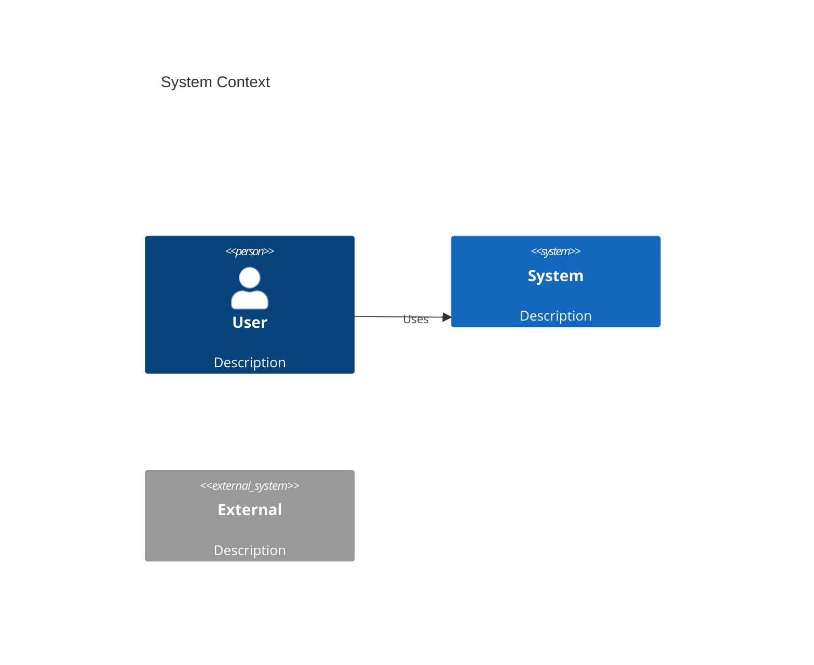

### C4 Container Diagram


### Sequence Diagram
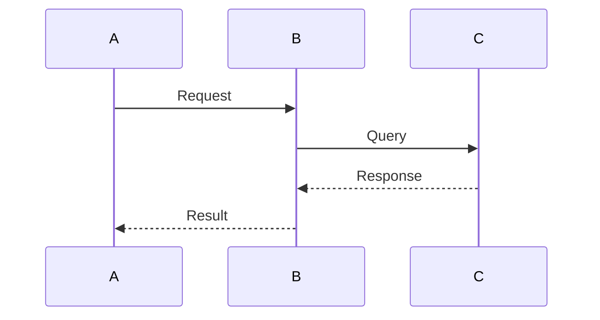

### Flowchart
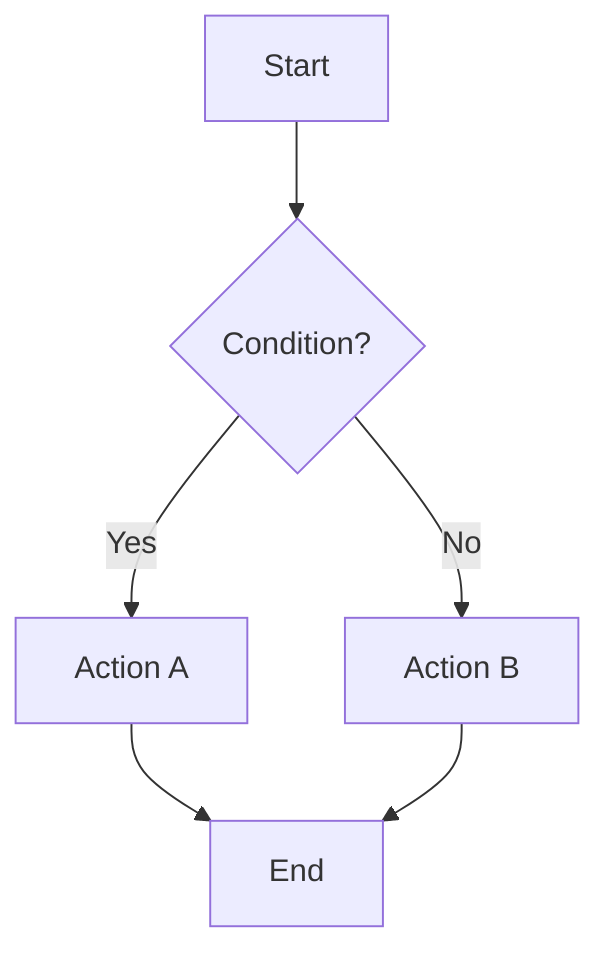

### Class Diagram
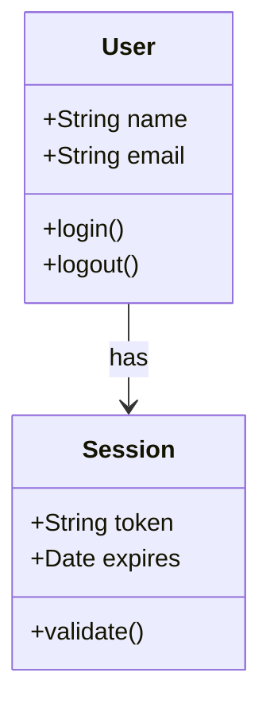

### ER Diagram
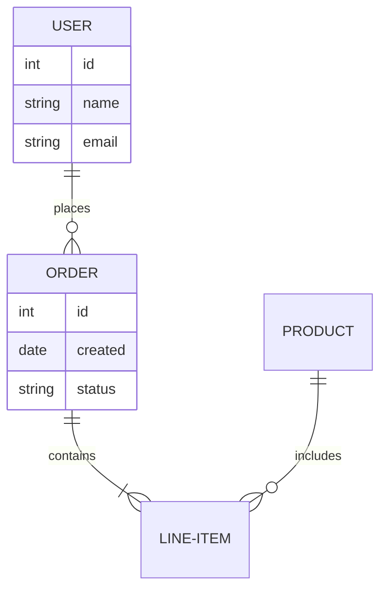

### State Diagram
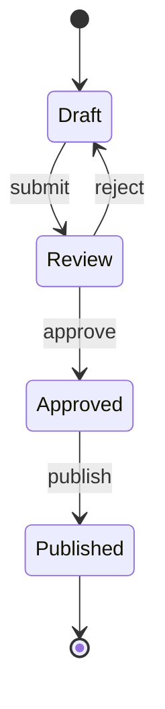

## Validation Checklist

Before proceeding to Phase 4:

- [ ] Project overview document created
- [ ] C4 Level 1 diagram (System Context)
- [ ] C4 Level 2 diagram (Containers)
- [ ] C4 Level 3 diagram (Components)
- [ ] Workflow sequence diagrams
- [ ] Component deep-dive documents (3-5 minimum)
- [ ] All Mermaid diagrams validated
- [ ] Cross-references between documents work

## Common Issues

**Issue**: Diagrams too complex
**Solution**: Break into multiple diagrams, focus on one aspect at a time

**Issue**: Mermaid syntax errors
**Solution**: Use Mermaid Live Editor to validate, check for typos

**Issue**: Unclear component boundaries
**Solution**: Review Phase 1 architecture analysis, group by responsibility

**Issue**: Too much detail
**Solution**: Focus on high-level overview, details in deep-dive docs
