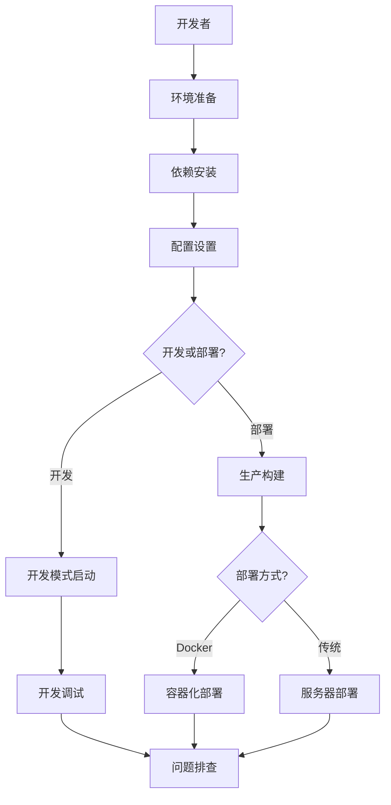

# 设计文档 - 项目构建指南

## 概述

本设计文档定义了 Huobao Drama AI 短剧生成平台的完整构建指南实现方案。该指南是一个结构化的 Markdown 文档，为开发者和运维人员提供从环境准备到生产部署的完整流程。

### 设计目标

1. **清晰性**: 提供步骤明确、易于理解的指导
2. **完整性**: 覆盖开发、构建、部署的全生命周期
3. **实用性**: 包含可直接执行的命令和配置示例
4. **可维护性**: 结构化组织，便于更新和扩展

### 技术栈概览

- **后端**: Go 1.23+, Gin 框架, GORM, SQLite
- **前端**: Vue3, TypeScript, Vite
- **视频处理**: FFmpeg
- **部署**: Docker, 传统服务器部署
- **文档格式**: Markdown

### 生成文件和存放位置

**重要说明**: 
- 所有生成的指导文件和配置文件都存放在 `Analysis-huobao-drama/build-guides/` 目录下
- 不会修改 `huobao-drama/` 原项目目录的结构或新增文件
- 用户在实际使用时，可以根据指南中的说明，将配置文件复制到项目目录
- **文档采用模块化结构**，将大型 BUILD.md 拆分为多个专题文档，便于维护和阅读

本项目将生成以下文件：

#### 主要文档文件

1. **README.md** - 主导航页面
   - 位置: `Analysis-huobao-drama/build-guides/README.md`
   - 内容: 文档导航、快速链接、使用建议
   - 语言: 中文
   - 特点: 作为文档入口，提供清晰的导航结构

2. **模块化文档** - 按主题拆分的文档
   - 位置: `Analysis-huobao-drama/build-guides/docs/`
   - 结构: 按使用流程组织（快速开始 → 开发 → 部署 → 参考）
   - 特点: 每个文档专注单一主题，易于维护和更新

#### 配置文件示例

2. **config.example.yaml** - 配置文件模板
   - 位置: `Analysis-huobao-drama/build-guides/config/config.example.yaml`
   - 内容: 包含所有配置项的示例配置文件
   - 用途: 用户复制此文件到 `huobao-drama/` 目录并重命名为 `config.yaml`

#### Docker 相关文件

3. **Dockerfile** - Docker 镜像构建文件
   - 位置: `Analysis-huobao-drama/build-guides/docker/Dockerfile`
   - 内容: 多阶段构建配置，包含后端和前端
   - 用途: 用户复制到 `huobao-drama/` 目录用于构建 Docker 镜像

4. **docker-compose.yml** - Docker Compose 编排文件
   - 位置: `Analysis-huobao-drama/build-guides/docker/docker-compose.yml`
   - 内容: 服务编排、卷挂载、网络配置
   - 用途: 用户复制到 `huobao-drama/` 目录用于 Docker 部署

5. **.dockerignore** - Docker 构建忽略文件
   - 位置: `Analysis-huobao-drama/build-guides/docker/.dockerignore`
   - 内容: 构建时需要忽略的文件和目录
   - 用途: 用户复制到 `huobao-drama/` 目录以减小构建上下文

#### 部署配置文件

6. **huobao.service** - systemd 服务配置
   - 位置: `Analysis-huobao-drama/build-guides/deploy/huobao.service`
   - 内容: Linux 系统服务配置
   - 用途: 传统服务器部署时复制到 `/etc/systemd/system/`

7. **nginx.conf** - Nginx 反向代理配置示例
   - 位置: `Analysis-huobao-drama/build-guides/deploy/nginx.conf`
   - 内容: Nginx 配置示例
   - 用途: 生产环境反向代理配置参考

#### 辅助脚本

8. **scripts/setup.sh** - 环境设置脚本
   - 位置: `Analysis-huobao-drama/build-guides/scripts/setup.sh`
   - 内容: 自动化环境检查和依赖安装
   - 用途: 在项目目录中执行，简化初始环境配置

9. **scripts/build.sh** - 构建脚本
   - 位置: `Analysis-huobao-drama/build-guides/scripts/build.sh`
   - 内容: 自动化构建后端和前端
   - 用途: 在项目目录中执行，简化生产构建流程

10. **scripts/deploy.sh** - 部署脚本
    - 位置: `Analysis-huobao-drama/build-guides/scripts/deploy.sh`
    - 内容: 自动化部署流程
    - 用途: 在服务器上执行，简化部署过程

#### 过程记录文件

11. **PROCESS.md** - 构建过程记录
    - 位置: `Analysis-huobao-drama/build-guides/PROCESS.md`
    - 内容: 记录实际构建过程中的步骤、遇到的问题和解决方案
    - 用途: 作为实际操作的参考和问题排查依据

12. **REFACTORING_SUMMARY.md** - 文档重构总结
    - 位置: `Analysis-huobao-drama/build-guides/REFACTORING_SUMMARY.md`
    - 内容: 记录文档重构过程、新旧结构对比、待完成工作
    - 用途: 追踪重构进度和指导后续工作

### 文件组织结构

```
Analysis-huobao-drama/
└── build-guides/                           # 构建指南目录
    ├── README.md                           # 主导航页面
    ├── BUILD.md                            # 原完整文档（保留作为参考）
    ├── PROCESS.md                          # 构建过程记录
    ├── REFACTORING_SUMMARY.md              # 重构总结
    │
    ├── docs/                               # 模块化文档目录
    │   ├── 01-getting-started/            # 快速开始
    │   │   ├── environment-setup.md       # 环境准备
    │   │   ├── dependencies.md            # 依赖安装
    │   │   └── troubleshooting.md         # 常见问题
    │   │
    │   ├── 02-development/                # 开发指南
    │   │   ├── configuration.md           # 配置详解
    │   │   ├── dev-mode.md               # 开发模式
    │   │   └── database.md               # 数据库管理
    │   │
    │   ├── 03-deployment/                 # 部署指南
    │   │   ├── production-build.md        # 生产构建
    │   │   ├── docker.md                 # Docker 部署
    │   │   └── traditional.md            # 传统部署
    │   │
    │   └── 04-reference/                  # 参考资料
    │       ├── troubleshooting.md         # 问题排查
    │       └── optimization.md            # 性能优化
    │
    ├── config/                             # 配置文件目录
    │   └── config.example.yaml            # 配置文件模板
    │
    ├── docker/                             # Docker 相关文件
    │   ├── Dockerfile                     # Docker 镜像构建
    │   ├── docker-compose.yml             # Docker Compose 编排
    │   └── .dockerignore                  # Docker 构建忽略
    │
    ├── deploy/                             # 部署配置目录
    │   ├── huobao.service                 # systemd 服务配置
    │   └── nginx.conf                     # Nginx 配置示例
    │
    └── scripts/                            # 辅助脚本目录
        ├── setup.sh                       # 环境设置脚本
        ├── build.sh                       # 构建脚本
        └── deploy.sh                      # 部署脚本

huobao-drama/                               # 原项目目录（不修改）
├── backend/                                # 后端代码
├── frontend/                               # 前端代码
└── ...                                    # 其他项目文件
```

### 使用流程

1. **阅读指南**: 从 `Analysis-huobao-drama/build-guides/README.md` 开始
2. **准备环境**: 按照 `docs/01-getting-started/environment-setup.md` 安装必需的软件
3. **安装依赖**: 按照 `docs/01-getting-started/dependencies.md` 安装依赖
4. **配置项目**: 将配置文件从 `config/` 复制到 `huobao-drama/` 并修改
5. **开发运行**: 参考 `docs/02-development/` 中的文档进行开发
6. **部署上线**: 参考 `docs/03-deployment/` 中的文档进行部署
7. **问题排查**: 遇到问题查看 `docs/04-reference/troubleshooting.md`
8. **记录过程**: 在 `PROCESS.md` 中记录实际操作过程和问题

## 架构

### 文档结构架构

构建指南采用模块化分层结构，从基础环境到高级部署逐步深入：

```
README.md (主导航)
│
├── docs/01-getting-started/
│   ├── environment-setup.md        # 环境准备
│   │   ├── 必需软件
│   │   ├── 版本要求
│   │   ├── 安装说明（Windows/macOS/Linux）
│   │   ├── 环境验证
│   │   └── 国内网络优化
│   │
│   ├── dependencies.md             # 依赖安装
│   │   ├── 后端依赖安装
│   │   ├── 前端依赖安装
│   │   └── 依赖验证
│   │
│   └── troubleshooting.md          # 常见问题
│       ├── 后端依赖错误
│       ├── 前端依赖错误
│       └── CGO 编译问题
│
├── docs/02-development/
│   ├── configuration.md            # 配置详解
│   │   ├── 配置文件模板
│   │   ├── 数据库配置
│   │   ├── 存储配置
│   │   ├── AI 服务配置
│   │   ├── FFmpeg 配置
│   │   └── 敏感信息管理
│   │
│   ├── dev-mode.md                # 开发模式
│   │   ├── 后端开发启动
│   │   ├── 前端开发启动
│   │   ├── 并行启动
│   │   └── 调试技巧
│   │
│   └── database.md                # 数据库管理
│       ├── 自动初始化
│       ├── 手动迁移
│       ├── 权限设置
│       └── 备份恢复
│
├── docs/03-deployment/
│   ├── production-build.md        # 生产构建
│   │   ├── 后端构建
│   │   ├── 前端构建
│   │   ├── 构建优化
│   │   └── 构建验证
│   │
│   ├── docker.md                  # Docker 部署
│   │   ├── Dockerfile 说明
│   │   ├── 多阶段构建
│   │   ├── docker-compose 配置
│   │   ├── 数据持久化
│   │   └── 网络配置
│   │
│   └── traditional.md             # 传统部署
│       ├── Linux 服务器部署
│       ├── systemd 服务配置
│       ├── Nginx 反向代理
│       └── Windows 服务器部署
│
└── docs/04-reference/
    ├── troubleshooting.md         # 问题排查
    │   ├── 构建错误
    │   ├── 运行时错误
    │   ├── FFmpeg 问题
    │   └── 数据库问题
    │
    └── optimization.md            # 性能优化
        ├── 日志分析
        └── 性能调优
```

### 信息流架构



## 组件和接口

### 文档组件

#### 1. 环境准备组件

**职责**: 指导用户安装和配置必需的软件环境

**内容结构**:
```markdown
## 环境准备

### 必需软件
- Go 1.23+
- Node.js 18+
- FFmpeg 4.4+

### 安装说明
[操作系统特定的安装步骤]

### 环境验证
[验证命令和预期输出]

### 国内网络优化
[镜像配置说明]
```

**接口**: 提供可执行的验证命令
- 输入: 无
- 输出: 版本信息和状态确认

#### 2. 依赖安装组件

**职责**: 指导安装后端和前端依赖

**内容结构**:
```markdown
## 依赖安装

### 后端依赖
```bash
cd backend
go mod download
go mod verify
```

### 前端依赖
```bash
cd frontend
npm install
# 或
pnpm install
```

### 验证安装
[验证步骤]
```

**接口**: 提供依赖管理命令
- 输入: 项目目录
- 输出: 依赖安装状态

#### 3. 配置管理组件

**职责**: 指导创建和管理配置文件

**内容结构**:
```markdown
## 配置文件

### 配置模板
[config.yaml 示例]

### 配置项说明
- database: 数据库配置
- storage: 文件存储配置
- ai: AI 服务配置
- ffmpeg: FFmpeg 路径配置

### 敏感信息管理
[环境变量和密钥管理]
```

**配置文件接口**:
```yaml
# config.yaml
database:
  path: ./data/huobao.db
  
storage:
  upload_dir: ./uploads
  temp_dir: ./temp
  
ai:
  api_key: ${AI_API_KEY}
  endpoint: https://api.example.com
  
ffmpeg:
  path: /usr/bin/ffmpeg
```

#### 4. 开发启动组件

**职责**: 指导启动开发环境

**内容结构**:
```markdown
## 开发模式

### 启动后端
```bash
cd backend
go run cmd/server/main.go
```

### 启动前端
```bash
cd frontend
npm run dev
```

### 访问应用
- 前端: http://localhost:5173
- 后端: http://localhost:8080
```

**接口**: 提供启动命令和访问地址
- 输入: 配置文件路径
- 输出: 服务运行状态和访问 URL

#### 5. 数据库初始化组件

**职责**: 指导数据库初始化和迁移

**内容结构**:
```markdown
## 数据库初始化

### 自动初始化
应用首次启动时自动创建数据库

### 手动迁移
```bash
cd backend
go run cmd/migrate/main.go
```

### 权限设置
[文件权限配置]
```

**接口**: 提供迁移命令
- 输入: 数据库配置
- 输出: 迁移状态和表结构

#### 6. 生产构建组件

**职责**: 指导生产环境构建

**内容结构**:
```markdown
## 生产构建

### 构建后端
```bash
cd backend
CGO_ENABLED=1 go build -o huobao-server cmd/server/main.go
```

### 构建前端
```bash
cd frontend
npm run build
```

### 构建产物
- 后端: huobao-server
- 前端: dist/
```

**接口**: 提供构建命令和产物路径
- 输入: 源代码目录
- 输出: 可执行文件和静态资源

#### 7. Docker 部署组件

**职责**: 指导 Docker 容器化部署

**内容结构**:
```markdown
## Docker 部署

### Dockerfile
[多阶段构建示例]

### docker-compose.yml
[服务编排配置]

### 构建和运行
```bash
docker-compose up -d
```

### 数据持久化
[卷挂载配置]
```

**Docker Compose 接口**:
```yaml
version: '3.8'
services:
  huobao:
    build: .
    ports:
      - "8080:8080"
    volumes:
      - ./data:/app/data
      - ./uploads:/app/uploads
    environment:
      - AI_API_KEY=${AI_API_KEY}
```

#### 8. 传统部署组件

**职责**: 指导传统服务器部署

**内容结构**:
```markdown
## 服务器部署

### systemd 服务
[服务配置文件]

### Nginx 反向代理
[配置示例]

### 启动服务
```bash
sudo systemctl start huobao
sudo systemctl enable huobao
```
```

**systemd 服务接口**:
```ini
[Unit]
Description=Huobao Drama Service
After=network.target

[Service]
Type=simple
User=huobao
WorkingDirectory=/opt/huobao
ExecStart=/opt/huobao/huobao-server
Restart=on-failure

[Install]
WantedBy=multi-user.target
```

#### 9. 问题排查组件

**职责**: 提供常见问题的诊断和解决方案

**内容结构**:
```markdown
## 问题排查

### 构建错误
- 错误: go mod download 失败
  解决: 配置 GOPROXY

### 运行时错误
- 错误: FFmpeg not found
  解决: 检查 FFmpeg 路径配置

### 性能问题
[诊断和优化建议]
```

**接口**: 提供诊断命令和解决步骤
- 输入: 错误信息或症状
- 输出: 诊断结果和修复命令

## 数据模型

### 配置数据模型

```go
// Config 配置结构
type Config struct {
    Database DatabaseConfig `yaml:"database"`
    Storage  StorageConfig  `yaml:"storage"`
    AI       AIConfig       `yaml:"ai"`
    FFmpeg   FFmpegConfig   `yaml:"ffmpeg"`
    Server   ServerConfig   `yaml:"server"`
}

// DatabaseConfig 数据库配置
type DatabaseConfig struct {
    Path string `yaml:"path"` // SQLite 文件路径
}

// StorageConfig 存储配置
type StorageConfig struct {
    UploadDir string `yaml:"upload_dir"` // 上传目录
    TempDir   string `yaml:"temp_dir"`   // 临时目录
}

// AIConfig AI 服务配置
type AIConfig struct {
    APIKey   string `yaml:"api_key"`   // API 密钥
    Endpoint string `yaml:"endpoint"`  // 服务端点
}

// FFmpegConfig FFmpeg 配置
type FFmpegConfig struct {
    Path string `yaml:"path"` // FFmpeg 可执行文件路径
}

// ServerConfig 服务器配置
type ServerConfig struct {
    Port int    `yaml:"port"` // 监听端口
    Mode string `yaml:"mode"` // 运行模式: development/production
}
```

### 文档结构模型

```markdown
# 文档章节结构
type DocumentSection struct {
    Title       string            // 章节标题
    Level       int               // 标题级别 (1-6)
    Content     string            // 章节内容
    CodeBlocks  []CodeBlock       // 代码块
    Subsections []DocumentSection // 子章节
}

# 代码块结构
type CodeBlock struct {
    Language string // 语言标识: bash, yaml, go, etc.
    Content  string // 代码内容
    Caption  string // 说明文字
}

# 命令结构
type Command struct {
    Description string   // 命令说明
    Command     string   // 实际命令
    WorkingDir  string   // 工作目录
    Expected    string   // 预期输出
}
```

### 部署配置模型

```yaml
# Docker 部署配置
type DockerDeployment struct {
    Dockerfile:
        - Stage: builder
          BaseImage: golang:1.23-alpine
          Steps: [...]
        - Stage: runtime
          BaseImage: alpine:latest
          Steps: [...]
    
    Compose:
        Services:
            - Name: huobao
              Build: .
              Ports: ["8080:8080"]
              Volumes: ["./data:/app/data"]
              Environment: [...]

# 传统部署配置
type TraditionalDeployment struct {
    SystemdService:
        Unit: {...}
        Service: {...}
        Install: {...}
    
    NginxConfig:
        Server:
            Listen: 80
            ServerName: example.com
            Location: [...]
```


## 正确性属性

*属性是一个特征或行为，应该在系统的所有有效执行中保持为真——本质上是关于系统应该做什么的形式化陈述。属性作为人类可读规范和机器可验证正确性保证之间的桥梁。*

由于本项目是创建文档而非可执行代码，大多数验收标准是关于文档内容的完整性检查。这些主要通过示例测试来验证文档是否包含必需的章节、配置和说明。

### 文档完整性示例

以下是需要在最终文档中验证的关键内容：

**示例 1: 环境准备章节完整性**
验证 BUILD.md 文档包含以下内容：
- 软件依赖列表（Go 1.23+, Node.js 18+, FFmpeg 4.4+）
- 各操作系统的安装说明
- 环境验证命令
- 国内网络镜像配置说明
**验证需求: 1.1, 1.2, 1.3, 1.4, 1.5**

**示例 2: 依赖安装章节完整性**
验证 BUILD.md 文档包含以下内容：
- 后端 Go 依赖安装步骤（`go mod download`）
- 前端 npm/pnpm 依赖安装步骤
- 依赖验证方法
- 常见错误解决方案
**验证需求: 2.2, 2.3, 2.4, 2.5**

**示例 3: 配置文件模板完整性**
验证 BUILD.md 文档包含完整的配置文件模板，包括：
- 数据库配置（SQLite 路径）
- 存储配置（上传目录、临时目录）
- AI 服务配置（API 密钥、端点）
- FFmpeg 路径配置
- 敏感信息管理说明
- 配置验证方法
**验证需求: 3.1, 3.2, 3.3, 3.4, 3.5, 3.6, 3.7**

**示例 4: 开发模式启动说明完整性**
验证 BUILD.md 文档包含以下内容：
- 后端和前端的启动命令
- 并行启动说明
- 服务访问地址（前端和后端 URL）
- 日志查看方法
**验证需求: 4.3, 4.5, 4.6**

**示例 5: 数据库初始化说明完整性**
验证 BUILD.md 文档包含以下内容：
- 数据库文件权限设置说明
- Docker 环境下的卷挂载配置
- 数据库重置和迁移命令
**验证需求: 5.3, 5.4, 5.5**

**示例 6: 生产构建说明完整性**
验证 BUILD.md 文档包含以下内容：
- 后端和前端的构建命令
- 构建优化说明
- 构建产物列表
- 构建验证步骤
- 生产环境配置说明
**验证需求: 6.3, 6.4, 6.5, 6.6**

**示例 7: Docker 部署配置完整性**
验证 BUILD.md 文档包含以下内容：
- Dockerfile（包含运行时依赖、多阶段构建）
- docker-compose.yml（端口映射、卷挂载）
- 网络配置说明（访问宿主机服务）
- Docker 镜像加速配置
**验证需求: 7.1, 7.2, 7.3, 7.4, 7.5, 7.6, 7.7**

**示例 8: 传统服务器部署说明完整性**
验证 BUILD.md 文档包含以下内容：
- Linux 服务器部署步骤
- systemd 服务配置文件
- Nginx/Caddy 反向代理配置
- 文件和用户权限配置
- 日志管理和轮转配置
- Windows 服务配置说明
**验证需求: 8.1, 8.2, 8.3, 8.4, 8.5, 8.6**

**示例 9: 问题排查指南完整性**
验证 BUILD.md 文档包含以下内容：
- 常见构建错误及解决方案
- 常见运行时错误及解决方案
- FFmpeg 问题诊断步骤
- 数据库权限问题解决方案
- 端口冲突解决方案
- 日志分析指导
- 性能优化建议
**验证需求: 9.1, 9.2, 9.3, 9.4, 9.5, 9.6, 9.7**

**示例 10: 文档结构和格式完整性**
验证 BUILD.md 文档符合以下要求：
- 清晰的章节层级结构
- 每个主要步骤都有代码示例
- 正确使用代码块标注命令和配置
- 包含目录结构
- 使用标记区分提示、警告、注意事项
- 多种选择时提供适用场景说明
**验证需求: 10.1, 10.2, 10.3, 10.4, 10.5, 10.6**

## 错误处理

### 文档创建错误

**错误类型**: 文件系统错误
- **场景**: 无法创建或写入 BUILD.md 文件
- **处理**: 检查目录权限，确保有写入权限
- **恢复**: 提示用户检查权限或更改输出目录

**错误类型**: 模板缺失
- **场景**: 配置文件模板或代码示例缺失
- **处理**: 使用默认模板或从项目源代码中提取
- **恢复**: 记录警告并使用通用模板

### 内容验证错误

**错误类型**: 章节缺失
- **场景**: 必需的章节未包含在文档中
- **处理**: 标记缺失的章节
- **恢复**: 提示需要补充的内容

**错误类型**: 代码块格式错误
- **场景**: 代码块缺少语言标识或格式不正确
- **处理**: 自动修正常见格式问题
- **恢复**: 记录警告并尝试修复

**错误类型**: 配置示例不完整
- **场景**: 配置文件缺少必需的配置项
- **处理**: 标记缺失的配置项
- **恢复**: 补充默认配置值

### 引用错误

**错误类型**: 无效的文件路径
- **场景**: 文档中引用的文件路径不存在
- **处理**: 验证路径是否存在于项目中
- **恢复**: 更正路径或添加说明

**错误类型**: 命令不可用
- **场景**: 文档中的命令在目标系统上不可用
- **处理**: 提供替代命令或安装说明
- **恢复**: 添加平台特定的说明

## 测试策略

### 测试方法

由于本项目的产出是文档而非可执行代码，测试策略主要关注文档内容的完整性、准确性和可用性验证。

#### 1. 文档内容验证测试

**目标**: 验证文档包含所有必需的章节和内容

**方法**:
- 使用脚本解析 Markdown 文档结构
- 检查必需章节是否存在
- 验证代码块的语言标识和格式
- 检查配置示例的完整性

**测试用例**:
```go
// 示例：验证文档章节结构
func TestDocumentStructure(t *testing.T) {
    doc := parseMarkdown("BUILD.md")
    
    requiredSections := []string{
        "环境准备",
        "依赖安装",
        "配置文件",
        "开发模式",
        "数据库初始化",
        "生产构建",
        "Docker 部署",
        "服务器部署",
        "问题排查",
    }
    
    for _, section := range requiredSections {
        assert.True(t, doc.HasSection(section), 
            "文档缺少必需章节: %s", section)
    }
}
```

#### 2. 代码示例验证测试

**目标**: 验证文档中的代码示例和命令是否正确

**方法**:
- 提取文档中的所有代码块
- 验证 bash 命令的语法
- 验证配置文件的 YAML/JSON 格式
- 检查文件路径的有效性

**测试用例**:
```go
// 示例：验证配置文件格式
func TestConfigurationExamples(t *testing.T) {
    doc := parseMarkdown("BUILD.md")
    configBlocks := doc.GetCodeBlocks("yaml")
    
    for _, block := range configBlocks {
        var config map[string]interface{}
        err := yaml.Unmarshal([]byte(block.Content), &config)
        assert.NoError(t, err, "配置示例格式错误")
        
        // 验证必需的配置项
        assert.Contains(t, config, "database")
        assert.Contains(t, config, "storage")
        assert.Contains(t, config, "ai")
        assert.Contains(t, config, "ffmpeg")
    }
}
```

#### 3. 链接和引用验证测试

**目标**: 验证文档中的链接和文件引用是否有效

**方法**:
- 提取所有内部链接和文件引用
- 验证引用的文件是否存在
- 检查章节锚点是否正确

**测试用例**:
```go
// 示例：验证文件引用
func TestFileReferences(t *testing.T) {
    doc := parseMarkdown("BUILD.md")
    references := doc.GetFileReferences()
    
    for _, ref := range references {
        _, err := os.Stat(ref.Path)
        assert.NoError(t, err, 
            "引用的文件不存在: %s", ref.Path)
    }
}
```

#### 4. 可执行性验证测试

**目标**: 验证文档中的命令在实际环境中可以执行

**方法**:
- 在测试环境中执行文档中的关键命令
- 验证命令的输出是否符合预期
- 测试不同操作系统的兼容性

**测试用例**:
```go
// 示例：验证环境检查命令
func TestEnvironmentCommands(t *testing.T) {
    commands := []struct {
        name    string
        command string
        check   func(string) bool
    }{
        {
            name:    "Go version",
            command: "go version",
            check: func(output string) bool {
                return strings.Contains(output, "go1.23") ||
                       strings.Contains(output, "go1.24")
            },
        },
        {
            name:    "Node version",
            command: "node --version",
            check: func(output string) bool {
                version := strings.TrimPrefix(output, "v")
                major, _ := strconv.Atoi(strings.Split(version, ".")[0])
                return major >= 18
            },
        },
    }
    
    for _, tc := range commands {
        output, err := exec.Command("sh", "-c", tc.command).Output()
        assert.NoError(t, err, "%s 命令执行失败", tc.name)
        assert.True(t, tc.check(string(output)), 
            "%s 版本不符合要求", tc.name)
    }
}
```

#### 5. 文档可读性测试

**目标**: 验证文档的可读性和用户体验

**方法**:
- 检查章节长度是否适中
- 验证代码块是否有适当的说明
- 检查是否有足够的示例和说明
- 验证信息标记（提示、警告）的使用

**测试用例**:
```go
// 示例：验证代码块说明
func TestCodeBlockCaptions(t *testing.T) {
    doc := parseMarkdown("BUILD.md")
    codeBlocks := doc.GetAllCodeBlocks()
    
    for _, block := range codeBlocks {
        // 验证代码块前后是否有说明文字
        assert.True(t, block.HasCaption() || block.HasContext(),
            "代码块缺少说明: %s", block.Preview())
    }
}
```

### 测试覆盖率目标

- **章节覆盖**: 100% - 所有必需章节都应被验证
- **代码示例覆盖**: 100% - 所有代码块都应被格式验证
- **配置项覆盖**: 100% - 所有配置项都应在示例中出现
- **命令覆盖**: 80% - 主要命令应在测试环境中验证

### 持续验证

**自动化验证**:
- 在文档更新时自动运行验证测试
- 使用 CI/CD 流程确保文档质量
- 定期验证文档中的命令和配置是否仍然有效

**手动审查**:
- 定期进行文档可读性审查
- 收集用户反馈并改进文档
- 验证文档是否与项目最新版本同步

### 测试工具

**推荐工具**:
- **markdownlint**: Markdown 格式检查
- **yamllint**: YAML 配置验证
- **shellcheck**: Shell 脚本语法检查
- **自定义脚本**: 文档结构和内容验证

**测试框架**:
- Go 标准库 `testing` 包
- 断言库: `testify/assert`
- Markdown 解析: `goldmark` 或 `blackfriday`

## 实现注意事项

### 文档组织原则

1. **渐进式披露**: 从简单到复杂，先快速开始，再深入细节
2. **任务导向**: 以用户任务为中心组织内容，而非技术分类
3. **示例优先**: 提供可直接复制使用的示例，减少理解成本
4. **平台兼容**: 考虑不同操作系统的差异，提供特定说明

### 代码示例规范

1. **完整性**: 代码示例应该是完整可执行的
2. **注释**: 关键步骤应有注释说明
3. **错误处理**: 展示如何处理常见错误
4. **最佳实践**: 示例应体现最佳实践

### 配置管理建议

1. **环境变量**: 敏感信息使用环境变量
2. **配置分离**: 开发和生产配置分离
3. **默认值**: 提供合理的默认配置
4. **验证**: 启动时验证配置的有效性

### 部署最佳实践

1. **Docker 优先**: 推荐使用 Docker 简化部署
2. **健康检查**: 配置健康检查端点
3. **日志管理**: 统一日志格式和输出
4. **监控**: 提供监控和告警建议

### 文档维护

1. **版本同步**: 文档应与代码版本保持同步
2. **变更记录**: 记录重要的配置和命令变更
3. **用户反馈**: 根据用户反馈持续改进
4. **定期审查**: 定期验证文档的准确性和时效性
