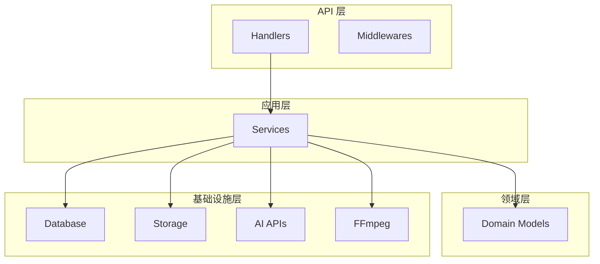

# 04-项目结构图

## DDD 分层架构

```
huobao-drama/
│
├── 📁 api/                    # API 层 - HTTP 接口
│   ├── handlers/             # 请求处理器 (Controllers)
│   ├── middlewares/          # 中间件 (CORS/日志/限流)
│   └── routes/               # 路由配置
│
├── 📁 application/           # 应用层 - 业务逻辑
│   └── services/             # 应用服务
│
├── 📁 domain/                # 领域层 - 领域模型
│   └── models/               # 实体/值对象
│
├── 📁 infrastructure/        # 基础设施层
│   ├── database/            # 数据库连接
│   ├── storage/             # 文件存储
│   ├── scheduler/           # 定时任务
│   └── external/            # 外部服务 (FFmpeg)
│
├── 📁 pkg/                   # 公共包
│   ├── ai/                  # AI 客户端
│   ├── image/               # 图像处理
│   ├── video/               # 视频处理
│   ├── config/              # 配置管理
│   ├── logger/              # 日志
│   └── utils/               # 工具函数
│
└── 📁 web/                  # 前端应用
    ├── src/
    │   ├── views/           # 页面视图
    │   ├── components/      # 组件
    │   ├── router/          # 路由
    │   ├── stores/          # Pinia 状态
    │   ├── api/             # API 客户端
    │   └── utils/           # 工具函数
    └── vite.config.ts       # Vite 配置
```

---

## 后端目录详解

### api/ - API 层
```
api/
├── handlers/               # 18个 HTTP 处理器
│   ├── drama.go          # 短剧管理
│   ├── character_library.go  # 角色库
│   ├── storyboard.go     # 分镜管理
│   ├── image_generation.go  # 图像生成
│   ├── video_generation.go  # 视频生成
│   └── ...               # 其他处理器
│
├── middlewares/
│   ├── cors.go           # 跨域处理
│   ├── logger.go         # 请求日志
│   └── ratelimit.go      # 限流控制
│
└── routes/
    └── routes.go         # 路由注册中心
```

**职责：**
- 接收 HTTP 请求
- 输入验证
- 调用应用服务
- 返回 HTTP 响应

---

### application/ - 应用层
```
application/
└── services/             # 22个应用服务
    ├── drama_service.go
    ├── image_generation_service.go
    ├── video_generation_service.go
    ├── storyboard_service.go
    ├── ai_service.go
    └── ...
```

**职责：**
- 实现业务用例
- 编排领域对象
- 协调外部服务
- 事务管理

---

### domain/ - 领域层
```
domain/
└── models/               # 9个领域模型
    ├── drama.go          # Drama/Character/Episode/Scene/Storyboard/Prop
    ├── image_generation.go
    ├── video_generation.go
    └── ...
```

**核心实体：**
| 实体 | 说明 |
|------|------|
| **Drama** | 短剧项目，聚合根 |
| **Episode** | 剧集，包含剧本内容 |
| **Character** | 角色定义 |
| **Scene** | 场景/背景 |
| **Storyboard** | 分镜 |
| **Prop** | 道具 |

---

### infrastructure/ - 基础设施层
```
infrastructure/
├── database/
│   ├── database.go       # GORM 连接
│   └── custom_logger.go  # 自定义日志
│
├── storage/
│   └── local_storage.go  # 本地文件存储
│
├── scheduler/
│   └── resource_transfer_scheduler.go  # 资源转移定时任务
│
└── external/ffmpeg/
    └── ffmpeg.go         # FFmpeg 视频处理
```

**职责：**
- 数据持久化
- 外部服务调用
- 文件存储
- 媒体处理

---

## 前端目录详解

```
web/
├── src/
│   ├── views/              # 页面视图
│   │   ├── drama/          # 短剧管理页面
│   │   ├── workflow/       # 工作流页面
│   │   ├── generation/     # 生成页面
│   │   ├── storyboard/     # 分镜页面
│   │   └── editor/         # 编辑器页面
│   │
│   ├── components/          # 组件
│   │   ├── common/         # 通用组件
│   │   └── drama/          # 业务组件
│   │
│   ├── router/              # 路由配置
│   │   └── index.ts
│   │
│   ├── stores/              # Pinia 状态管理
│   │   ├── drama.ts
│   │   └── user.ts
│   │
│   ├── api/                 # API 客户端
│   │   ├── drama.ts
│   │   └── request.ts
│   │
│   └── utils/               # 工具函数
│       └── helpers.ts
│
├── package.json
└── vite.config.ts
```

---

## 依赖关系



**依赖规则：**
- 上层依赖下层
- 下层不依赖上层
- 领域层不依赖任何框架

---

## 关键目录说明

| 目录 | 用途 | 文件数量 |
|------|------|---------|
| `api/handlers/` | HTTP 处理器 | 18个 |
| `application/services/` | 业务服务 | 22个 |
| `domain/models/` | 领域模型 | 9个 |
| `web/src/views/` | 前端页面 | 15+个 |
| `web/src/components/` | 前端组件 | 40+个 |

---

## 入口文件

### 后端入口
**文件：** `main.go`

```go
func main() {
    // 1. 加载配置
    cfg := config.LoadConfig()
    
    // 2. 初始化日志
    logr := logger.NewLogger(cfg.App.Debug)
    
    // 3. 连接数据库
    db := database.NewDatabase(cfg.Database)
    
    // 4. 自动迁移表结构
    database.AutoMigrate(db)
    
    // 5. 初始化存储
    storage := storage.NewLocalStorage(...)
    
    // 6. 设置 Gin 路由
    router := routes.SetupRouter(cfg, db, logr, storage)
    
    // 7. 启动 HTTP 服务器
    srv.ListenAndServe()
}
```

### 前端入口
**文件：** `web/src/main.ts`

```typescript
import { createApp } from 'vue'
import App from './App.vue'
import router from './router'
import { createPinia } from 'pinia'

const app = createApp(App)
app.use(createPinia())
app.use(router)
app.mount('#app')
```

---

## 配置文件

### 后端配置
**路径：** `configs/config.yaml`

主要配置：
- 应用基本信息
- 服务器端口和CORS
- 数据库连接
- 存储路径
- AI服务提供商

### 前端配置
**路径：** `web/vite.config.ts`

主要配置：
- 开发服务器代理
- 构建设置
- 插件配置

---

## 开发命令

### 后端
```bash
go run main.go              # 开发模式运行
go build -o huobao-drama . # 编译二进制
go test ./...               # 运行测试
```

### 前端
```bash
cd web
pnpm install               # 安装依赖
pnpm dev                   # 开发模式
pnpm build                 # 生产构建
pnpm lint                  # 代码检查
```

---

*详见：*
- [API 层详细设计](../02-架构设计/06-详细设计/API层.md)
- [应用层详细设计](../02-架构设计/06-详细设计/应用层.md)
- [领域层详细设计](../02-架构设计/06-详细设计/领域层.md)
- [基础设施层详细设计](../02-架构设计/06-详细设计/基础设施层.md)
