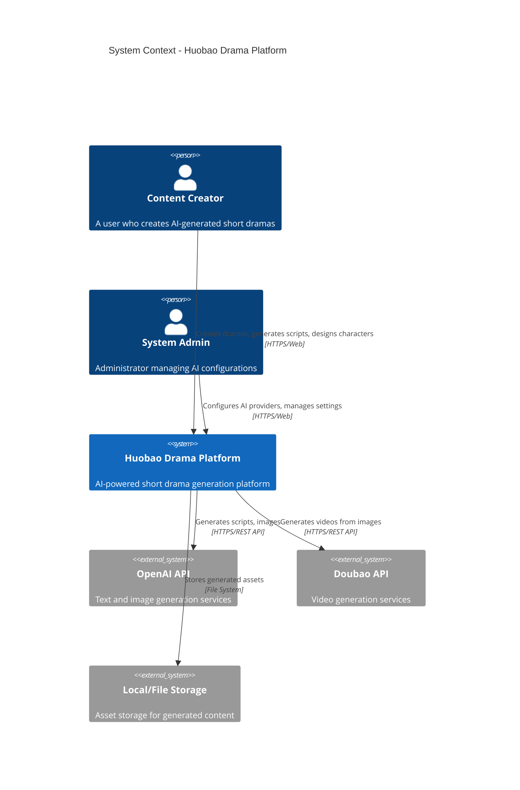
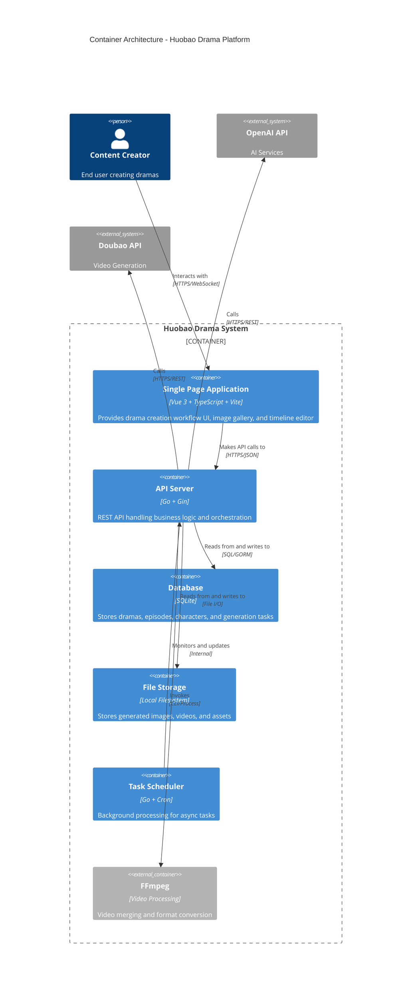

# 2. Architecture Overview

## C4 Model Architecture

This document uses the [C4 Model](https://c4model.com/) to describe the architecture at different levels of abstraction.

---

## Level 1: System Context Diagram

The System Context diagram shows Huobao Drama as a black box and its interactions with external systems and users.



### System Context Description

**Primary Actors:**
- **Content Creator**: End users who create short dramas through the web interface
- **System Admin**: Manages AI service configurations and system settings

**External Dependencies:**
- **OpenAI API**: GPT for script generation, DALL-E for image generation
- **Doubao API**: Video generation from images
- **Local Storage**: Persistent storage for videos, images, and project files

---

## Level 2: Container Diagram

The Container diagram shows the high-level technology choices and how responsibilities are distributed across them.



### Container Responsibilities

| Container | Technology | Responsibility |
|-----------|------------|----------------|
| SPA | Vue 3 + Vite | Interactive UI for drama creation workflow |
| API Server | Go + Gin | Business logic, request handling, AI orchestration |
| Database | SQLite | Persistent data storage with WAL mode for concurrency |
| File Storage | Local FS | Binary asset storage (images, videos) |
| Task Scheduler | Go Cron | Background job processing for long-running tasks |
| FFmpeg | C Binary | Video post-processing and merging |

---

## Level 3: Component Diagram

The Component diagram shows the internal structure of the API Server container, following DDD layered architecture.

```mermaid
C4Component
    title Component Architecture - API Server (DDD Layers)
    
    Container(spa, "Single Page Application", "Vue 3", "Web UI")
    
    Container_Boundary(api, "API Server - DDD Architecture") {
        
        Component_Boundary(presentation, "API Layer (Presentation)") {
            Component(router, "Router", "Gin Router", "Route definitions and middleware chain")
            Component(middleware, "Middlewares", "Go", "CORS, logging, rate limiting, recovery")
            Component(handlers, "HTTP Handlers", "18 Handlers", "Request/response handling")
        }
        
        Component_Boundary(application, "Application Layer") {
            Component(services, "Application Services", "22 Services", "Use cases and orchestration")
            Component(dtos, "DTOs", "Go Structs", "Data transfer objects")
            Component(workflows, "Workflow Engines", "Go", "Drama generation workflows")
        }
        
        Component_Boundary(domain, "Domain Layer") {
            Component(models, "Domain Models", "9 Entities", "Business entities and rules")
            Component(repos, "Repository Interfaces", "Go Interfaces", "Data access abstractions")
        }
        
        Component_Boundary(infrastructure, "Infrastructure Layer") {
            Component(db_infra, "Database", "GORM + SQLite", "Data persistence")
            Component(storage_infra, "Storage", "Local Storage", "File operations")
            Component(ai_clients, "AI Clients", "HTTP Clients", "OpenAI, Doubao integrations")
            Component(ffmpeg_infra, "FFmpeg Wrapper", "Go", "Video processing")
        }
    }
    
    System_Ext(ai_external, "External AI Services", "OpenAI/Doubao")
    
    Rel(spa, router, "Sends requests to", "HTTPS/JSON")
    Rel(router, middleware, "Uses")
    Rel(router, handlers, "Routes to")
    Rel(handlers, services, "Calls")
    Rel(services, models, "Uses")
    Rel(services, db_infra, "Persists via")
    Rel(services, storage_infra, "Stores files via")
    Rel(services, ai_clients, "Generates via")
    Rel(ai_clients, ai_external, "Calls", "HTTPS")
    Rel(services, ffmpeg_infra, "Processes video via")
    
    UpdateLayoutConfig($c4ShapeInRow="3", $c4BoundaryInRow="1")
```

### DDD Layer Responsibilities

#### API Layer (Presentation)
- **Router** (`api/routes/routes.go`): Defines all HTTP routes and their handlers
- **Middlewares**: 
  - CORS handling (`api/middlewares/cors.go`)
  - Request logging (`api/middlewares/logger.go`)
  - Rate limiting (`api/middlewares/ratelimit.go`)
- **Handlers** (18 total): Handle HTTP requests/responses, input validation

#### Application Layer
- **Services** (22 total): Implement use cases and orchestrate domain operations
- **DTOs**: Define request/response structures
- **Workflows**: Long-running drama generation workflows

#### Domain Layer
- **Models** (9 entities): Core business entities with behavior
- **Repository Interfaces**: Define data access contracts

#### Infrastructure Layer
- **Database** (`infrastructure/database/`): GORM implementation, migrations
- **Storage** (`infrastructure/storage/`): Local file system storage
- **AI Clients** (`application/services/ai_service.go`): External API integrations
- **FFmpeg** (`infrastructure/external/ffmpeg/`): Video processing

---

## Architecture Patterns

### 1. Domain-Driven Design (DDD)

The codebase follows strict DDD principles:

```
┌─────────────────────────────────────────────────────────┐
│                    API Layer                            │
│    ┌────────────┐  ┌────────────┐  ┌────────────┐        │
│    │  Router    │  │ Middleware │  │  Handlers  │        │
│    └─────┬──────┘  └────────────┘  └─────┬──────┘        │
│          │                                │              │
└──────────┼────────────────────────────────┼──────────────┘
           │                                │
           ▼                                ▼
┌─────────────────────────────────────────────────────────┐
│                Application Layer                        │
│    ┌────────────┐  ┌────────────┐  ┌────────────┐        │
│    │  Services  │  │    DTOs    │  │ Workflows  │        │
│    └─────┬──────┘  └────────────┘  └────────────┘        │
│          │                                              │
└──────────┼──────────────────────────────────────────────┘
           │
           ▼
┌─────────────────────────────────────────────────────────┐
│                   Domain Layer                          │
│    ┌────────────┐  ┌────────────┐  ┌────────────┐        │
│    │   Models   │  │   Value    │  │ Repository │        │
│    │  (Entities)│  │  Objects   │  │ Interfaces │        │
│    └─────┬──────┘  └────────────┘  └────────────┘        │
│          │                                              │
└──────────┼──────────────────────────────────────────────┘
           │
           ▼
┌─────────────────────────────────────────────────────────┐
│               Infrastructure Layer                      │
│    ┌────────────┐  ┌────────────┐  ┌────────────┐        │
│    │  Database  │  │   Storage  │  │ Ext. Svcs  │        │
│    │   (GORM)   │  │   (Local)  │  │ (AI/Video) │        │
│    └────────────┘  └────────────┘  └────────────┘        │
└─────────────────────────────────────────────────────────┘
```

### 2. Dependency Rule

Dependencies always point inward:
- **Domain Layer**: No external dependencies, pure business logic
- **Application Layer**: Depends only on Domain Layer
- **API Layer**: Depends on Application Layer
- **Infrastructure Layer**: Implements interfaces from inner layers

### 3. Repository Pattern

Data access abstraction through interfaces:
- Domain defines repository interfaces
- Infrastructure provides concrete implementations
- Application uses interfaces, not implementations

---

## Technology Decisions

| Decision | Choice | Rationale |
|----------|--------|-----------|
| **Language** | Go 1.23 | High performance, excellent concurrency, strong typing |
| **Web Framework** | Gin | Fast, lightweight, middleware support |
| **Database** | SQLite | Zero configuration, file-based, sufficient for single-user |
| **ORM** | GORM | Feature-rich, supports SQLite/MySQL/Postgres |
| **Frontend** | Vue 3 | Composition API, TypeScript support, reactivity |
| **Build Tool** | Vite | Fast HMR, modern bundling |
| **UI Library** | Element Plus | Comprehensive component library |
| **State Management** | Pinia | Official Vue solution, TypeScript support |
| **Video Processing** | FFmpeg | Industry standard, feature-complete |
| **Logging** | Zap | High performance structured logging |
| **Config** | Viper | Multiple format support, environment variables |

---

## Scalability Considerations

### Current Architecture
- **Single-node**: Designed for local/single-user deployment
- **SQLite**: File-based database with WAL mode for read concurrency
- **Local Storage**: File system for assets

### Future Scalability
- Database: Migration path to PostgreSQL/MySQL
- Storage: Abstraction allows S3-compatible storage
- Processing: Async task queue for horizontal scaling

---

## Security Architecture

### Implemented Measures
- **CORS**: Configurable origin whitelist
- **Rate Limiting**: Request throttling middleware
- **Input Validation**: Gin validator for request DTOs
- **No Authentication**: Current version assumes trusted environment

### Future Enhancements
- JWT-based authentication
- API key management for AI services
- Request signing for external webhooks

---

*See [3. Workflow Overview.md](./3.%20Workflow%20Overview.md) for detailed workflow documentation*

*See [4. Deep Dive](./4.Deep-Dive/) for component-level documentation*
