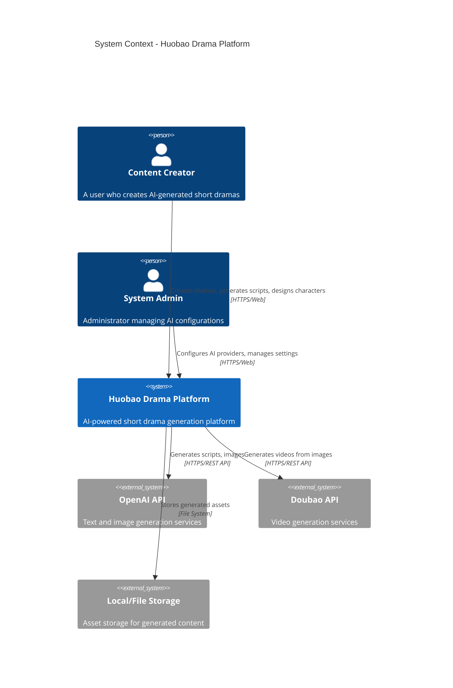

# 02-系统上下文

## C4 Model - Level 1: System Context

系统上下文图展示火宝短剧平台作为一个黑盒，以及它与外部系统和用户的交互。

---

## 系统上下文图



---

## 主要参与者

### 用户角色

| 角色 | 描述 | 主要职责 |
|------|------|---------|
| **内容创作者** | 使用平台创建短剧的最终用户 | 创建短剧、生成剧本、设计角色、生成视频 |
| **系统管理员** | 管理AI配置和系统设置的管理员 | 配置AI服务商、监控系统状态、管理用户权限 |

---

## 外部依赖系统

| 系统 | 服务商 | 功能描述 |
|------|--------|---------|
| **OpenAI API** | OpenAI | GPT模型用于剧本生成，DALL-E用于图像生成 |
| **豆包 API** | 字节跳动 | 视频生成服务，将图像转换为视频 |
| **本地存储** | Local/File System | 持久化存储视频、图像和项目文件 |

---

## 交互关系说明

### 用户与系统交互

**内容创作者 → 火宝短剧平台**
- 通过 HTTPS/Web 访问 Web 界面
- 创建短剧项目
- 编写剧本大纲
- 设计角色形象
- 生成分镜和场景
- 合成最终视频

**系统管理员 → 火宝短剧平台**
- 通过 HTTPS/Web 访问管理后台
- 配置 AI 服务提供商（API Key、模型选择）
- 管理系统设置和参数
- 监控系统运行状态

### 系统与外部服务交互

**火宝短剧平台 → OpenAI API**
- 调用 GPT 模型生成剧本内容
- 调用 DALL-E 生成角色和场景图像
- 使用 HTTPS/REST API 通信

**火宝短剧平台 → 豆包 API**
- 调用视频生成服务将图像转为视频
- 使用 HTTPS/REST API 通信

**火宝短剧平台 → 本地存储**
- 保存生成的图像文件
- 保存生成的视频文件
- 保存项目元数据和配置文件
- 使用文件系统 I/O

---

## 系统边界

### 系统内（火宝短剧平台）
- Web 前端应用（Vue 3）
- REST API 服务（Go + Gin）
- 业务逻辑处理
- 数据库访问层
- 文件存储管理

### 系统外
- 最终用户（内容创作者、管理员）
- OpenAI 云服务
- 豆包云服务
- 底层存储硬件

---

## 数据流向

```
用户输入 → 火宝短剧平台 → AI服务（OpenAI/豆包）→ 生成内容 → 本地存储 → 用户查看
```

1. **输入阶段**：用户提供创意、大纲、风格偏好
2. **生成阶段**：平台调用AI服务生成剧本、图像、视频
3. **存储阶段**：生成内容保存到本地存储
4. **展示阶段**：用户在界面上查看和编辑内容

---

## 下一步

了解系统内部结构，请查看：
- [03-容器架构](03-容器架构.md) - 了解应用容器和职责分配
- [04-组件架构](04-组件架构.md) - 了解内部组件和DDD分层

---

*注：本文档基于 C4 Model（https://c4model.com/）Level 1 标准绘制*
