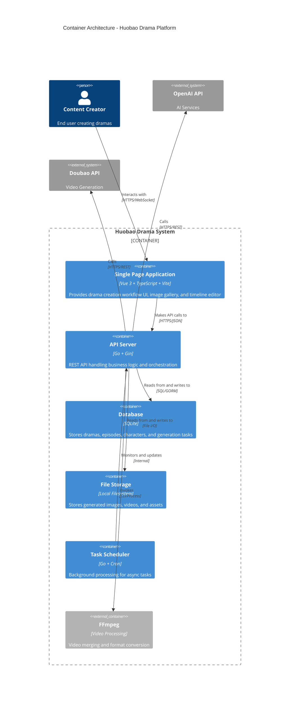

# 03-容器架构

## C4 Model - Level 2: Container Diagram

容器图展示高级技术选型，以及职责如何在各个容器间分配。

---

## 容器架构图



---

## 容器列表

| 容器 | 技术栈 | 职责描述 |
|------|--------|---------|
| **SPA** | Vue 3 + TypeScript + Vite | 提供短剧创建工作流界面、图库和时间线编辑器 |
| **API Server** | Go + Gin | REST API，处理业务逻辑和编排 |
| **Database** | SQLite | 存储短剧、剧集、角色和生成任务 |
| **File Storage** | 本地文件系统 | 存储生成的图像、视频和资源 |
| **Task Scheduler** | Go + Cron | 后台异步任务处理 |
| **FFmpeg** | C 二进制 | 视频后处理和合并 |

---

## 容器详细说明

### 1. Single Page Application (SPA)

**技术栈：** Vue 3 + TypeScript + Vite + Element Plus

**主要职责：**
- 提供交互式短剧创建工作流界面
- 展示图像图库和预览
- 时间线编辑器用于视频合成
- AI 配置界面
- 实时任务状态监控

**与其他容器交互：**
- → API Server: 通过 HTTPS/JSON 调用 REST API

---

### 2. API Server

**技术栈：** Go 1.23 + Gin Framework + GORM

**主要职责：**
- 实现 RESTful API（18个 Handler）
- 业务逻辑编排（22个 Service）
- AI 服务调用编排
- 请求验证和响应格式化
- 事务管理

**与其他容器交互：**
- → Database: 读写数据（SQL/GORM）
- → File Storage: 文件操作（File I/O）
- → OpenAI API: 调用AI服务（HTTPS/REST）
- → 豆包 API: 调用视频生成（HTTPS/REST）
- → FFmpeg: 视频处理（CLI/Process）

---

### 3. Database

**技术栈：** SQLite（modernc.org/sqlite）+ GORM

**主要职责：**
- 持久化存储短剧项目元数据
- 存储剧集、角色、场景、分镜信息
- 存储生成任务状态
- 支持 WAL 模式并发读写

**数据表：**
- `dramas` - 短剧项目
- `episodes` - 剧集
- `characters` - 角色
- `scenes` - 场景
- `storyboards` - 分镜
- `image_generations` - 图像生成任务
- `video_generations` - 视频生成任务

---

### 4. File Storage

**技术栈：** 本地文件系统

**主要职责：**
- 存储生成的图像文件（PNG/JPG）
- 存储生成的视频文件（MP4）
- 存储用户上传的参考图像
- 提供静态文件访问服务

**目录结构：**
```
data/storage/
├── images/          # 场景和分镜图像
├── characters/      # 角色图像
├── videos/          # 生成的视频
└── uploads/         # 用户上传文件
```

---

### 5. Task Scheduler

**技术栈：** Go + robfig/cron

**主要职责：**
- 后台异步处理耗时任务
- 定时清理临时文件
- 资源转移任务调度
- 监控长时间运行的生成任务

**与其他容器交互：**
- → API Server: 内部调用更新任务状态

---

### 6. FFmpeg

**技术栈：** C 二进制程序

**主要职责：**
- 视频格式转换
- 视频合并和拼接
- 音频提取和混音
- 视频压缩和优化

**使用场景：**
- 将多个视频片段合并为完整剧集
- 添加转场效果
- 调整视频分辨率和码率

---

## 容器间通信

| 通信双方 | 协议/技术 | 数据格式 | 说明 |
|---------|----------|---------|------|
| 用户 ↔ SPA | HTTPS | HTML/JS | Web 浏览器访问 |
| SPA ↔ API Server | HTTPS/JSON | JSON | REST API 调用 |
| API Server ↔ Database | SQL | SQL/GORM | 数据库查询 |
| API Server ↔ File Storage | File I/O | Binary | 文件读写 |
| API Server ↔ OpenAI | HTTPS/REST | JSON | AI 服务调用 |
| API Server ↔ 豆包 | HTTPS/REST | JSON | 视频生成调用 |
| API Server ↔ FFmpeg | CLI | Binary/Params | 命令行调用 |

---

## 部署视图

### 单机部署（开发/测试）

```
┌─────────────────────────────────────┐
│           本地机器                   │
│  ┌───────────────────────────────┐ │
│  │  Docker / 本地运行              │ │
│  │  ┌─────┐ ┌─────────┐ ┌─────┐  │ │
│  │  │ SPA │ │ API Svc │ │ DB  │  │ │
│  │  └─────┘ └─────────┘ └─────┘  │ │
│  │       ┌─────┐ ┌────────┐       │ │
│  │       │ FF  │ │ Storage│       │ │
│  │       └─────┘ └────────┘       │ │
│  └───────────────────────────────┘ │
└─────────────────────────────────────┘
```

### 生产部署（扩展）

```
┌─────────────────────────────────────┐
│         负载均衡器                   │
└──────────────┬──────────────────────┘
               │
        ┌──────┴──────┐
        ▼             ▼
┌──────────────┐ ┌──────────────┐
│  API Server 1  │ │  API Server 2  │
└───────┬────────┘ └───────┬────────┘
        │                  │
        └──────┬───────────┘
               ▼
        ┌──────────────┐
        │   Database   │
        │ (PostgreSQL) │
        └──────────────┘
```

---

## 技术决策

| 决策 | 选择 | 理由 |
|------|------|------|
| **前端框架** | Vue 3 | 组合式API、TypeScript支持好 |
| **后端语言** | Go | 高性能、并发支持强 |
| **Web框架** | Gin | 轻量、快速、中间件支持 |
| **数据库** | SQLite | 零配置、适合单机部署 |
| **ORM** | GORM | 功能丰富、支持多数据库 |
| **任务调度** | Cron | 简单可靠、Go原生支持 |
| **视频处理** | FFmpeg | 行业标准、功能完整 |

---

## 可扩展性考虑

### 当前架构
- **单节点**：适合本地/单用户部署
- **SQLite**：文件数据库
- **本地存储**：文件系统存储

### 未来扩展路径
- **数据库**：迁移到 PostgreSQL/MySQL 支持多用户
- **存储**：支持 S3 兼容的对象存储
- **任务队列**：引入 Redis/RabbitMQ 支持分布式处理
- **缓存**：添加 Redis 缓存热点数据

---

## 下一步

了解系统内部组件结构，请查看：
- [04-组件架构](04-组件架构.md) - 深入了解API Server内部的DDD分层
- [05-核心工作流](05-核心工作流.md) - 了解10个核心业务流程

---

*注：本文档基于 C4 Model（https://c4model.com/）Level 2 标准绘制*
