# Application Layer Documentation

## Overview

The Application Layer contains the core business logic and orchestrates use cases. It coordinates between the API Layer (presentation) and Domain Layer (entities), implementing the application's workflows and use cases.

## Architecture

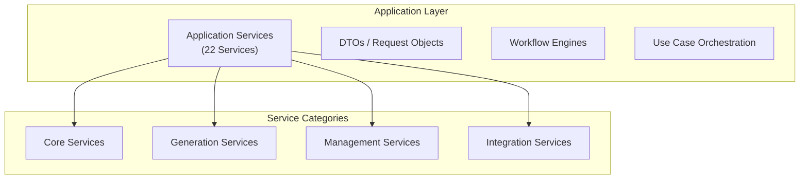

## Service Inventory (22 Services)

### Core Drama Services

| Service | File | Responsibility | Key Methods |
|---------|------|----------------|-------------|
| **DramaService** | `drama_service.go` | Drama CRUD & management | CreateDrama, GetDrama, ListDramas, UpdateDrama, DeleteDrama, SaveOutline, SaveCharacters, SaveEpisodes, GetDramaStats |

### Content Generation Services

| Service | File | Responsibility | Key Methods |
|---------|------|----------------|-------------|
| **ScriptGenerationService** | `script_generation_service.go` | AI script generation | GenerateScript, BuildPrompt |
| **ImageGenerationService** | `image_generation_service.go` | AI image generation | GenerateImage, GenerateCharacterImage, GenerateSceneImage, BatchGenerate |
| **VideoGenerationService** | `video_generation_service.go` | AI video generation | GenerateVideo, GenerateVideoFromImage, BatchGenerate |
| **StoryboardService** | `storyboard_service.go` | Storyboard creation | GenerateStoryboard, CreateStoryboard, UpdateStoryboard |
| **StoryboardCompositionService** | `storyboard_composition_service.go` | Storyboard image composition | ComposeStoryboardImage |

### Character & Asset Services

| Service | File | Responsibility | Key Methods |
|---------|------|----------------|-------------|
| **CharacterLibraryService** | `character_library_service.go` | Character library management | CreateLibraryItem, ListLibraryItems, GenerateLibraryCharacterImage |
| **SceneService** (in `drama_service.go`) | - | Scene management | CreateScene, UpdateScene, DeleteScene |
| **PropService** | `prop_service.go` | Prop management | CreateProp, UpdateProp, DeleteProp, ExtractProps |
| **AssetService** | `asset_service.go` | Asset library management | ListAssets, CreateAsset, ImportFromImageGen, ImportFromVideoGen |
| **FramePromptService** | `frame_prompt_service.go` | Frame prompt generation | GenerateFramePrompt |

### Task & Processing Services

| Service | File | Responsibility | Key Methods |
|---------|------|----------------|-------------|
| **TaskService** | `task_service.go` | Async task management | CreateTask, GetTask, ListTasks, UpdateTaskStatus |
| **VideoMergeService** | `video_merge_service.go` | Video post-processing | MergeVideos, ConcatVideos |
| **AudioExtractionService** | `audio_extraction_service.go` | Audio processing | ExtractAudio, BatchExtract |
| **ResourceTransferService** | `resource_transfer_service.go` | Resource URL handling | TransferExternalURL, DownloadAndStore |
| **UploadService** | `upload_service.go` | File upload handling | ProcessUpload, ValidateFile |

### Configuration & Utility Services

| Service | File | Responsibility | Key Methods |
|---------|------|----------------|-------------|
| **AIService** | `ai_service.go` | AI provider management | GetClient, CallTextGeneration, CallImageGeneration, CallVideoGeneration |
| **DataMigrationService** | `data_migration_service.go` | Data migrations | MigrateData, UpdateSchema |
| **SettingsService** | `settings_service.go` | System settings | GetSettings, UpdateSettings |

## Service Architecture Pattern

### Dependency Injection

All services follow dependency injection pattern:

```go
type ImageGenerationService struct {
    db             *gorm.DB
    cfg            *config.Config
    transferSvc    *ResourceTransferService
    storage        *storage.LocalStorage
    log            *logger.Logger
    aiService      *AIService
}

func NewImageGenerationService(
    db *gorm.DB,
    cfg *config.Config,
    transferSvc *ResourceTransferService,
    storage *storage.LocalStorage,
    log *logger.Logger,
) *ImageGenerationService {
    return &ImageGenerationService{
        db:          db,
        cfg:         cfg,
        transferSvc: transferSvc,
        storage:     storage,
        log:         log,
        aiService:   NewAIService(db, log),
    }
}
```

## Key Service Implementations

### DramaService

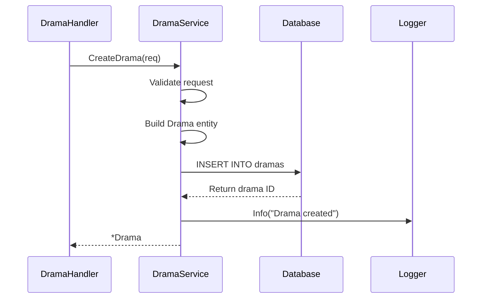

**Key Features:**
- Comprehensive CRUD operations
- Complex query with preloading (Episodes, Characters, Scenes, Storyboards)
- Progress tracking with metadata
- Status-based filtering

### ScriptGenerationService

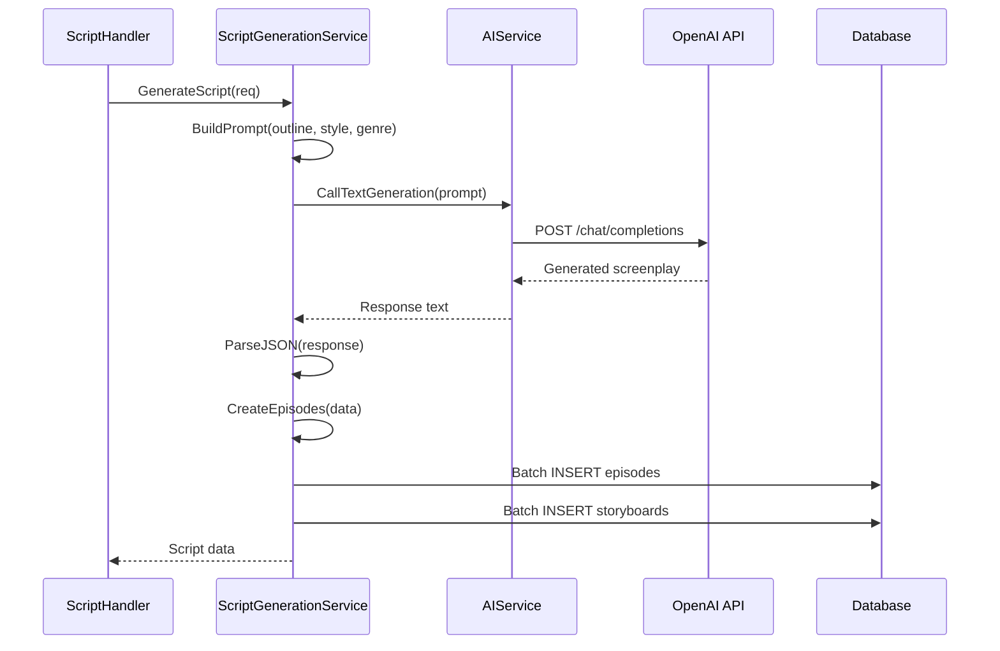

**AI Prompt Structure:**
```
You are a professional screenplay writer...

Story Outline: {outline}
Genre: {genre}
Style: {style}
Target Duration: {duration} minutes

Generate a screenplay with:
1. Episode breakdown
2. Scene descriptions
3. Character dialogues
4. Location and time
5. Shot type recommendations

Return JSON format:
{
  "episodes": [...],
  "characters": [...],
  "scenes": [...]
}
```

### ImageGenerationService

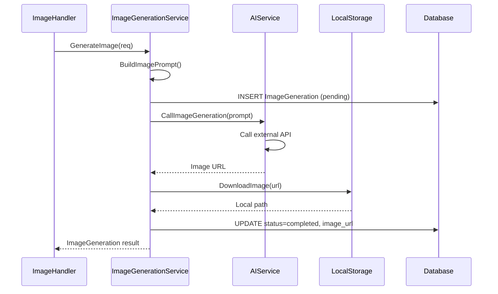

**Generation Types:**
1. **Character Images**: With character reference and style
2. **Scene Images**: Location-based backgrounds
3. **Storyboard Images**: Composed scenes with characters
4. **Prop Images**: Object design

**Style Configuration:**
```go
type StyleConfig struct {
    StyleBase         []string `json:"style_base"`
    Lighting          []string `json:"lighting"`
    Texture           []string `json:"texture"`
    Composition       []string `json:"composition"`
    StyleReferences   []string `json:"style_references"`
    ConsistencyControls []string `json:"consistency_controls"`
}
```

### VideoGenerationService

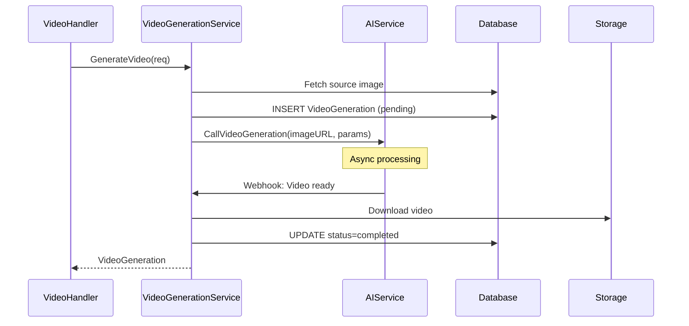

**Video Parameters:**
- Source image URL
- Motion type (pan, zoom, etc.)
- Duration (seconds)
- Frame rate
- Quality setting

### StoryboardService

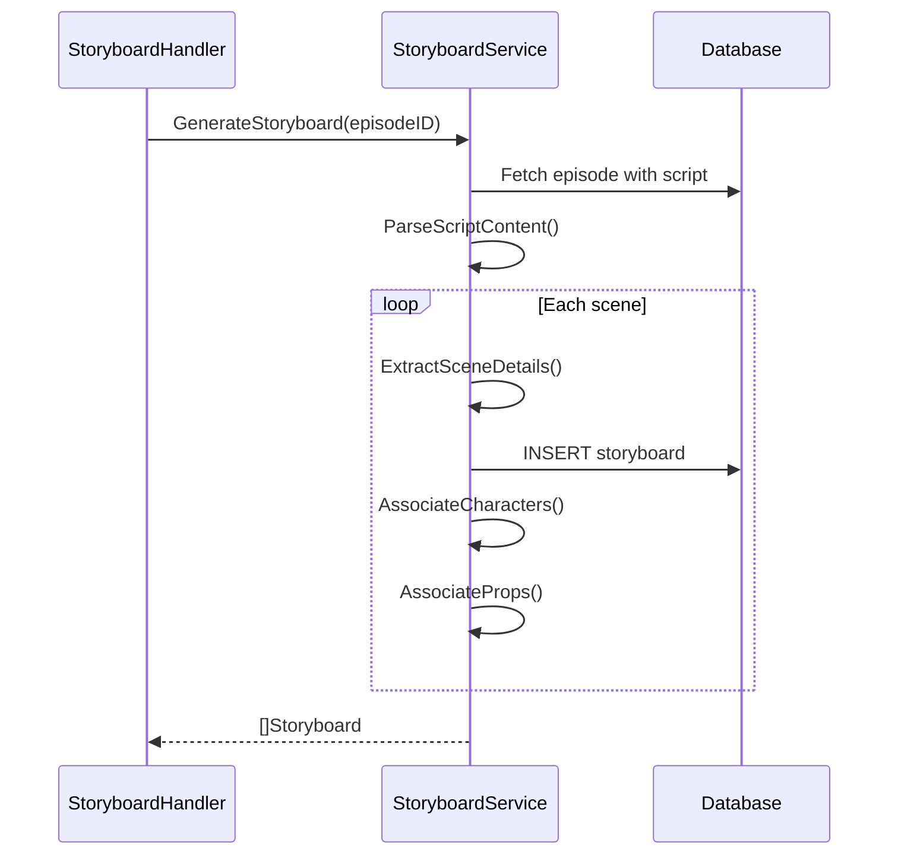

**Storyboard Fields:**
- StoryboardNumber
- Title, Location, Time
- ShotType, Angle, Movement
- Action, Result, Atmosphere
- Dialogue
- ImagePrompt, VideoPrompt
- BgmPrompt, SoundEffect
- Duration

### CharacterLibraryService

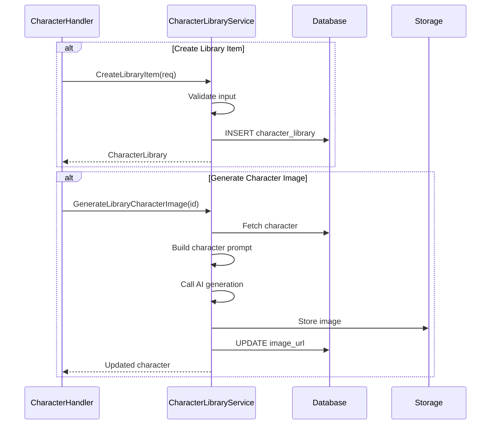

### VideoMergeService

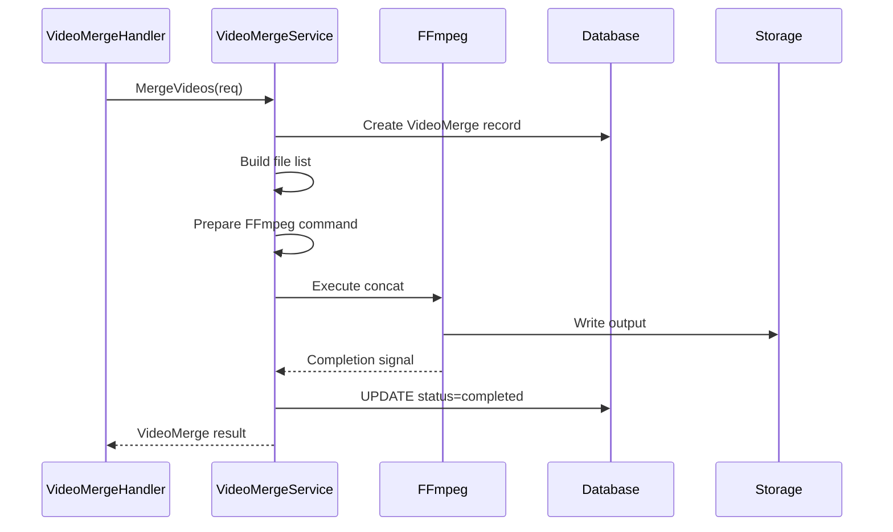

**FFmpeg Operations:**
- Concatenate multiple videos
- Add transitions
- Audio mixing
- Format conversion
- Resolution normalization

### TaskService (Async Processing)

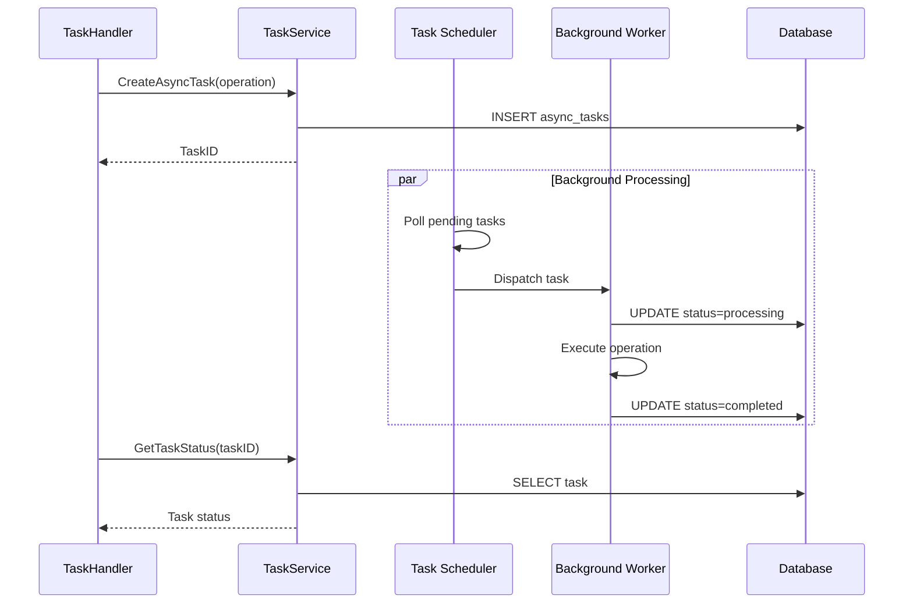

**Task States:**
- `pending` - Waiting to be processed
- `processing` - Currently executing
- `completed` - Successfully finished
- `failed` - Error occurred
- `cancelled` - Manually cancelled

### AIService

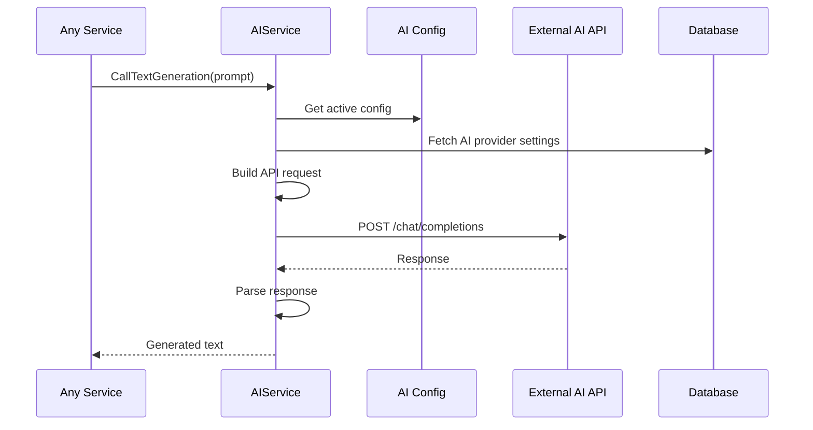

**Supported Providers:**
- **OpenAI**: GPT-4, DALL-E
- **Doubao**: Video generation
- **Custom**: Configurable endpoints

**Configuration Structure:**
```go
type AIServiceConfig struct {
    ID       uint
    Name     string
    Provider string // openai, doubao, custom
    BaseURL  string
    APIKey   string
    Model    string
    IsActive bool
}
```

## Data Transfer Objects (DTOs)

### Request DTOs

```go
// Drama requests
type CreateDramaRequest struct {
    Title       string `json:"title" binding:"required,min=1,max=100"`
    Description string `json:"description"`
    Genre       string `json:"genre"`
    Tags        string `json:"tags"`
}

type UpdateDramaRequest struct {
    Title       string `json:"title" binding:"omitempty,min=1,max=100"`
    Description string `json:"description"`
    Genre       string `json:"genre"`
    Status      string `json:"status" binding:"omitempty,oneof=draft planning production completed archived"`
}

// Generation requests
type GenerateScriptRequest struct {
    DramaID    uint   `json:"drama_id" binding:"required"`
    Outline    string `json:"outline" binding:"required"`
    Genre      string `json:"genre"`
    Style      string `json:"style"`
    TargetDuration int `json:"target_duration"`
}

type GenerateImageRequest struct {
    Type        string `json:"type" binding:"required,oneof=character scene storyboard prop"`
    ReferenceID uint   `json:"reference_id"`
    Prompt      string `json:"prompt"`
    Style       string `json:"style"`
    Size        string `json:"size"` // 1024x1024, 16:9, etc.
}

type GenerateVideoRequest struct {
    ImageGenID  uint   `json:"image_gen_id" binding:"required"`
    MotionType  string `json:"motion_type"`
    Duration    int    `json:"duration"`
    Quality     string `json:"quality"`
}
```

### Response DTOs

```go
// Standard list response
type ListResponse struct {
    Data     interface{} `json:"data"`
    Total    int64       `json:"total"`
    Page     int         `json:"page"`
    PageSize int         `json:"page_size"`
}

// Async task response
type AsyncTaskResponse struct {
    TaskID  string `json:"task_id"`
    Status  string `json:"status"`
    Message string `json:"message"`
}

// Error response
type ErrorResponse struct {
    Error   string      `json:"error"`
    Code    string      `json:"code,omitempty"`
    Details interface{} `json:"details,omitempty"`
}
```

## Service Dependencies

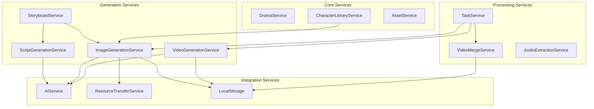

## Business Logic Patterns

### Transaction Management

```go
func (s *DramaService) SaveEpisodes(req *SaveEpisodesRequest) error {
    return s.db.Transaction(func(tx *gorm.DB) error {
        // Delete old episodes
        if err := tx.Where("drama_id = ?", dramaID).Delete(&models.Episode{}).Error; err != nil {
            return err
        }
        
        // Create new episodes
        for _, ep := range req.Episodes {
            if err := tx.Create(&episode).Error; err != nil {
                return err
            }
        }
        
        return nil
    })
}
```

### Async Pattern

```go
func (s *ImageGenerationService) GenerateImageAsync(req *GenerateImageRequest) (*models.AsyncTask, error) {
    // Create task record
    task := &models.AsyncTask{
        Type:   "image_generation",
        Status: "pending",
        Data:   req,
    }
    
    if err := s.db.Create(task).Error; err != nil {
        return nil, err
    }
    
    // Queue for background processing
    s.taskQueue <- task.ID
    
    return task, nil
}
```

### Retry Logic

```go
func (s *AIService) CallWithRetry(operation func() error, maxRetries int) error {
    var err error
    for i := 0; i < maxRetries; i++ {
        err = operation()
        if err == nil {
            return nil
        }
        
        // Exponential backoff
        time.Sleep(time.Second * time.Duration(i+1))
    }
    return fmt.Errorf("max retries exceeded: %w", err)
}
```

## Testing Services

### Unit Test Pattern

```go
func TestDramaService_CreateDrama(t *testing.T) {
    // Setup
    db := setupTestDB()
    log := logger.NewLogger(true)
    service := NewDramaService(db, nil, log)
    
    // Execute
    req := &CreateDramaRequest{
        Title: "Test Drama",
    }
    drama, err := service.CreateDrama(req)
    
    // Assert
    assert.NoError(t, err)
    assert.NotNil(t, drama)
    assert.Equal(t, "Test Drama", drama.Title)
    assert.Equal(t, "draft", drama.Status)
}
```

### Mock Pattern

```go
type MockAIService struct {
    mock.Mock
}

func (m *MockAIService) CallImageGeneration(prompt string) (string, error) {
    args := m.Called(prompt)
    return args.String(0), args.Error(1)
}

// Usage in test
mockAI := new(MockAIService)
mockAI.On("CallImageGeneration", mock.Anything).Return("http://image.url", nil)
```

---

*For domain model documentation, see [domain-layer.md](./domain-layer.md)*