# 3. Workflow Overview

## Huobao Drama - User Workflows and Processes

This document describes the complete user workflows for creating AI-generated short dramas.

---

## Core Workflow: Drama Creation Pipeline

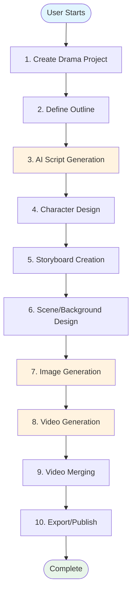

---

## Workflow 1: Drama Project Creation

### Overview
The entry point for creating a new drama project with basic metadata.

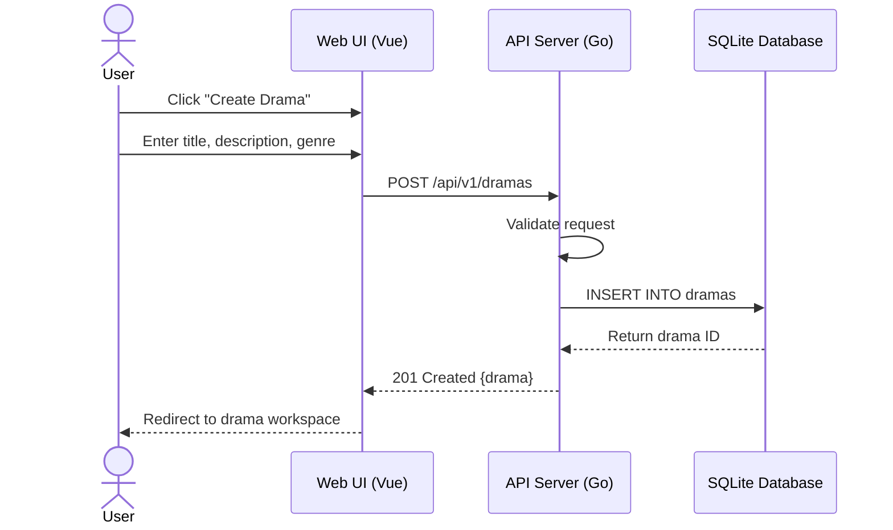

### API Endpoints
| Method | Endpoint | Description |
|--------|----------|-------------|
| POST | `/api/v1/dramas` | Create new drama project |
| GET | `/api/v1/dramas` | List all dramas |
| GET | `/api/v1/dramas/:id` | Get drama details |
| PUT | `/api/v1/dramas/:id` | Update drama |
| DELETE | `/api/v1/dramas/:id` | Delete drama |

---

## Workflow 2: AI Script Generation

### Overview
Generate screenplay content from outline using AI (OpenAI GPT).

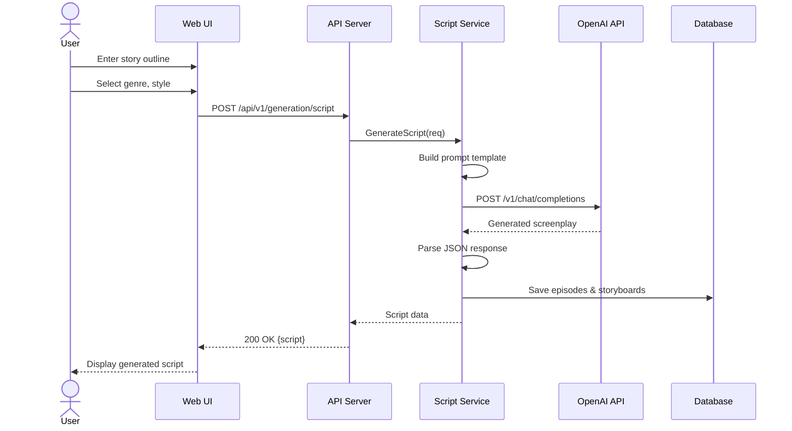

### Process Details
1. **Input**: Story outline, genre, target duration
2. **AI Prompt**: Structured prompt with style guidelines
3. **Output**: Structured screenplay with:
   - Episode breakdown
   - Scene descriptions
   - Character dialogues
   - Location/time information
4. **Storage**: Episodes and storyboards saved to database

---

## Workflow 3: Character Design & Management

### Overview
Create and manage characters with AI-generated reference images.

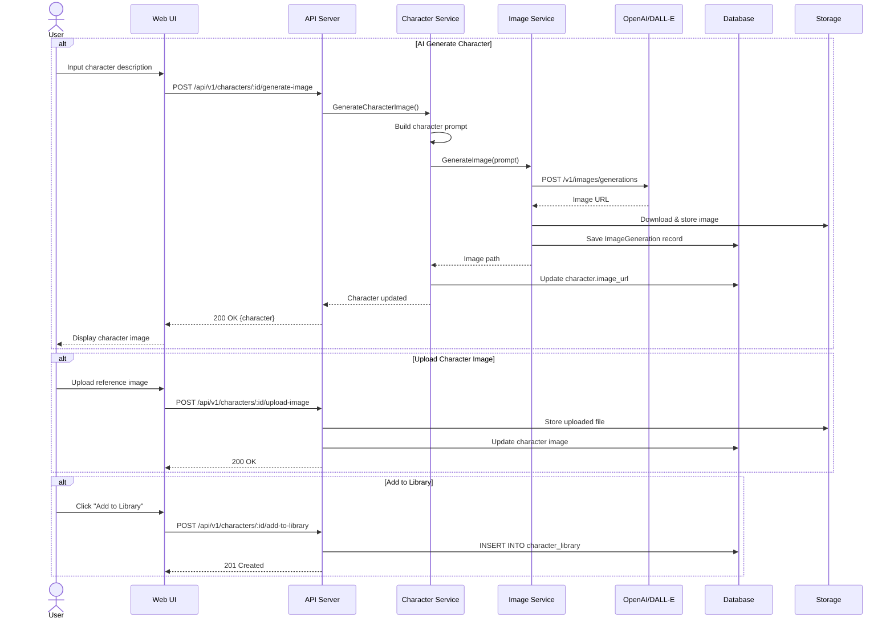

### Character Library Features
- **AI Generation**: Generate character images from descriptions
- **Upload**: Import custom reference images
- **Library**: Reuse characters across dramas
- **Batch Generation**: Generate images for multiple characters

---

## Workflow 4: Storyboard Creation

### Overview
Convert screenplay into visual storyboard with shot breakdown.

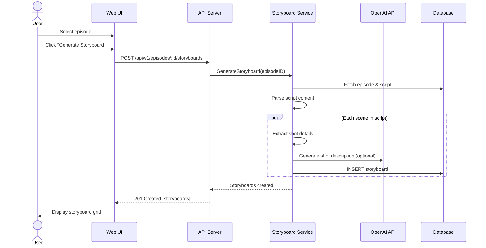

### Storyboard Structure
- **Shot Number**: Sequential identifier
- **Location**: Scene setting
- **Time**: Day/night/season
- **Shot Type**: Wide, medium, close-up, etc.
- **Action**: Character movements
- **Dialogue**: Character speech
- **Atmosphere**: Mood and tone
- **Image Prompt**: AI generation prompt

---

## Workflow 5: Scene/Background Design

### Overview
Design background scenes for storyboard shots.

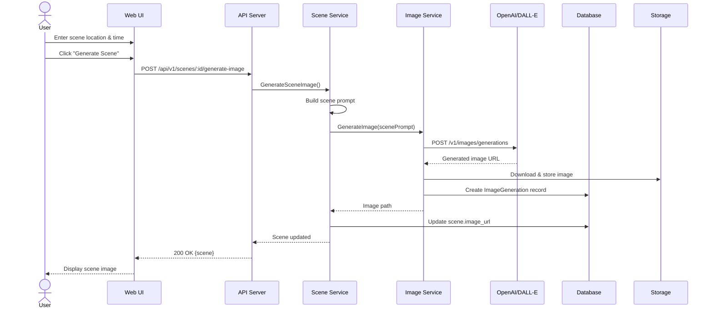

### Scene Management
- **Location-based**: Organize by story locations
- **Time-based**: Day/night variations
- **Episode association**: Link to specific episodes
- **Reusability**: Use across multiple shots

---

## Workflow 6: Image Generation Pipeline

### Overview
Generate anime-style images for characters and scenes.

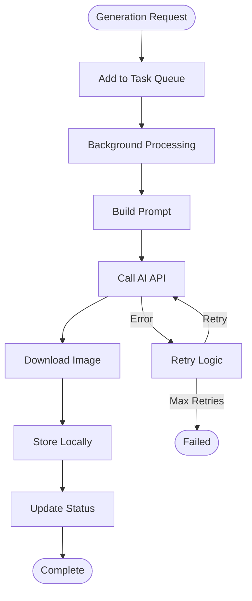

### Async Task Processing
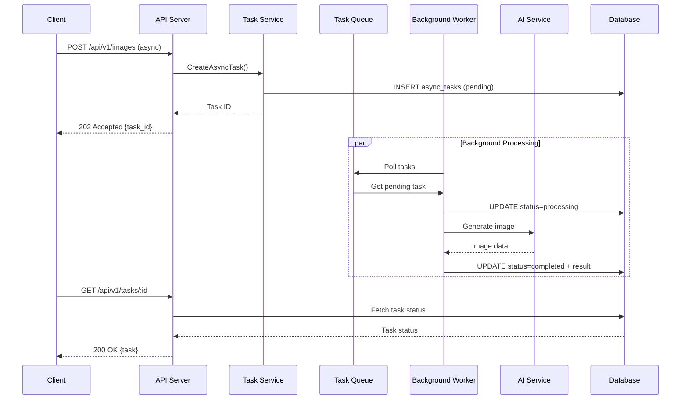

---

## Workflow 7: Video Generation

### Overview
Generate videos from images using AI video generation services.

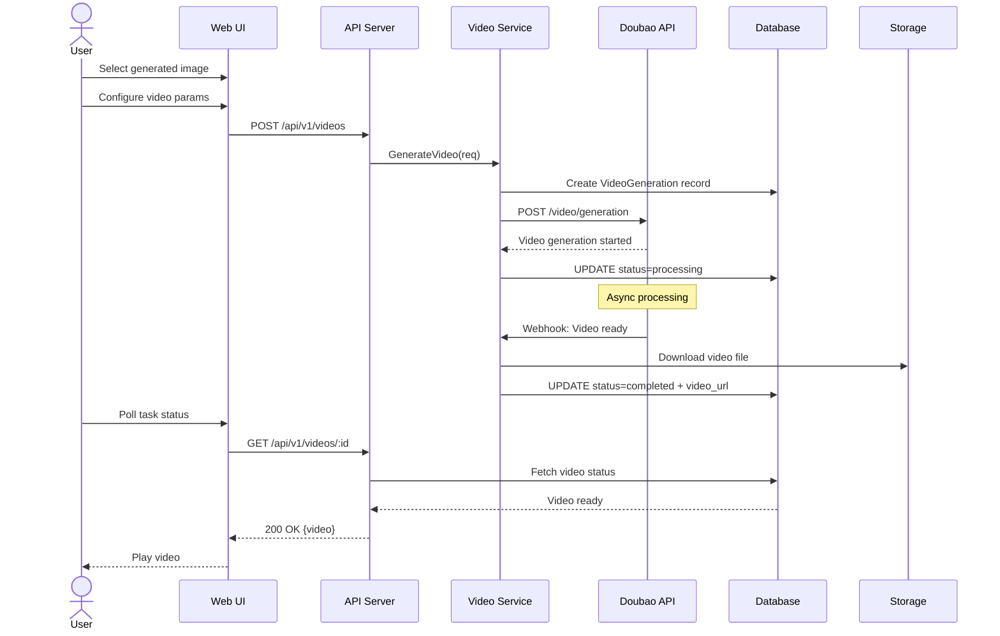

### Video Generation Features
- **Image-to-Video**: Convert static images to animated video
- **Motion Control**: Define movement types
- **Duration Control**: Set video length
- **Batch Processing**: Generate multiple videos

---

## Workflow 8: Video Merging & Post-Processing

### Overview
Combine individual video clips into final episode using FFmpeg.

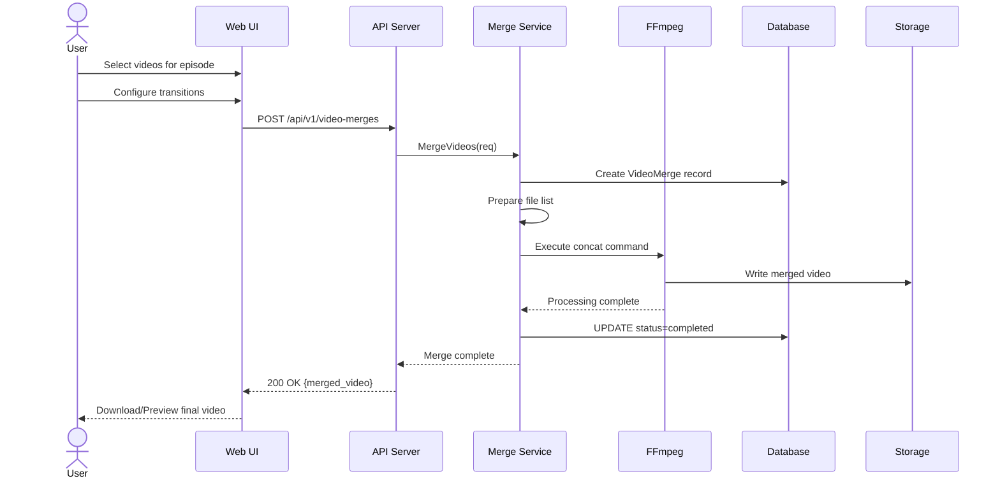

### FFmpeg Integration
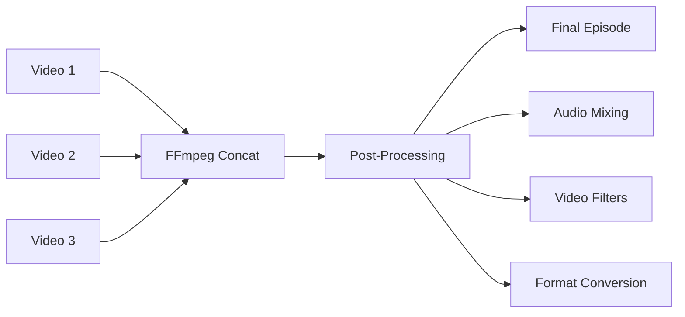

---

## Workflow 9: Asset Management

### Overview
Centralized resource library for managing generated content.

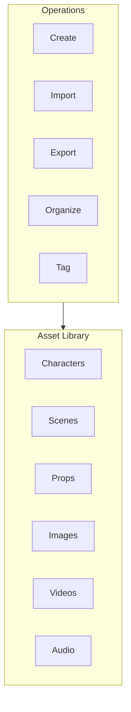

### Asset Types
- **Characters**: Character designs with reference images
- **Scenes**: Background images and locations
- **Props**: Object designs for storyboards
- **Images**: Generated character/scene images
- **Videos**: Generated video clips
- **Audio**: Extracted audio, sound effects, BGM

---

## Workflow 10: System Administration

### Overview
Manage AI service configurations and system settings.

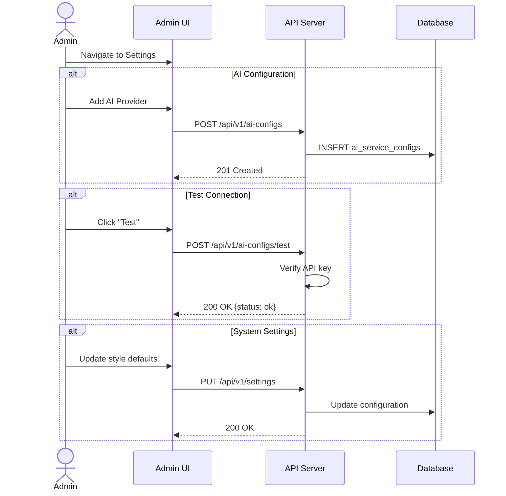

### Configuration Management
- **AI Providers**: OpenAI, Doubao, custom providers
- **Style Templates**: Default visual style settings
- **System Language**: i18n support (Chinese/English)
- **Storage Settings**: Local path configuration

---

## Data Flow Diagram

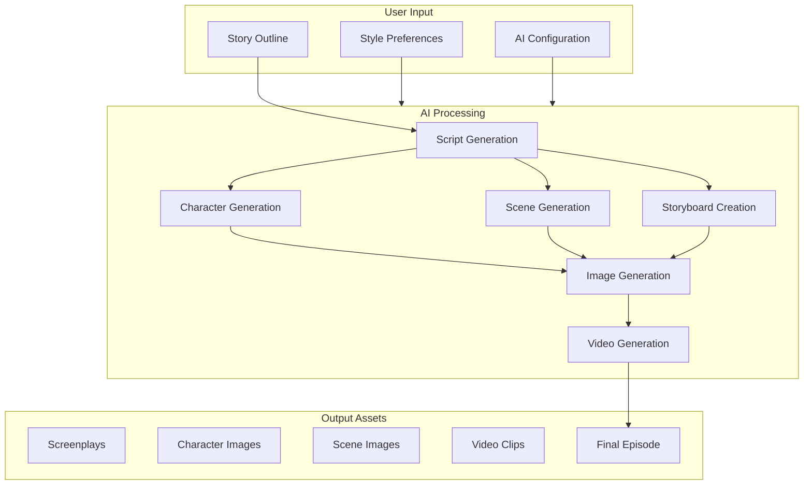

---

## Error Handling Workflows

### Async Task Failure Recovery
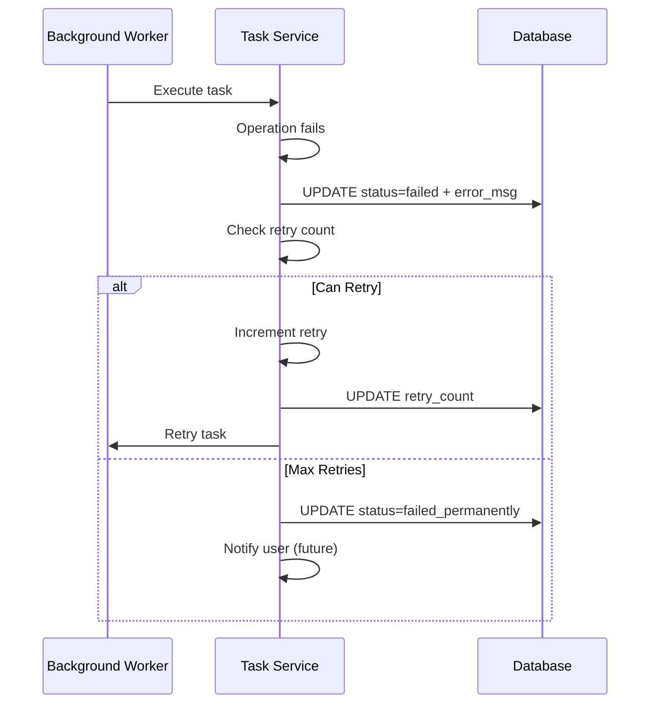

---

## Workflow Metrics

| Workflow | Average Duration | Async | AI Dependent |
|----------|------------------|-------|--------------|
| Drama Creation | < 1s | No | No |
| Script Generation | 10-30s | Yes | Yes |
| Character Generation | 15-45s | Yes | Yes |
| Storyboard Creation | 5-15s | No | Optional |
| Image Generation | 20-60s | Yes | Yes |
| Video Generation | 60-180s | Yes | Yes |
| Video Merging | 30-120s | Yes | No |

---

*For detailed API documentation, see [4. Deep Dive/api-layer.md](./4.Deep-Dive/api-layer.md)*

*For service implementation details, see [4. Deep Dive/application-layer.md](./4.Deep-Dive/application-layer.md)*
