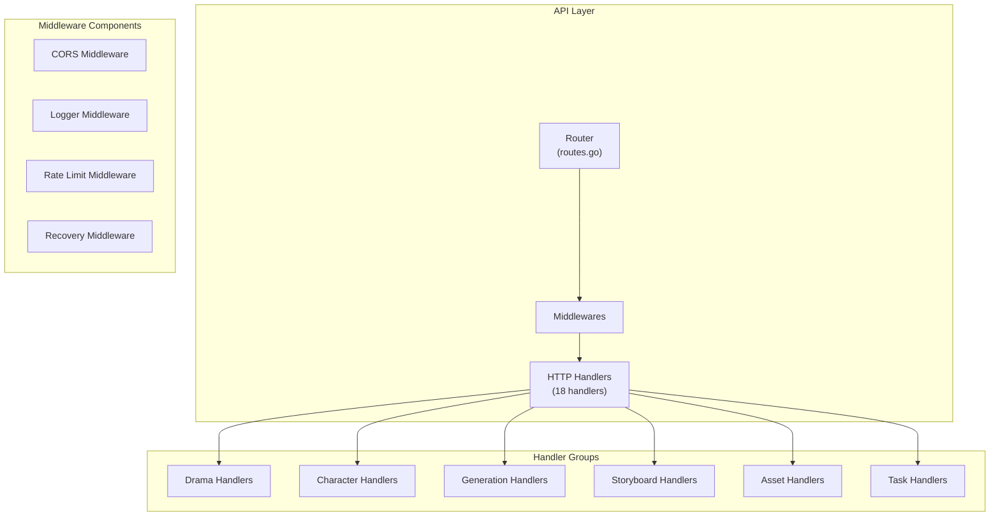
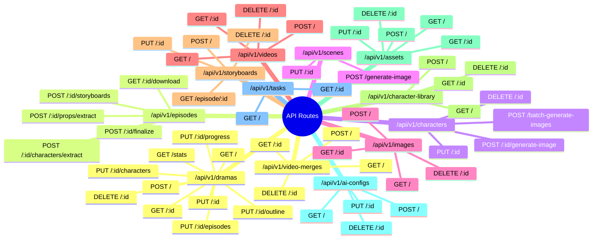
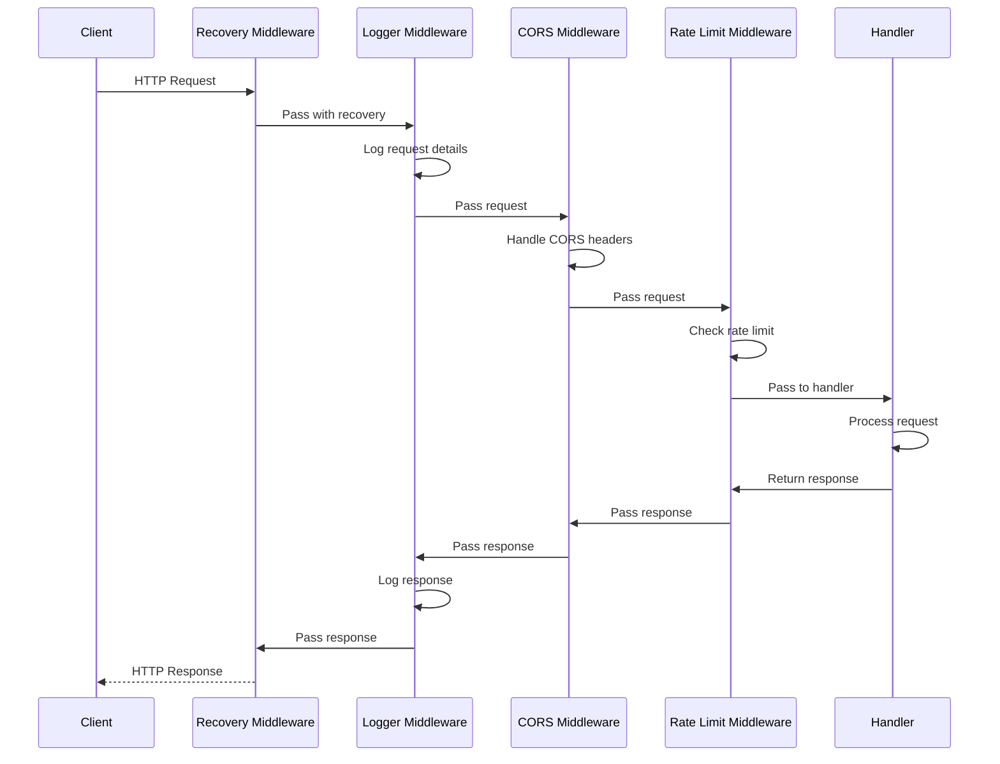
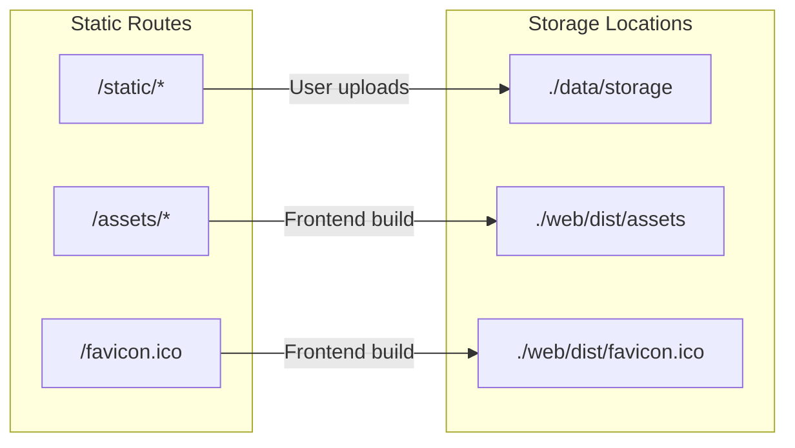

# API Layer Documentation

## Overview

The API Layer is the outermost layer of the DDD architecture, responsible for handling HTTP requests, routing, middleware processing, and delegating to application services.

## Architecture



## Route Structure



## Middleware Stack

### Request Flow



### Middleware Details

| Middleware | File | Purpose | Order |
|------------|------|---------|-------|
| **Recovery** | Built-in | Panic recovery and error handling | 1st |
| **Logger** | `middlewares/logger.go` | Request/response logging with Zap | 2nd |
| **CORS** | `middlewares/cors.go` | Cross-origin request handling | 3rd |
| **Rate Limit** | `middlewares/ratelimit.go` | Request throttling | 4th (API group) |

### CORS Middleware
```go
// Configurable allowed origins from config.yaml
func CORSMiddleware(origins []string) gin.HandlerFunc {
    return func(c *gin.Context) {
        origin := c.Request.Header.Get("Origin")
        // Check if origin is in whitelist
        // Set appropriate headers
    }
}
```

### Logger Middleware
```go
// Structured logging with Zap
func LoggerMiddleware(log *logger.Logger) gin.HandlerFunc {
    return func(c *gin.Context) {
        start := time.Now()
        c.Next()
        // Log: method, path, status, duration, client IP
    }
}
```

### Rate Limit Middleware
```go
// Simple rate limiting for API protection
func RateLimitMiddleware() gin.HandlerFunc {
    // Implement rate limiting logic
}
```

## Handler Architecture

### Handler Pattern

All handlers follow a consistent pattern:

```go
type DramaHandler struct {
    db      *gorm.DB
    cfg     *config.Config
    log     *logger.Logger
    service *services.DramaService
}

func NewDramaHandler(db *gorm.DB, cfg *config.Config, log *logger.Logger, svc *services.DramaService) *DramaHandler {
    return &DramaHandler{
        db:      db,
        cfg:     cfg,
        log:     log,
        service: svc,
    }
}

func (h *DramaHandler) CreateDrama(c *gin.Context) {
    // 1. Bind and validate request
    var req CreateDramaRequest
    if err := c.ShouldBindJSON(&req); err != nil {
        c.JSON(400, gin.H{"error": err.Error()})
        return
    }
    
    // 2. Call service layer
    drama, err := h.service.CreateDrama(&req)
    if err != nil {
        h.log.Errorw("Failed to create drama", "error", err)
        c.JSON(500, gin.H{"error": "Internal server error"})
        return
    }
    
    // 3. Return response
    c.JSON(201, drama)
}
```

## Handler Inventory (18 Handlers)

### Drama Management

| Handler | File | Methods | Routes |
|---------|------|---------|--------|
| **DramaHandler** | `handlers/drama.go` | 10 | `/dramas/*` |

Key methods:
- `ListDramas` - GET `/dramas`
- `CreateDrama` - POST `/dramas`
- `GetDrama` - GET `/dramas/:id`
- `UpdateDrama` - PUT `/dramas/:id`
- `DeleteDrama` - DELETE `/dramas/:id`
- `GetDramaStats` - GET `/dramas/stats`
- `SaveOutline` - PUT `/dramas/:id/outline`
- `SaveCharacters` - PUT `/dramas/:id/characters`
- `SaveEpisodes` - PUT `/dramas/:id/episodes`
- `SaveProgress` - PUT `/dramas/:id/progress`

### Character Management

| Handler | File | Methods | Routes |
|---------|------|---------|--------|
| **CharacterLibraryHandler** | `handlers/character_library.go` | 12 | `/character-library/*`, `/characters/*` |
| **CharacterBatchHandler** | `handlers/character_batch.go` | 2 | `/characters/batch-*` |

Key methods:
- `ListLibraryItems` - Character library CRUD
- `GenerateCharacterImage` - Single image generation
- `BatchGenerateCharacterImages` - Batch processing
- `ExtractCharacters` - AI character extraction from script

### Content Generation

| Handler | File | Methods | Routes |
|---------|------|---------|--------|
| **ScriptGenerationHandler** | `handlers/script_generation.go` | 2 | `/generation/*` |
| **ImageGenerationHandler** | `handlers/image_generation.go` | 9 | `/images/*` |
| **VideoGenerationHandler** | `handlers/video_generation.go` | 8 | `/videos/*` |

Key methods:
- `GenerateCharacters` - AI character generation
- `GenerateImage` - Single image generation
- `BatchGenerateForEpisode` - Batch episode images
- `GenerateVideo` - Video creation
- `BatchGenerateForEpisode` (videos) - Batch video generation

### Storyboard & Scene Management

| Handler | File | Methods | Routes |
|---------|------|---------|--------|
| **StoryboardHandler** | `handlers/storyboard.go` | 5 | `/storyboards/*`, `/episodes/:id/storyboards` |
| **SceneHandler** | `handlers/scene.go` | 6 | `/scenes/*`, `/episodes/:id/storyboards` |

Key methods:
- `GenerateStoryboard` - Create storyboards from script
- `CreateStoryboard` - Manual storyboard creation
- `UpdateScene` - Update scene details
- `GenerateSceneImage` - Background generation

### Asset & Resource Management

| Handler | File | Methods | Routes |
|---------|------|---------|--------|
| **AssetHandler** | `handlers/asset.go` | 7 | `/assets/*` |
| **UploadHandler** | `handlers/upload.go` | 3 | `/upload/*`, `/characters/:id/upload-image` |
| **PropHandler** | `handlers/prop.go` | 7 | `/props/*`, `/dramas/:id/props` |

Key methods:
- `ListAssets` - Asset library
- `UploadImage` - File upload handling
- `CreateProp` - Prop creation
- `ExtractProps` - AI prop extraction

### System & Administration

| Handler | File | Methods | Routes |
|---------|------|---------|--------|
| **AIConfigHandler** | `handlers/ai_config.go` | 6 | `/ai-configs/*` |
| **TaskHandler** | `handlers/task.go` | 3 | `/tasks/*` |
| **VideoMergeHandler** | `handlers/video_merge.go` | 5 | `/video-merges/*` |
| **SettingsHandler** | `handlers/settings.go` | 2 | `/settings/*` |
| **AudioExtractionHandler** | `handlers/audio_extraction.go` | 2 | `/audio/*` |
| **FramePromptHandler** | `handlers/frame_prompt.go` | 2 | `/storyboards/:id/frame-prompt*` |

## Request/Response Patterns

### Success Responses

```go
// Single resource
c.JSON(200, resource)

// Collection
c.JSON(200, gin.H{
    "data": resources,
    "total": total,
    "page": page,
    "page_size": pageSize,
})

// Created
c.JSON(201, resource)

// Accepted (async task)
c.JSON(202, gin.H{
    "task_id": taskID,
    "status": "pending",
    "message": "Task queued",
})

// No Content
c.Status(204)
```

### Error Responses

```go
// Validation Error
c.JSON(400, gin.H{
    "error": "Validation failed",
    "details": validationErrors,
})

// Not Found
c.JSON(404, gin.H{
    "error": "Resource not found",
})

// Internal Error
c.JSON(500, gin.H{
    "error": "Internal server error",
})

// Service Unavailable (AI service down)
c.JSON(503, gin.H{
    "error": "AI service unavailable",
})
```

## Static File Serving

### File Structure



### SPA Fallback

```go
// NoRoute handler for SPA
r.NoRoute(func(c *gin.Context) {
    path := c.Request.URL.Path
    
    // API 404
    if strings.HasPrefix(path, "/api") {
        c.JSON(404, gin.H{"error": "API endpoint not found"})
        return
    }
    
    // SPA fallback
    c.File("./web/dist/index.html")
})
```

## Route Configuration

### Route Groups

```go
api := r.Group("/api/v1")
{
    api.Use(middlewares2.RateLimitMiddleware())
    
    // Drama routes
    dramas := api.Group("/dramas")
    // ...
    
    // Episode routes
    episodes := api.Group("/episodes")
    // ...
    
    // Character routes
    characters := api.Group("/characters")
    // ...
}
```

### Route Table

| Method | Route | Handler | Description |
|--------|-------|---------|-------------|
| GET | `/health` | Built-in | Health check endpoint |
| GET | `/api/v1/dramas` | ListDramas | List all dramas |
| POST | `/api/v1/dramas` | CreateDrama | Create new drama |
| GET | `/api/v1/dramas/:id` | GetDrama | Get drama details |
| PUT | `/api/v1/dramas/:id` | UpdateDrama | Update drama |
| DELETE | `/api/v1/dramas/:id` | DeleteDrama | Delete drama |
| POST | `/api/v1/episodes/:id/storyboards` | GenerateStoryboard | Generate storyboards |
| POST | `/api/v1/characters/:id/generate-image` | GenerateCharacterImage | Generate character image |
| POST | `/api/v1/images` | GenerateImage | Generate image |
| POST | `/api/v1/videos` | GenerateVideo | Generate video |
| POST | `/api/v1/video-merges` | MergeVideos | Merge video clips |
| GET | `/api/v1/tasks/:id` | GetTaskStatus | Get async task status |

## Error Handling Strategy

### Middleware Recovery

```go
// Panic recovery at top of middleware chain
r.Use(gin.Recovery())
```

### Structured Error Logging

```go
h.log.Errorw("Operation failed",
    "error", err,
    "resource_id", id,
    "operation", "create",
)
```

### Client Error Responses

```go
// Consistent error format
{
    "error": "Human-readable message",
    "code": "ERROR_CODE",      // Optional
    "details": {}              // Optional extra info
}
```

## Testing Handlers

### Unit Test Pattern

```go
func TestCreateDrama(t *testing.T) {
    // Setup
    gin.SetMode(gin.TestMode)
    w := httptest.NewRecorder()
    c, _ := gin.CreateTestContext(w)
    
    // Build request
    body := `{"title":"Test Drama"}`
    c.Request, _ = http.NewRequest("POST", "/dramas", strings.NewReader(body))
    c.Request.Header.Set("Content-Type", "application/json")
    
    // Execute
    handler := NewDramaHandler(db, cfg, log, svc)
    handler.CreateDrama(c)
    
    // Assert
    assert.Equal(t, 201, w.Code)
}
```

---

*For service layer documentation, see [application-layer.md](./application-layer.md)*