# Domain Layer Documentation

## Overview

The Domain Layer is the core of the DDD architecture, containing business entities, value objects, and domain logic. It has no dependencies on external frameworks or infrastructure - it's pure business logic.

## Architecture

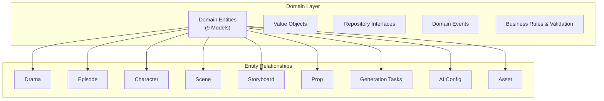

## Domain Models (9 Entities)

### 1. Drama

The aggregate root representing a complete drama project.

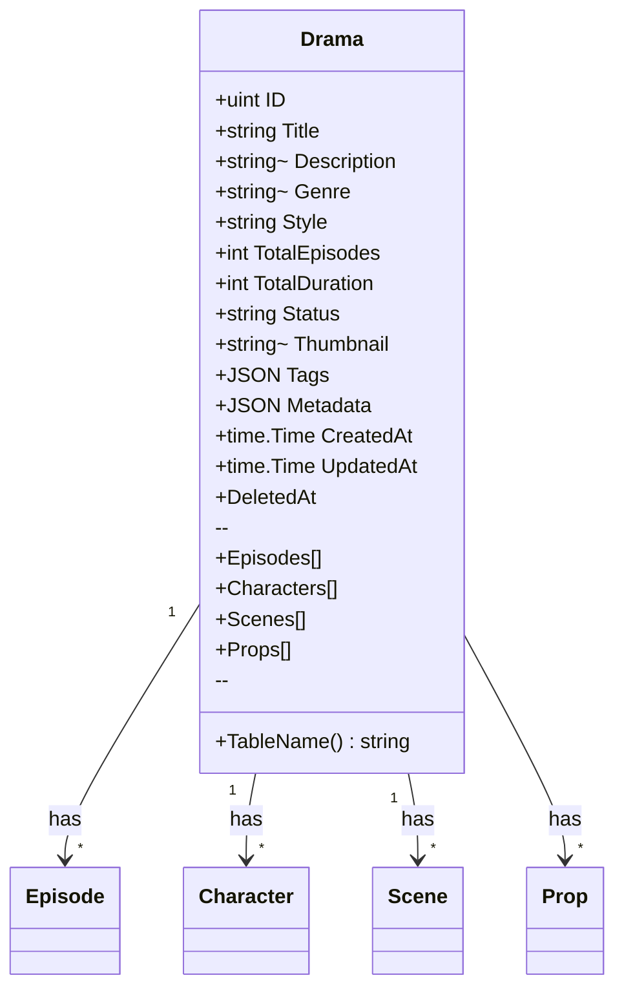

**Fields:**
| Field | Type | Description |
|-------|------|-------------|
| ID | uint | Primary key, auto-increment |
| Title | string (200) | Drama name (required) |
| Description | *string | Project summary |
| Genre | *string (50) | Category (romance, action, etc.) |
| Style | string (50) | Visual style (anime, realistic) |
| TotalEpisodes | int | Number of episodes |
| TotalDuration | int | Total runtime in minutes |
| Status | string (20) | draft/planning/production/completed/archived |
| Thumbnail | *string (500) | Preview image URL |
| Tags | JSON | Category tags |
| Metadata | JSON | Workflow progress, settings |
| CreatedAt | time.Time | Creation timestamp |
| UpdatedAt | time.Time | Last update timestamp |

**Status Workflow:**
```
draft → planning → production → completed → archived
```

**Metadata Structure:**
```json
{
  "current_step": "character_design",
  "step_data": {
    "outline_completed": true,
    "script_generated": true,
    "characters_extracted": 5
  }
}
```

### 2. Episode

Represents a single episode/chapter within a drama.

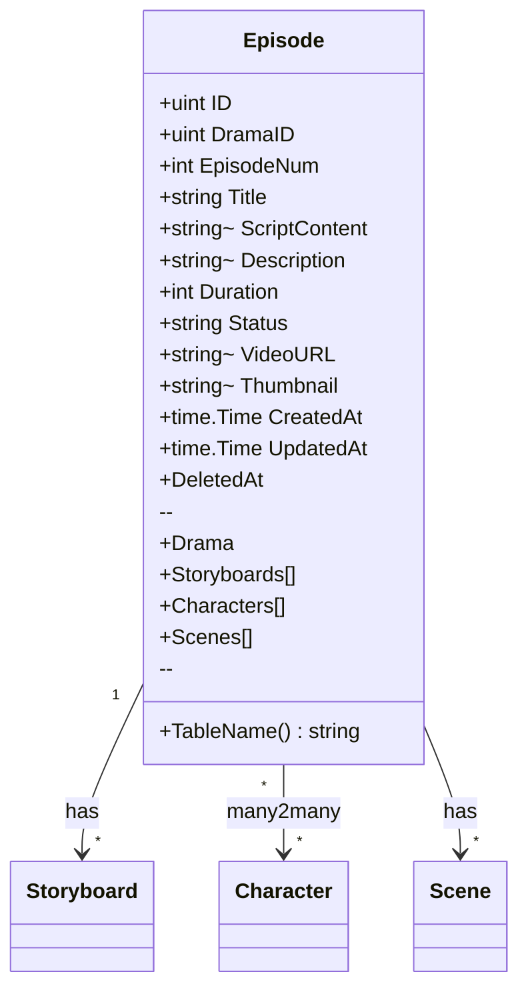

**Fields:**
| Field | Type | Description |
|-------|------|-------------|
| ID | uint | Primary key |
| DramaID | uint | Foreign key to Drama |
| EpisodeNum | int | Episode number (1, 2, 3...) |
| Title | string (200) | Episode title |
| ScriptContent | *string (longtext) | Full screenplay |
| Description | *string | Episode summary |
| Duration | int | Runtime in minutes |
| Status | string (20) | draft/production/completed |
| VideoURL | *string (500) | Final video URL |
| Thumbnail | *string (500) | Episode thumbnail |

### 3. Character

Represents a character in the drama with appearance and personality.

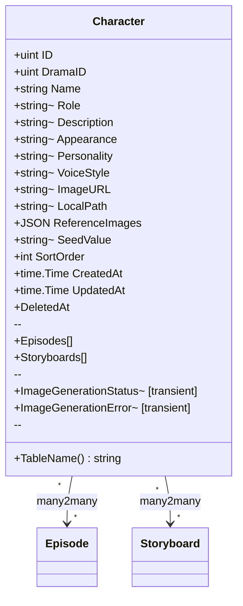

**Fields:**
| Field | Type | Description |
|-------|------|-------------|
| ID | uint | Primary key |
| DramaID | uint | Parent drama |
| Name | string (100) | Character name |
| Role | *string (50) | Protagonist, antagonist, supporting |
| Description | *string | Character bio |
| Appearance | *string | Physical description |
| Personality | *string | Character traits |
| VoiceStyle | *string (200) | Voice characteristics |
| ImageURL | *string (500) | Generated image URL |
| LocalPath | *string | Local file path |
| ReferenceImages | JSON | Multiple reference angles |
| SeedValue | *string (100) | AI generation seed for consistency |
| SortOrder | int | Display order |

**Transient Fields:**
- `ImageGenerationStatus` - Current image generation state (pending/processing/completed/failed)
- `ImageGenerationError` - Error message if failed

### 4. Scene

Represents a location/background setting.

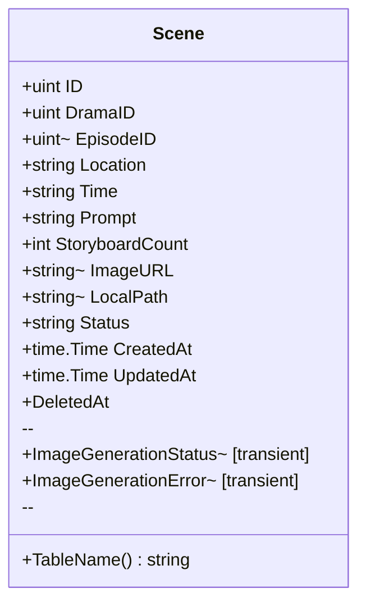

**Fields:**
| Field | Type | Description |
|-------|------|-------------|
| ID | uint | Primary key |
| DramaID | uint | Parent drama |
| EpisodeID | *uint | Associated episode |
| Location | string (200) | Place name |
| Time | string (100) | Time of day/season |
| Prompt | string (text) | AI generation prompt |
| StoryboardCount | int | Usage count |
| ImageURL | *string (500) | Generated image |
| LocalPath | *string | Local file path |
| Status | string (20) | pending/generated/failed |

### 5. Storyboard

Represents a single shot/scene breakdown.

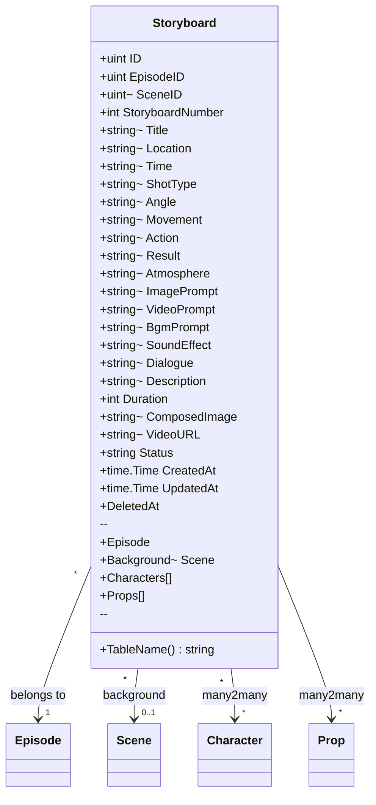

**Fields:**
| Field | Type | Description |
|-------|------|-------------|
| ID | uint | Primary key |
| EpisodeID | uint | Parent episode |
| SceneID | *uint | Background scene reference |
| StoryboardNumber | int | Shot sequence number |
| Title | *string (255) | Shot title |
| Location | *string (255) | Where shot takes place |
| Time | *string (255) | When shot takes place |
| ShotType | *string (100) | Wide, medium, close-up, etc. |
| Angle | *string (100) | Camera angle |
| Movement | *string (100) | Camera movement |
| Action | *string (text) | What happens |
| Result | *string (text) | Outcome of action |
| Atmosphere | *string (text) | Mood/feeling |
| ImagePrompt | *string (text) | AI image prompt |
| VideoPrompt | *string (text) | AI video prompt |
| BgmPrompt | *string (text) | Background music prompt |
| SoundEffect | *string (255) | SFX description |
| Dialogue | *string (text) | Character dialogue |
| Description | *string (text) | General description |
| Duration | int | Shot duration in seconds |
| ComposedImage | *string (text) | Final composed image |
| VideoURL | *string (text) | Generated video URL |
| Status | string (20) | pending/image_ready/video_ready/completed |

### 6. Prop

Represents physical objects used in scenes.

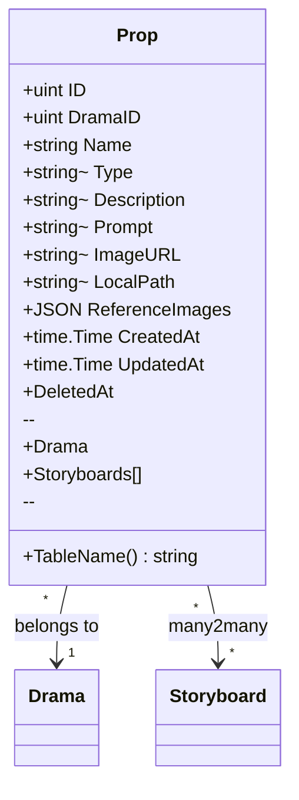

**Fields:**
| Field | Type | Description |
|-------|------|-------------|
| ID | uint | Primary key |
| DramaID | uint | Parent drama |
| Name | string (100) | Object name |
| Type | *string (50) | weapon, daily, vehicle, etc. |
| Description | *string | Object description |
| Prompt | *string (text) | AI generation prompt |
| ImageURL | *string (500) | Generated image |
| LocalPath | *string | Local file path |
| ReferenceImages | JSON | Reference angles |

### 7. ImageGeneration

Tracks AI image generation tasks.

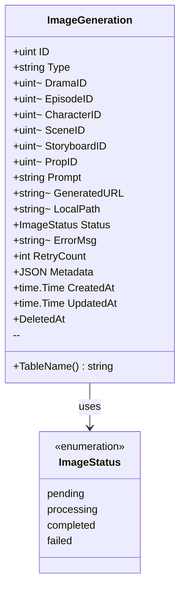

**Fields:**
| Field | Type | Description |
|-------|------|-------------|
| ID | uint | Primary key |
| Type | string | character/scene/storyboard/prop |
| DramaID | *uint | Parent drama |
| EpisodeID | *uint | Parent episode |
| CharacterID | *uint | For character images |
| SceneID | *uint | For scene images |
| StoryboardID | *uint | For storyboard images |
| PropID | *uint | For prop images |
| Prompt | string (text) | AI prompt used |
| GeneratedURL | *string (500) | AI service URL |
| LocalPath | *string | Local stored path |
| Status | ImageStatus | pending/processing/completed/failed |
| ErrorMsg | *string | Error description |
| RetryCount | int | Retry attempts |
| Metadata | JSON | Extra info (seed, size, etc.) |

**Status Enum:**
```go
type ImageStatus string

const (
    ImageStatusPending     ImageStatus = "pending"
    ImageStatusProcessing  ImageStatus = "processing"
    ImageStatusCompleted   ImageStatus = "completed"
    ImageStatusFailed      ImageStatus = "failed"
)
```

### 8. VideoGeneration

Tracks AI video generation tasks.

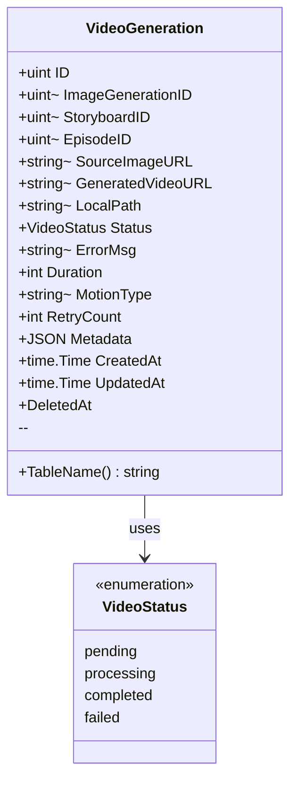

**Fields:**
| Field | Type | Description |
|-------|------|-------------|
| ID | uint | Primary key |
| ImageGenerationID | *uint | Source image |
| StoryboardID | *uint | Parent storyboard |
| EpisodeID | *uint | Parent episode |
| SourceImageURL | *string (500) | Input image |
| GeneratedVideoURL | *string (500) | Output video |
| LocalPath | *string | Local stored path |
| Status | VideoStatus | Generation status |
| ErrorMsg | *string | Error description |
| Duration | int | Video length (seconds) |
| MotionType | *string | Camera motion type |
| RetryCount | int | Retry attempts |
| Metadata | JSON | Generation params |

### 9. AsyncTask

General-purpose async task tracking.

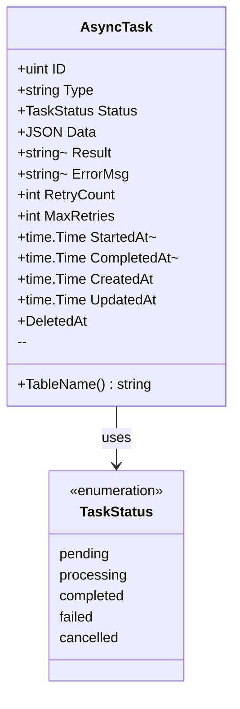

**Fields:**
| Field | Type | Description |
|-------|------|-------------|
| ID | uint | Primary key |
| Type | string | Task type identifier |
| Status | TaskStatus | Current state |
| Data | JSON | Task input data |
| Result | *string | Task output |
| ErrorMsg | *string | Error if failed |
| RetryCount | int | Current retry count |
| MaxRetries | int | Maximum retries |
| StartedAt | *time.Time | When processing started |
| CompletedAt | *time.Time | When completed |

### Supporting Entities

#### AIServiceConfig & AIServiceProvider

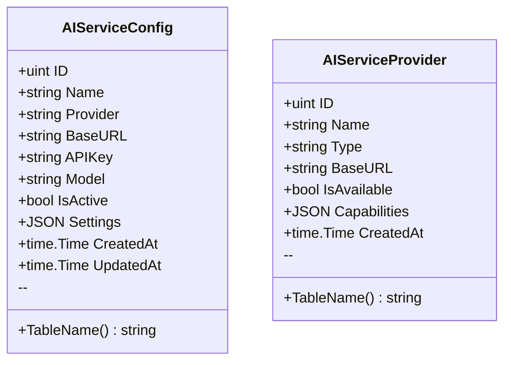

#### CharacterLibrary

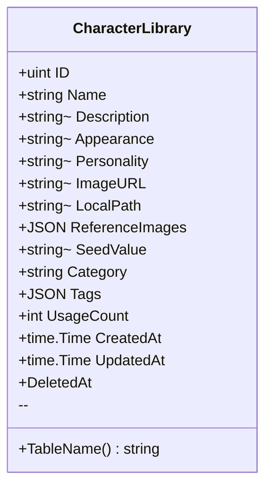

#### Asset

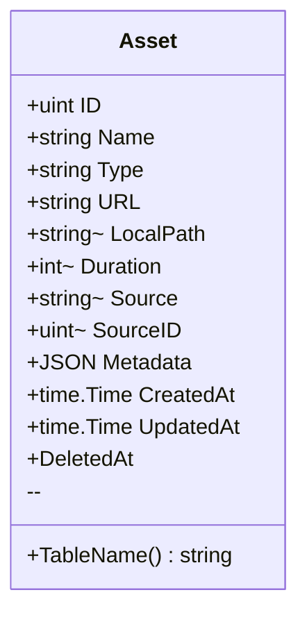

#### VideoMerge

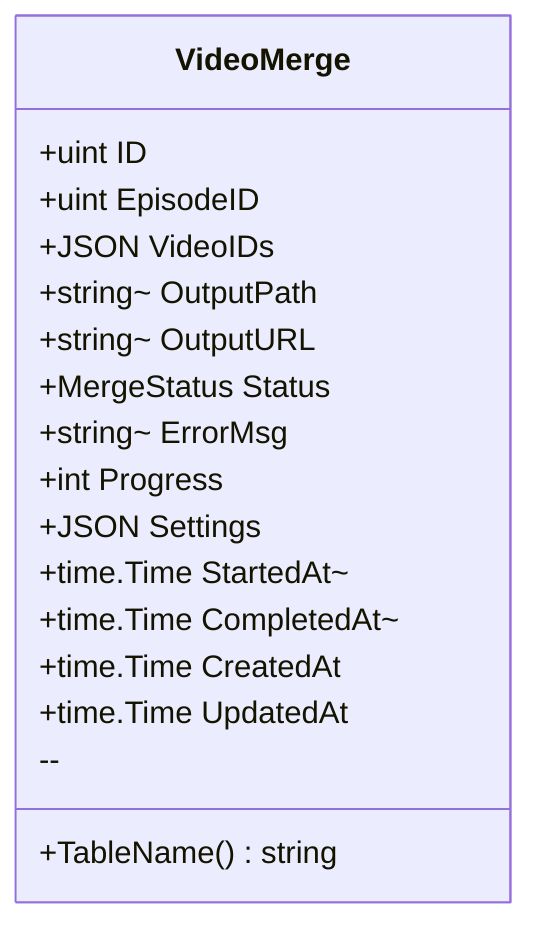

## Entity Relationship Diagram (ERD)

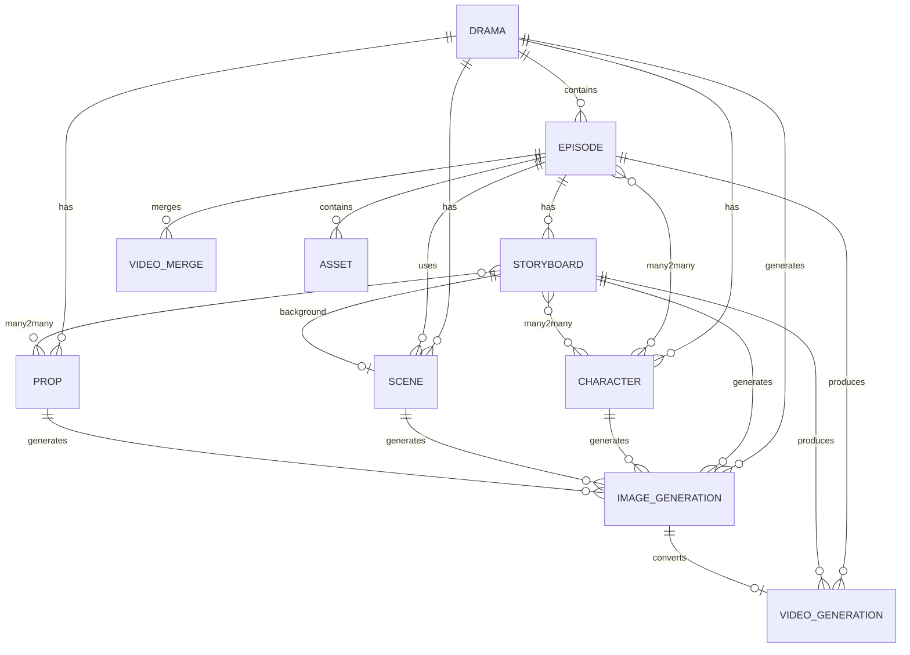

## Domain Logic

### Business Rules

#### Drama Status Transitions

```go
func (d *Drama) CanTransitionTo(newStatus string) bool {
    transitions := map[string][]string{
        "draft":       []string{"planning"},
        "planning":    []string{"production", "draft"},
        "production":  []string{"completed", "planning"},
        "completed":   []string{"archived", "production"},
        "archived":    []string{"completed"},
    }
    
    allowed, ok := transitions[d.Status]
    if !ok {
        return false
    }
    
    for _, s := range allowed {
        if s == newStatus {
            return true
        }
    }
    return false
}
```

#### Image Generation Validation

```go
func (ig *ImageGeneration) CanRetry() bool {
    return ig.RetryCount < 3 && ig.Status == ImageStatusFailed
}

func (ig *ImageGeneration) MarkFailed(err string) {
    ig.Status = ImageStatusFailed
    ig.ErrorMsg = &err
    ig.RetryCount++
}
```

#### Episode Duration Calculation

```go
func (e *Episode) CalculateDuration() int {
    total := 0
    for _, sb := range e.Storyboards {
        total += sb.Duration
    }
    // Convert to minutes, round up
    return (total + 59) / 60
}
```

### Value Objects

#### Style Configuration

```go
type StyleConfig struct {
    StyleBase           []string `json:"style_base"`
    Lighting            []string `json:"lighting"`
    Texture             []string `json:"texture"`
    Composition         []string `json:"composition"`
    StyleReferences     []string `json:"style_references"`
    ConsistencyControls []string `json:"consistency_controls"`
}

func (s *StyleConfig) ToPrompt() string {
    var parts []string
    parts = append(parts, s.StyleBase...)
    parts = append(parts, s.Lighting...)
    parts = append(parts, s.Texture...)
    return strings.Join(parts, ", ")
}
```

#### Image Size

```go
type ImageSize struct {
    Width  int
    Height int
}

func (s ImageSize) String() string {
    return fmt.Sprintf("%dx%d", s.Width, s.Height)
}

func (s ImageSize) Ratio() string {
    gcd := gcd(s.Width, s.Height)
    return fmt.Sprintf("%d:%d", s.Width/gcd, s.Height/gcd)
}
```

## Repository Interfaces

```go
// Domain layer defines interfaces
type DramaRepository interface {
    Create(drama *Drama) error
    GetByID(id uint) (*Drama, error)
    List(query DramaListQuery) ([]Drama, int64, error)
    Update(drama *Drama) error
    Delete(id uint) error
}

type CharacterRepository interface {
    Create(character *Character) error
    GetByID(id uint) (*Character, error)
    ListByDrama(dramaID uint) ([]Character, error)
    Update(character *Character) error
    Delete(id uint) error
}

// Infrastructure layer implements them
type GormDramaRepository struct {
    db *gorm.DB
}

func (r *GormDramaRepository) Create(drama *Drama) error {
    return r.db.Create(drama).Error
}
```

## Testing Domain Logic

```go
func TestDrama_CanTransitionTo(t *testing.T) {
    drama := &Drama{Status: "draft"}
    
    assert.True(t, drama.CanTransitionTo("planning"))
    assert.False(t, drama.CanTransitionTo("completed"))
}

func TestEpisode_CalculateDuration(t *testing.T) {
    episode := &Episode{
        Storyboards: []Storyboard{
            {Duration: 5},
            {Duration: 10},
            {Duration: 7},
        },
    }
    
    duration := episode.CalculateDuration()
    assert.Equal(t, 1, duration) // 22 seconds = 1 minute
}
```

---

*For infrastructure layer documentation, see [infrastructure-layer.md](./infrastructure-layer.md)*