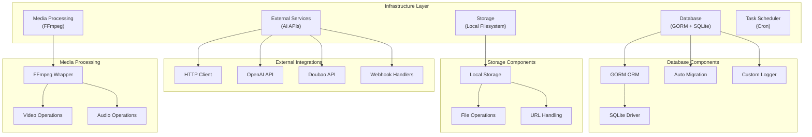
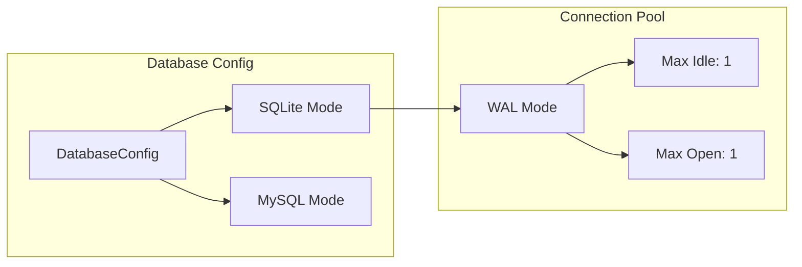
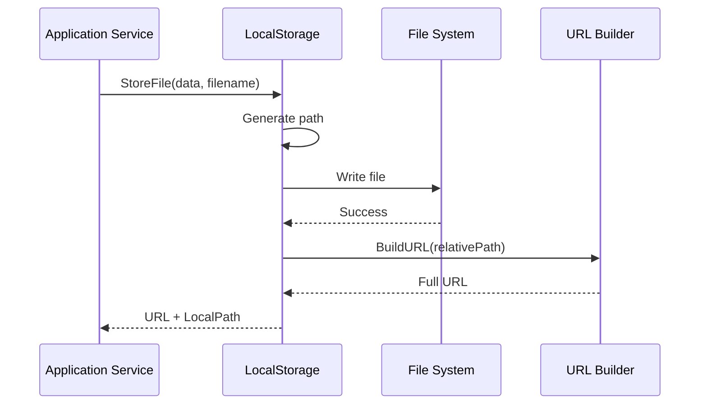
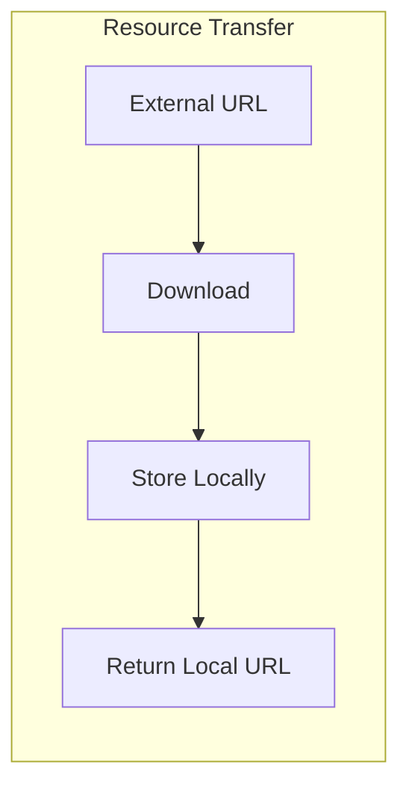
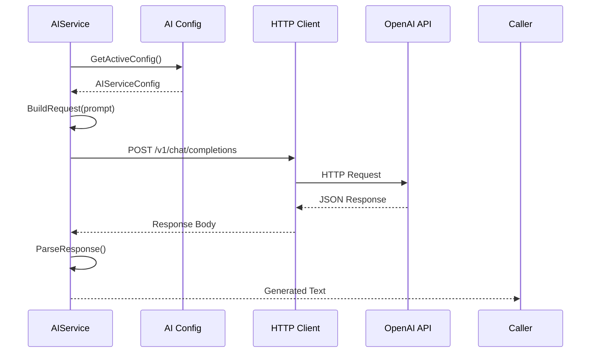
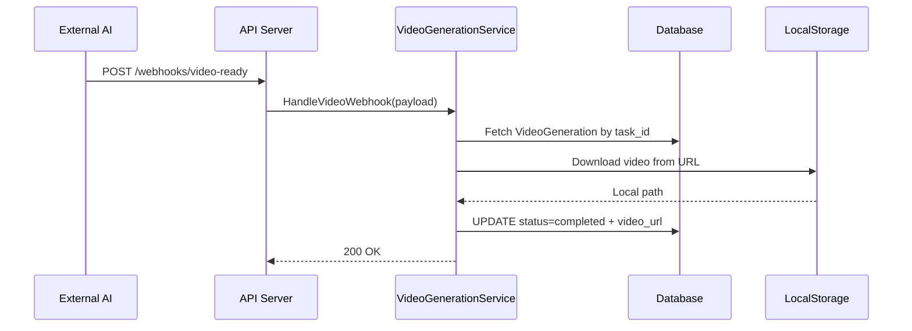
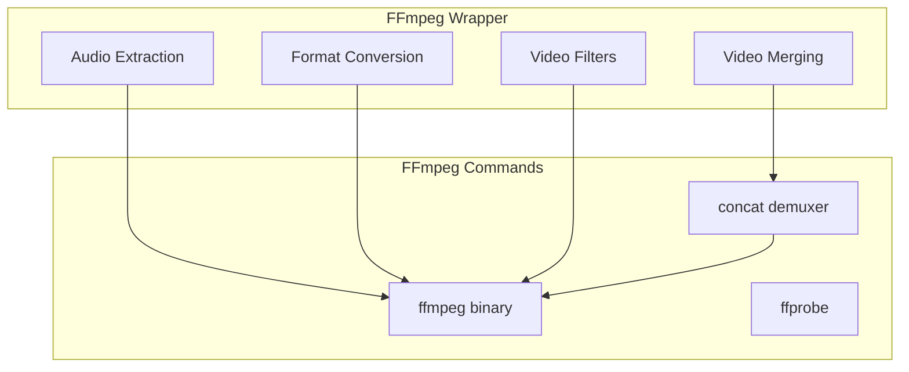
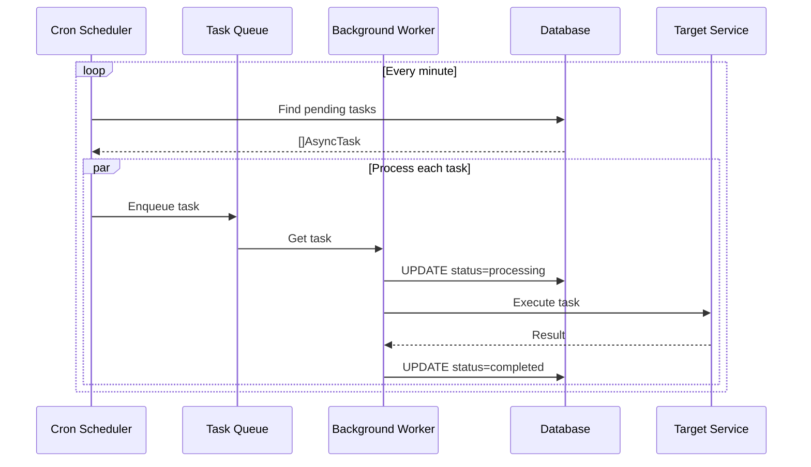

# Infrastructure Layer Documentation

## Overview

The Infrastructure Layer provides technical capabilities that support the upper layers. It implements interfaces defined by the Domain Layer and provides concrete implementations for data persistence, external service communication, file storage, and media processing.

## Architecture



## Database Infrastructure

### Database Configuration



**SQLite Optimization:**
```go
// DSN with performance parameters
dsnWithParams := dsn + "?_journal_mode=WAL&_busy_timeout=5000&_synchronous=NORMAL&cache=shared"
```

**Connection Pool Settings:**
- **MaxIdleConns**: 1 (SQLite single writer)
- **MaxOpenConns**: 1 (SQLite concurrency limit)
- **ConnMaxLifetime**: 1 hour

### Database Implementation

**File:** `infrastructure/database/database.go`

```go
func NewDatabase(cfg config.DatabaseConfig) (*gorm.DB, error) {
    // 1. Create directory for SQLite
    if cfg.Type == "sqlite" {
        dbDir := filepath.Dir(cfg.DSN())
        if err := os.MkdirAll(dbDir, 0755); err != nil {
            return nil, fmt.Errorf("failed to create database directory: %w", err)
        }
    }
    
    // 2. Configure GORM
    gormConfig := &gorm.Config{
        Logger: NewCustomLogger(),
    }
    
    // 3. Open connection
    var db *gorm.DB
    var err error
    
    if cfg.Type == "sqlite" {
        // modernc.org/sqlite - pure Go, no CGO
        db, err = gorm.Open(sqlite.Dialector{
            DriverName: "sqlite",
            DSN:        dsnWithParams,
        }, gormConfig)
    } else {
        db, err = gorm.Open(mysql.Open(dsn), gormConfig)
    }
    
    // 4. Configure connection pool
    sqlDB, _ := db.DB()
    sqlDB.SetMaxIdleConns(1)
    sqlDB.SetMaxOpenConns(1)
    sqlDB.SetConnMaxLifetime(time.Hour)
    
    return db, nil
}
```

### Auto Migration

**File:** `infrastructure/database/database.go`

```go
func AutoMigrate(db *gorm.DB) error {
    return db.AutoMigrate(
        // Core models
        &models.Drama{},
        &models.Episode{},
        &models.Character{},
        &models.Scene{},
        &models.Storyboard{},
        &models.FramePrompt{},
        &models.Prop{},
        
        // Generation tracking
        &models.ImageGeneration{},
        &models.VideoGeneration{},
        &models.VideoMerge{},
        
        // Configuration
        &models.AIServiceConfig{},
        &models.AIServiceProvider{},
        
        // Resources
        &models.Asset{},
        &models.CharacterLibrary{},
        
        // Tasks
        &models.AsyncTask{},
    )
}
```

### Custom Logger

**File:** `infrastructure/database/custom_logger.go`

```go
type CustomLogger struct {
    logger *zap.Logger
}

func (l *CustomLogger) LogMode(level logger.LogLevel) logger.Interface {
    return l
}

func (l *CustomLogger) Info(ctx context.Context, msg string, data ...interface{}) {
    l.logger.Sugar().Infof(msg, data...)
}

func (l *CustomLogger) Error(ctx context.Context, msg string, data ...interface{}) {
    l.logger.Sugar().Errorf(msg, data...)
}

// Implements GORM's logger.Interface
```

### Database Schema

```mermaid
erDiagram
    DRAMAS {
        uint ID PK
        string Title
        string Description
        string Genre
        string Style
        int TotalEpisodes
        int TotalDuration
        string Status
        string Thumbnail
        json Tags
        json Metadata
        datetime CreatedAt
        datetime UpdatedAt
        datetime DeletedAt
    }
    
    EPISODES {
        uint ID PK
        uint DramaID FK
        int EpisodeNum
        string Title
        text ScriptContent
        string Description
        int Duration
        string Status
        string VideoURL
        string Thumbnail
        datetime CreatedAt
        datetime UpdatedAt
    }
    
    CHARACTERS {
        uint ID PK
        uint DramaID FK
        string Name
        string Role
        text Description
        text Appearance
        text Personality
        string VoiceStyle
        string ImageURL
        string LocalPath
        json ReferenceImages
        string SeedValue
        int SortOrder
        datetime CreatedAt
        datetime UpdatedAt
    }
    
    SCENES {
        uint ID PK
        uint DramaID FK
        uint EpisodeID FK
        string Location
        string Time
        text Prompt
        int StoryboardCount
        string ImageURL
        string LocalPath
        string Status
        datetime CreatedAt
        datetime UpdatedAt
    }
    
    STORYBOARDS {
        uint ID PK
        uint EpisodeID FK
        uint SceneID FK
        int StoryboardNumber
        string Title
        string Location
        string Time
        string ShotType
        string Angle
        string Movement
        text Action
        text Result
        text Atmosphere
        text ImagePrompt
        text VideoPrompt
        text BgmPrompt
        string SoundEffect
        text Dialogue
        text Description
        int Duration
        string ComposedImage
        string VideoURL
        string Status
        datetime CreatedAt
        datetime UpdatedAt
    }
    
    PROPS {
        uint ID PK
        uint DramaID FK
        string Name
        string Type
        text Description
        text Prompt
        string ImageURL
        string LocalPath
        json ReferenceImages
        datetime CreatedAt
        datetime UpdatedAt
    }
    
    IMAGE_GENERATIONS {
        uint ID PK
        string Type
        uint DramaID FK
        uint EpisodeID FK
        uint CharacterID FK
        uint SceneID FK
        uint StoryboardID FK
        uint PropID FK
        text Prompt
        string GeneratedURL
        string LocalPath
        string Status
        string ErrorMsg
        int RetryCount
        json Metadata
        datetime CreatedAt
        datetime UpdatedAt
    }
    
    VIDEO_GENERATIONS {
        uint ID PK
        uint ImageGenerationID FK
        uint StoryboardID FK
        uint EpisodeID FK
        string SourceImageURL
        string GeneratedVideoURL
        string LocalPath
        string Status
        string ErrorMsg
        int Duration
        string MotionType
        int RetryCount
        json Metadata
        datetime CreatedAt
        datetime UpdatedAt
    }
    
    ASYNC_TASKS {
        uint ID PK
        string Type
        string Status
        json Data
        string Result
        string ErrorMsg
        int RetryCount
        int MaxRetries
        datetime StartedAt
        datetime CompletedAt
        datetime CreatedAt
        datetime UpdatedAt
    }
    
    AI_SERVICE_CONFIGS {
        uint ID PK
        string Name
        string Provider
        string BaseURL
        string APIKey
        string Model
        bool IsActive
        json Settings
        datetime CreatedAt
        datetime UpdatedAt
    }
```



## Storage Infrastructure

### Local Storage Implementation

**File:** `infrastructure/storage/local_storage.go`



**Implementation:**
```go
type LocalStorage struct {
    basePath string
    baseURL  string
}

func NewLocalStorage(basePath, baseURL string) (*LocalStorage, error) {
    // Ensure directory exists
    if err := os.MkdirAll(basePath, 0755); err != nil {
        return nil, err
    }
    
    return &LocalStorage{
        basePath: basePath,
        baseURL:  baseURL,
    }, nil
}

func (s *LocalStorage) StoreFile(data []byte, filename string) (string, string, error) {
    // 1. Generate relative path: /images/2024/01/filename.jpg
    relativePath := s.generatePath(filename)
    fullPath := filepath.Join(s.basePath, relativePath)
    
    // 2. Ensure subdirectory exists
    dir := filepath.Dir(fullPath)
    if err := os.MkdirAll(dir, 0755); err != nil {
        return "", "", err
    }
    
    // 3. Write file
    if err := os.WriteFile(fullPath, data, 0644); err != nil {
        return "", "", err
    }
    
    // 4. Build URL
    url := s.baseURL + relativePath
    
    return url, relativePath, nil
}

func (s *LocalStorage) GetFile(relativePath string) ([]byte, error) {
    fullPath := filepath.Join(s.basePath, relativePath)
    return os.ReadFile(fullPath)
}

func (s *LocalStorage) DeleteFile(relativePath string) error {
    fullPath := filepath.Join(s.basePath, relativePath)
    return os.Remove(fullPath)
}
```

### File Organization

```
data/storage/
├── images/
│   ├── 2024/
│   │   ├── 01/
│   │   │   ├── abc123.jpg
│   │   │   └── def456.png
│   │   └── 02/
│   └── 2025/
├── videos/
│   ├── 2024/
│   └── 2025/
├── audio/
│   ├── extracted/
│   └── bgm/
└── uploads/
    └── temp/
```

### URL Handling

**File:** `application/services/resource_transfer_service.go`



**Implementation:**
```go
type ResourceTransferService struct {
    db      *gorm.DB
    log     *logger.Logger
    storage *storage.LocalStorage
}

func (s *ResourceTransferService) TransferExternalURL(externalURL string) (string, error) {
    // 1. Download from external URL
    resp, err := http.Get(externalURL)
    if err != nil {
        return "", err
    }
    defer resp.Body.Close()
    
    // 2. Read content
    data, err := io.ReadAll(resp.Body)
    if err != nil {
        return "", err
    }
    
    // 3. Detect content type and generate filename
    contentType := resp.Header.Get("Content-Type")
    ext := s.getExtensionFromContentType(contentType)
    filename := uuid.New().String() + ext
    
    // 4. Store locally
    url, path, err := s.storage.StoreFile(data, filename)
    if err != nil {
        return "", err
    }
    
    s.log.Infow("Resource transferred",
        "from", externalURL,
        "to", url,
        "path", path,
    )
    
    return url, nil
}
```

## External Service Infrastructure

### HTTP Client Configuration

**Centralized HTTP Client:**
```go
var httpClient = &http.Client{
    Timeout: 10 * time.Minute,
    Transport: &http.Transport{
        MaxIdleConns:        100,
        MaxIdleConnsPerHost: 10,
        IdleConnTimeout:     90 * time.Second,
    },
}
```

### OpenAI Integration

**File:** `application/services/ai_service.go`



**Text Generation:**
```go
func (s *AIService) CallTextGeneration(prompt string, config *models.AIServiceConfig) (string, error) {
    reqBody := map[string]interface{}{
        "model": config.Model,
        "messages": []map[string]string{
            {"role": "user", "content": prompt},
        },
        "temperature": 0.7,
        "max_tokens": 4000,
    }
    
    jsonData, _ := json.Marshal(reqBody)
    
    req, _ := http.NewRequest("POST", config.BaseURL+"/v1/chat/completions", bytes.NewBuffer(jsonData))
    req.Header.Set("Authorization", "Bearer "+config.APIKey)
    req.Header.Set("Content-Type", "application/json")
    
    resp, err := httpClient.Do(req)
    if err != nil {
        return "", err
    }
    defer resp.Body.Close()
    
    // Parse response
    var result struct {
        Choices []struct {
            Message struct {
                Content string `json:"content"`
            } `json:"message"`
        } `json:"choices"`
    }
    
    json.NewDecoder(resp.Body).Decode(&result)
    
    return result.Choices[0].Message.Content, nil
}
```

**Image Generation:**
```go
func (s *AIService) CallImageGeneration(prompt string, size string, config *models.AIServiceConfig) (string, error) {
    reqBody := map[string]interface{}{
        "model": "dall-e-3",
        "prompt": prompt,
        "size": size, // "1024x1024", "1024x1792", "1792x1024"
        "quality": "standard",
        "n": 1,
    }
    
    // Send request to /v1/images/generations
    // Parse and return URL
}
```

### Doubao (Video) Integration

**Video Generation:**
```go
func (s *AIService) CallVideoGeneration(imageURL string, params map[string]interface{}, config *models.AIServiceConfig) (string, error) {
    reqBody := map[string]interface{}{
        "model": config.Model,
        "input": map[string]interface{}{
            "image_url": imageURL,
        },
        "parameters": map[string]interface{}{
            "duration": params["duration"],
            "motion_type": params["motion_type"],
        },
    }
    
    // Send request to Doubao API
    // Return task ID for async processing
}
```

### Webhook Handling



## Media Processing Infrastructure

### FFmpeg Integration

**File:** `infrastructure/external/ffmpeg/ffmpeg.go`



**FFmpeg Wrapper:**
```go
type FFmpegWrapper struct {
    binaryPath string
    log        *logger.Logger
}

func NewFFmpegWrapper(log *logger.Logger) *FFmpegWrapper {
    // Auto-detect ffmpeg binary
    path, _ := exec.LookPath("ffmpeg")
    return &FFmpegWrapper{
        binaryPath: path,
        log:        log,
    }
}

func (f *FFmpegWrapper) ConcatenateVideos(inputFiles []string, outputPath string) error {
    // 1. Create concat list file
    listFile := filepath.Join(os.TempDir(), "concat_list.txt")
    content := ""
    for _, file := range inputFiles {
        content += fmt.Sprintf("file '%s'\n", file)
    }
    os.WriteFile(listFile, []byte(content), 0644)
    
    // 2. Build command
    cmd := exec.Command(f.binaryPath,
        "-f", "concat",
        "-safe", "0",
        "-i", listFile,
        "-c", "copy",
        "-y",
        outputPath,
    )
    
    // 3. Execute
    output, err := cmd.CombinedOutput()
    if err != nil {
        f.log.Errorw("FFmpeg concat failed",
            "error", err,
            "output", string(output),
        )
        return err
    }
    
    // 4. Cleanup
    os.Remove(listFile)
    
    return nil
}

func (f *FFmpegWrapper) ExtractAudio(videoPath, outputPath string) error {
    cmd := exec.Command(f.binaryPath,
        "-i", videoPath,
        "-vn", // no video
        "-acodec", "copy",
        "-y",
        outputPath,
    )
    
    return cmd.Run()
}

func (f *FFmpegWrapper) GetVideoDuration(videoPath string) (float64, error) {
    cmd := exec.Command("ffprobe",
        "-v", "error",
        "-show_entries", "format=duration",
        "-of", "default=noprint_wrappers=1:nokey=1",
        videoPath,
    )
    
    output, err := cmd.Output()
    if err != nil {
        return 0, err
    }
    
    duration, _ := strconv.ParseFloat(strings.TrimSpace(string(output)), 64)
    return duration, nil
}
```

### Video Processing Operations

**Video Merge Service:**
```go
func (s *VideoMergeService) MergeVideos(episodeID uint, videoIDs []uint, settings map[string]interface{}) (*models.VideoMerge, error) {
    // 1. Create merge record
    merge := &models.VideoMerge{
        EpisodeID: episodeID,
        VideoIDs:  videoIDs,
        Status:    "processing",
        Settings:  settings,
    }
    s.db.Create(merge)
    
    // 2. Fetch video files
    var videos []models.VideoGeneration
    s.db.Where("id IN ?", videoIDs).Find(&videos)
    
    // 3. Build file list
    var files []string
    for _, v := range videos {
        files = append(files, v.LocalPath)
    }
    
    // 4. Execute merge
    outputPath := filepath.Join(s.storagePath, "episodes", fmt.Sprintf("%d.mp4", episodeID))
    err := s.ffmpeg.ConcatenateVideos(files, outputPath)
    
    // 5. Update status
    if err != nil {
        merge.Status = "failed"
        merge.ErrorMsg = err.Error()
    } else {
        merge.Status = "completed"
        merge.OutputPath = outputPath
        merge.OutputURL = s.buildURL(outputPath)
    }
    
    s.db.Save(merge)
    return merge, nil
}
```

## Task Scheduler Infrastructure

### Background Task Processing

**File:** `infrastructure/scheduler/resource_transfer_scheduler.go`



**Scheduler Implementation:**
```go
type ResourceTransferScheduler struct {
    db       *gorm.DB
    log      *logger.Logger
    cron     *cron.Cron
    services map[string]interface{}
}

func NewResourceTransferScheduler(db *gorm.DB, log *logger.Logger) *ResourceTransferScheduler {
    return &ResourceTransferScheduler{
        db:   db,
        log:  log,
        cron: cron.New(),
    }
}

func (s *ResourceTransferScheduler) Start() {
    // Schedule task every minute
    s.cron.AddFunc("@every 1m", s.processPendingTasks)
    s.cron.Start()
}

func (s *ResourceTransferScheduler) processPendingTasks() {
    var tasks []models.AsyncTask
    
    // Fetch pending tasks
    s.db.Where("status = ?", "pending").
        Limit(10).
        Find(&tasks)
    
    for _, task := range tasks {
        // Update status
        s.db.Model(&task).Update("status", "processing")
        
        // Execute based on type
        switch task.Type {
        case "image_generation":
            s.processImageGeneration(&task)
        case "video_generation":
            s.processVideoGeneration(&task)
        case "video_merge":
            s.processVideoMerge(&task)
        }
    }
}
```

## Configuration Management

### Configuration Structure

**File:** `pkg/config/config.go`

```go
type Config struct {
    App      AppConfig
    Server   ServerConfig
    Database DatabaseConfig
    Storage  StorageConfig
    AI       AIConfig
}

type AppConfig struct {
    Name     string
    Version  string
    Debug    bool
    Language string
}

type ServerConfig struct {
    Port          int
    Host          string
    CORSOrigins   []string
    ReadTimeout   int
    WriteTimeout  int
}

type DatabaseConfig struct {
    Type    string
    Path    string
    MaxIdle int
    MaxOpen int
}

type StorageConfig struct {
    Type      string
    LocalPath string
    BaseURL   string
}

type AIConfig struct {
    DefaultTextProvider  string
    DefaultImageProvider string
    DefaultVideoProvider string
    Style                StyleConfig
}
```

### Viper Configuration Loading

```go
func LoadConfig() (*Config, error) {
    viper.SetConfigName("config")
    viper.SetConfigType("yaml")
    viper.AddConfigPath("./configs")
    viper.AddConfigPath(".")
    
    // Environment variable overrides
    viper.SetEnvPrefix("DRAMA")
    viper.AutomaticEnv()
    
    // Read config file
    if err := viper.ReadInConfig(); err != nil {
        return nil, err
    }
    
    var config Config
    if err := viper.Unmarshal(&config); err != nil {
        return nil, err
    }
    
    return &config, nil
}
```

## Logging Infrastructure

### Zap Logger

**File:** `pkg/logger/logger.go`

```go
type Logger struct {
    *zap.SugaredLogger
}

func NewLogger(debug bool) *Logger {
    var config zap.Config
    
    if debug {
        config = zap.NewDevelopmentConfig()
    } else {
        config = zap.NewProductionConfig()
    }
    
    logger, _ := config.Build()
    return &Logger{logger.Sugar()}
}

// Structured logging methods
func (l *Logger) Infow(msg string, keysAndValues ...interface{}) {
    l.SugaredLogger.Infow(msg, keysAndValues...)
}

func (l *Logger) Errorw(msg string, keysAndValues ...interface{}) {
    l.SugaredLogger.Errorw(msg, keysAndValues...)
}

func (l *Logger) Fatalw(msg string, keysAndValues ...interface{}) {
    l.SugaredLogger.Fatalw(msg, keysAndValues...)
}
```

### Log Format

```
2024-01-15T10:30:45.123Z    INFO    application/services/drama_service.go:55    Drama created    {"drama_id": 123, "title": "My Drama"}
2024-01-15T10:30:46.456Z    ERROR   application/services/ai_service.go:89    Image generation failed    {"error": "timeout", "retry": 2}
```

## Infrastructure Testing

### Database Testing

```go
func TestDatabase_NewDatabase(t *testing.T) {
    cfg := config.DatabaseConfig{
        Type: "sqlite",
        Path: ":memory:",
    }
    
    db, err := database.NewDatabase(cfg)
    assert.NoError(t, err)
    assert.NotNil(t, db)
    
    // Test auto-migration
    err = database.AutoMigrate(db)
    assert.NoError(t, err)
}
```

### Storage Testing

```go
func TestLocalStorage_StoreFile(t *testing.T) {
    storage, err := NewLocalStorage("/tmp/test", "http://localhost/static")
    assert.NoError(t, err)
    
    data := []byte("test content")
    url, path, err := storage.StoreFile(data, "test.txt")
    
    assert.NoError(t, err)
    assert.Contains(t, url, "http://localhost/static")
    assert.NotEmpty(t, path)
}
```

### FFmpeg Testing

```go
func TestFFmpegWrapper_ConcatenateVideos(t *testing.T) {
    ffmpeg := NewFFmpegWrapper(nil)
    
    // Create test video files
    files := []string{"/tmp/video1.mp4", "/tmp/video2.mp4"}
    output := "/tmp/output.mp4"
    
    err := ffmpeg.ConcatenateVideos(files, output)
    assert.NoError(t, err)
    assert.FileExists(t, output)
}
```

---

*For API layer documentation, see [api-layer.md](./api-layer.md)*
