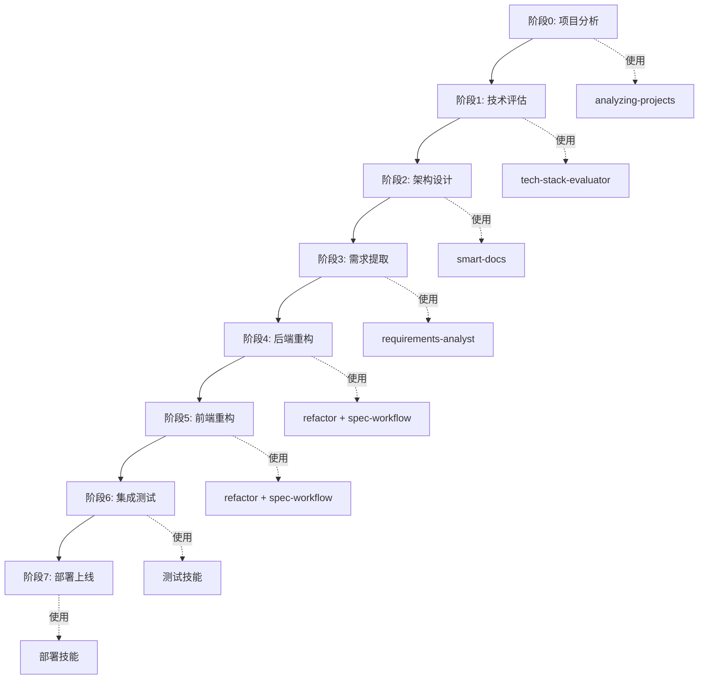

# 🔄 Huobao Drama 重构工作流规划

## 📋 项目概述

**项目名称**: Huobao Drama 技术栈重构  
**重构目标**: Go + Gin → NestJS + TypeScript (后端) | Vue3 界面现代化 (前端)  
**工作流特点**: 基于 Agent Skills 的标准化、文档化重构流程

---

## 🎯 工作流设计原则

1. **技能驱动**: 每个阶段使用专门的 Agent Skill 执行
2. **文档先行**: 每个步骤产出标准化文档
3. **可追溯性**: 所有决策和变更有据可查
4. **渐进式**: 分阶段实施，降低风险
5. **质量保证**: 每个阶段有明确的验收标准

---

## 📊 重构工作流全景图



---

## 🚀 详细工作流阶段

### 阶段 0: 项目深度分析 (1-2天)

**使用技能**: `analyzing-projects`

**目标**: 全面理解现有项目的结构、技术栈和业务逻辑

**执行步骤**:
1. 使用 `analyzing-projects` 技能分析 Go 项目
2. 生成项目分析报告
3. 识别核心业务模块和依赖关系
4. 梳理 API 接口清单

**产出文档**:
- `refactor-docs/01-项目分析/01-现有项目分析报告.md`
- `refactor-docs/01-项目分析/02-业务模块清单.md`
- `refactor-docs/01-项目分析/03-API接口清单.md`
- `refactor-docs/01-项目分析/04-数据模型分析.md`

**验收标准**:
- [ ] 完整的项目结构分析
- [ ] 所有业务模块识别完成
- [ ] API 接口文档化
- [ ] 数据模型关系图

---

### 阶段 1: 技术栈评估与选型 (2-3天)

**使用技能**: `tech-stack-evaluator` (如果有) 或自定义评估流程

**目标**: 评估新技术栈的适用性，做出技术选型决策

**执行步骤**:
1. 评估 NestJS vs 其他 Node.js 框架
2. 评估 TypeORM vs Prisma
3. 评估前端 UI 框架选项
4. 分析技术栈迁移风险
5. 制定技术选型方案

**产出文档**:
- `refactor-docs/02-技术评估/01-后端框架评估报告.md`
- `refactor-docs/02-技术评估/02-ORM框架对比.md`
- `refactor-docs/02-技术评估/03-前端UI框架评估.md`
- `refactor-docs/02-技术评估/04-技术选型决策.md`
- `refactor-docs/02-技术评估/05-风险评估与应对.md`

**验收标准**:
- [ ] 技术栈对比分析完成
- [ ] 选型决策有充分依据
- [ ] 风险识别和应对措施明确
- [ ] 团队技术评审通过

---

### 阶段 2: 新架构设计 (3-5天)

**使用技能**: `smart-docs`

**目标**: 设计 NestJS 后端架构和前端新架构

**执行步骤**:
1. 使用 `smart-docs` 生成 NestJS 架构文档
2. 设计模块划分和依赖关系
3. 设计数据库迁移方案
4. 设计前端组件架构
5. 绘制 C4 架构图

**产出文档**:
- `refactor-docs/03-架构设计/01-NestJS架构总览.md`
- `refactor-docs/03-架构设计/02-模块设计.md`
- `refactor-docs/03-架构设计/03-数据库迁移方案.md`
- `refactor-docs/03-架构设计/04-前端架构设计.md`
- `refactor-docs/03-架构设计/05-C4架构图.md`
- `refactor-docs/03-架构设计/06-接口设计规范.md`

**验收标准**:
- [ ] 完整的架构设计文档
- [ ] 模块划分清晰合理
- [ ] 数据库迁移方案可行
- [ ] 架构评审通过

---

### 阶段 3: 需求提取与规格化 (2-3天)

**使用技能**: `requirements-analyst`

**目标**: 从现有系统提取需求，形成标准化需求文档

**执行步骤**:
1. 使用 `requirements-analyst` 分析现有功能
2. 提取功能需求和非功能需求
3. 编写用户故事
4. 定义验收标准
5. 识别业务规则

**产出文档**:
- `refactor-docs/04-需求规格/01-功能需求说明书.md`
- `refactor-docs/04-需求规格/02-非功能需求说明书.md`
- `refactor-docs/04-需求规格/03-用户故事集.md`
- `refactor-docs/04-需求规格/04-业务规则说明书.md`
- `refactor-docs/04-需求规格/05-验收标准.md`

**验收标准**:
- [ ] 所有功能需求文档化
- [ ] 用户故事完整
- [ ] 验收标准明确
- [ ] 业务规则清晰

---

### 阶段 4: 后端重构实施 (3-4周)

**使用方式**: 基于 Spec 工作流 + Kiro AI 辅助

**目标**: 将 Go 后端重构为 NestJS + TypeScript

**代码组织方式**: 
- 在当前工作目录下创建新项目 `huobao-drama-nestjs/`
- 保持原项目 `huobao-drama/` 不变，作为参考
- 重构完成并验证后，再决定是否替换

**执行步骤**:

#### 4.1 创建重构 Spec
1. 为每个模块创建重构 spec（基于阶段3的需求文档）
2. 定义重构需求和设计
3. 制定实施任务清单

#### 4.2 模块重构顺序
```
Phase 1: 基础设施层 (1周)
├── 数据库连接和配置
├── 日志系统
├── 存储服务
└── FFmpeg 集成

Phase 2: 领域层 (1周)
├── Entity 定义
├── Repository 接口
└── 领域服务

Phase 3: 应用层 (1周)
├── 短剧管理服务
├── 角色管理服务
├── 分镜管理服务
├── 视频生成服务
└── AI 服务集成

Phase 4: API 层 (1周)
├── Controller 实现
├── DTO 定义
├── 中间件和守卫
└── API 文档
```

**产出文档**:
- `.kiro/specs/backend-refactor-infrastructure/` (基础设施层 spec)
- `.kiro/specs/backend-refactor-domain/` (领域层 spec)
- `.kiro/specs/backend-refactor-application/` (应用层 spec)
- `.kiro/specs/backend-refactor-api/` (API 层 spec)
- `refactor-docs/05-后端重构/01-重构进度跟踪.md`
- `refactor-docs/05-后端重构/02-代码迁移对照表.md`
- `refactor-docs/05-后端重构/03-API变更说明.md`

**验收标准**:
- [ ] 所有模块重构完成
- [ ] 单元测试通过率 > 80%
- [ ] API 功能完整性 100%
- [ ] 性能指标达标

---

### 阶段 5: 前端重构实施 (3-4周)

**使用技能**: `refactor` + `spec-workflow`

**目标**: 重构前端界面，提升用户体验

**执行步骤**:

#### 5.1 UI 设计
1. 设计新的视觉风格
2. 制定组件库规范
3. 创建设计系统

#### 5.2 组件重构顺序
```
Phase 1: 基础框架 (1周)
├── 布局组件
├── 导航系统
├── 路由配置
└── 状态管理

Phase 2: 核心页面 (1周)
├── 首页/仪表盘
├── 短剧列表
├── 短剧创建
└── 短剧管理

Phase 3: 高级功能 (1周)
├── 角色管理
├── 分镜编辑器
├── 视频时间轴
└── 资源管理

Phase 4: 配置与优化 (1周)
├── 设置页面
├── AI 配置
├── 性能优化
└── 响应式适配
```

**产出文档**:
- `.kiro/specs/frontend-refactor-layout/` (布局 spec)
- `.kiro/specs/frontend-refactor-pages/` (页面 spec)
- `.kiro/specs/frontend-refactor-components/` (组件 spec)
- `refactor-docs/06-前端重构/01-UI设计规范.md`
- `refactor-docs/06-前端重构/02-组件库文档.md`
- `refactor-docs/06-前端重构/03-重构进度跟踪.md`

**验收标准**:
- [ ] 所有页面重构完成
- [ ] UI 一致性检查通过
- [ ] 响应式设计验证
- [ ] 用户体验测试通过

---

### 阶段 6: 集成测试与优化 (1-2周)

**使用技能**: 测试相关技能

**目标**: 确保系统整体功能正常，性能达标

**执行步骤**:
1. 前后端集成测试
2. 端到端测试
3. 性能测试和优化
4. 安全测试
5. 兼容性测试

**产出文档**:
- `refactor-docs/07-测试报告/01-集成测试报告.md`
- `refactor-docs/07-测试报告/02-性能测试报告.md`
- `refactor-docs/07-测试报告/03-安全测试报告.md`
- `refactor-docs/07-测试报告/04-问题清单与修复记录.md`

**验收标准**:
- [ ] 所有集成测试通过
- [ ] 性能指标达标
- [ ] 无严重安全漏洞
- [ ] 主流浏览器兼容

---

### 阶段 7: 部署与上线 (1周)

**使用技能**: 部署相关技能

**目标**: 安全平稳地将新系统部署到生产环境

**执行步骤**:
1. 准备部署环境
2. 数据迁移
3. 灰度发布
4. 监控和告警配置
5. 正式上线

**产出文档**:
- `refactor-docs/08-部署文档/01-部署方案.md`
- `refactor-docs/08-部署文档/02-数据迁移指南.md`
- `refactor-docs/08-部署文档/03-回滚方案.md`
- `refactor-docs/08-部署文档/04-监控配置.md`
- `refactor-docs/08-部署文档/05-上线检查清单.md`

**验收标准**:
- [ ] 部署流程验证通过
- [ ] 数据迁移成功
- [ ] 监控系统正常
- [ ] 回滚方案可用

---

## 📁 文档结构规划

```
refactor-docs/
├── 00-重构工作流规划.md (本文档)
├── 01-项目分析/
│   ├── 01-现有项目分析报告.md
│   ├── 02-业务模块清单.md
│   ├── 03-API接口清单.md
│   └── 04-数据模型分析.md
├── 02-技术评估/
│   ├── 01-后端框架评估报告.md
│   ├── 02-ORM框架对比.md
│   ├── 03-前端UI框架评估.md
│   ├── 04-技术选型决策.md
│   └── 05-风险评估与应对.md
├── 03-架构设计/
│   ├── 01-NestJS架构总览.md
│   ├── 02-模块设计.md
│   ├── 03-数据库迁移方案.md
│   ├── 04-前端架构设计.md
│   ├── 05-C4架构图.md
│   └── 06-接口设计规范.md
├── 04-需求规格/
│   ├── 01-功能需求说明书.md
│   ├── 02-非功能需求说明书.md
│   ├── 03-用户故事集.md
│   ├── 04-业务规则说明书.md
│   └── 05-验收标准.md
├── 05-后端重构/
│   ├── 01-重构进度跟踪.md
│   ├── 02-代码迁移对照表.md
│   └── 03-API变更说明.md
├── 06-前端重构/
│   ├── 01-UI设计规范.md
│   ├── 02-组件库文档.md
│   └── 03-重构进度跟踪.md
├── 07-测试报告/
│   ├── 01-集成测试报告.md
│   ├── 02-性能测试报告.md
│   ├── 03-安全测试报告.md
│   └── 04-问题清单与修复记录.md
└── 08-部署文档/
    ├── 01-部署方案.md
    ├── 02-数据迁移指南.md
    ├── 03-回滚方案.md
    ├── 04-监控配置.md
    └── 05-上线检查清单.md
```

---

## 🎯 Spec 工作流集成

每个重构模块都将创建独立的 Spec，遵循 `requirements → design → tasks` 流程：

### Spec 命名规范
```
.kiro/specs/
├── backend-refactor-infrastructure/    # 后端基础设施层重构
├── backend-refactor-domain/            # 后端领域层重构
├── backend-refactor-application/       # 后端应用层重构
├── backend-refactor-api/               # 后端API层重构
├── frontend-refactor-layout/           # 前端布局重构
├── frontend-refactor-pages/            # 前端页面重构
└── frontend-refactor-components/       # 前端组件重构
```

### Spec 内容结构
每个 Spec 包含：
- `requirements.md` - 重构需求和目标
- `design.md` - 技术设计和实现方案
- `tasks.md` - 详细任务清单

---

## 📊 进度跟踪

### 总体进度
- [ ] 阶段 0: 项目深度分析
- [ ] 阶段 1: 技术栈评估与选型
- [ ] 阶段 2: 新架构设计
- [ ] 阶段 3: 需求提取与规格化
- [ ] 阶段 4: 后端重构实施
- [ ] 阶段 5: 前端重构实施
- [ ] 阶段 6: 集成测试与优化
- [ ] 阶段 7: 部署与上线

### 时间估算
- **总工期**: 10-12 周
- **关键路径**: 后端重构 → 前端重构 → 集成测试
- **并行任务**: 文档编写可与开发并行

---

## 🔧 工具和技能清单

### Agent Skills
- `analyzing-projects` - 项目分析
- `tech-stack-evaluator` - 技术栈评估
- `smart-docs` - 架构文档生成
- `requirements-analyst` - 需求分析
- `refactor` - 代码重构
- `spec-workflow` (requirements-first-workflow) - Spec 驱动开发

### 开发工具
- NestJS CLI
- TypeORM/Prisma CLI
- Vue CLI / Vite
- ESLint / Prettier
- Jest / Vitest
- Docker / Docker Compose

---

## 📝 下一步行动

1. **立即执行**: 启动阶段 0 - 使用 `analyzing-projects` 技能深度分析项目
2. **准备工作**: 搭建文档目录结构
3. **团队对齐**: 评审工作流方案，确认时间表
4. **资源准备**: 准备开发环境和工具

---

*文档创建时间: 2026-02-06*  
*版本: v1.0*  
*维护者: Refactor Team*
