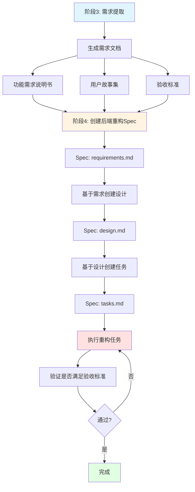
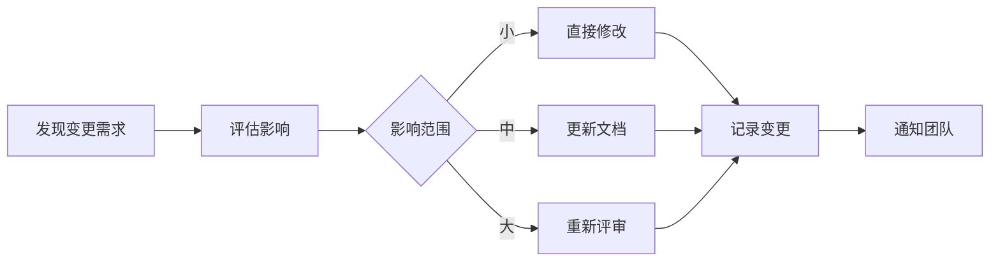

# ❓ 重构工作流 - 常见问题解答 (FAQ)

## 📋 目录

1. [代码组织相关](#代码组织相关)
2. [工作流程相关](#工作流程相关)
3. [技能使用相关](#技能使用相关)
4. [文档管理相关](#文档管理相关)
5. [实施策略相关](#实施策略相关)

---

## 代码组织相关

### Q1: 后端与前端重构时，代码应该放在哪里？

**A: 推荐在当前工作目录下创建新项目，保持原项目不变。**

#### 推荐方案：新建独立项目

```
Analysis-huobao-drama/
├── huobao-drama/              # 原项目（Go + Vue3）- 保持不变
├── huobao-drama-nestjs/       # 新后端项目（NestJS + TypeScript）
├── huobao-drama-frontend/     # 新前端项目（Vue3 重构版）
├── refactor-docs/             # 重构文档
├── analysis-docs/             # 原项目分析文档
└── .kiro/specs/               # 重构 Specs
```

#### 优势

✅ **安全性高**: 原项目保持完整，可随时参考和对比  
✅ **并行开发**: 可以同时运行新旧系统进行对比测试  
✅ **渐进迁移**: 可以逐步迁移功能，降低风险  
✅ **回滚容易**: 如果重构失败，原系统不受影响  
✅ **学习参考**: 开发时可以随时查看原代码实现

#### 实施步骤

**步骤 1: 创建新项目**
```bash
# 在工作目录根下创建新后端项目
cd Analysis-huobao-drama
nest new huobao-drama-nestjs

# 创建新前端项目
npm create vite@latest huobao-drama-frontend -- --template vue-ts
```

**步骤 2: 配置 Git**
```bash
# 为新项目创建独立的 Git 分支或仓库
cd huobao-drama-nestjs
git init
git remote add origin <new-backend-repo-url>

cd ../huobao-drama-frontend
git init
git remote add origin <new-frontend-repo-url>
```

**步骤 3: 开发和测试**
- 在新项目中实现功能
- 参考原项目的业务逻辑
- 进行对比测试

**步骤 4: 验证完成后决定**
- 选项 A: 替换原项目（重命名或删除旧项目）
- 选项 B: 保持两个项目共存（用于对比和学习）
- 选项 C: 归档原项目到 `huobao-drama-legacy/`

#### 其他方案对比

| 方案 | 优点 | 缺点 | 推荐度 |
|------|------|------|--------|
| **新建独立项目** | 安全、灵活、可对比 | 需要额外空间 | ⭐⭐⭐⭐⭐ |
| 直接覆盖原项目 | 节省空间 | 风险高、无法回滚 | ⭐ |
| 使用 Git 分支 | 版本控制好 | 分支管理复杂 | ⭐⭐⭐ |
| 新开独立仓库 | 完全独立 | 管理分散 | ⭐⭐⭐⭐ |

---

### Q2: 重构完成后如何处理原项目？

**A: 根据实际情况选择以下方案之一：**

#### 方案 A: 归档保留（推荐）
```bash
# 重命名原项目为 legacy
mv huobao-drama huobao-drama-legacy

# 新项目改为主项目名
mv huobao-drama-nestjs huobao-drama
mv huobao-drama-frontend huobao-drama/web
```

#### 方案 B: 完全替换
```bash
# 备份原项目到其他位置
cp -r huobao-drama ~/backups/huobao-drama-go-backup

# 删除原项目
rm -rf huobao-drama

# 新项目改名
mv huobao-drama-nestjs huobao-drama
```

#### 方案 C: 长期共存
```
# 保持两个项目共存，用于：
- 性能对比
- 功能验证
- 学习参考
- 渐进式迁移
```

---

## 工作流程相关

### Q3: 阶段3（需求提取）与阶段4（后端重构）如何联系？

**A: 通过 Spec 工作流将需求转化为实施任务。**

#### 完整流程图



#### 详细说明

**1. 阶段3产出（需求文档）**

```
refactor-docs/04-需求规格/
├── 01-功能需求说明书.md
│   ├── FR-1: 短剧管理
│   ├── FR-2: 角色管理
│   ├── FR-3: 分镜管理
│   └── ...
├── 02-非功能需求说明书.md
├── 03-用户故事集.md
│   ├── US-1: 作为用户，我想创建短剧...
│   ├── US-2: 作为用户，我想编辑角色...
│   └── ...
└── 05-验收标准.md
```

**2. 转化为 Spec（阶段4输入）**

基于需求文档，为每个模块创建 Spec：

```bash
# 示例：为短剧管理模块创建 Spec
.kiro/specs/backend-drama-module/
├── requirements.md    # 从 FR-1 和相关用户故事提取
├── design.md          # 基于需求设计技术方案
└── tasks.md           # 将设计拆分为可执行任务
```

**3. Spec 内容示例**

**requirements.md** (从阶段3需求提取)
```markdown
# 短剧管理模块 - 需求

## 功能需求
基于 refactor-docs/04-需求规格/01-功能需求说明书.md 的 FR-1

### FR-1.1 创建短剧
- 用户可以创建新的短剧项目
- 输入：标题、描述、类型
- 输出：短剧ID、创建时间

### FR-1.2 编辑短剧
...

## 用户故事
基于 refactor-docs/04-需求规格/03-用户故事集.md

- US-1: 作为内容创作者，我想创建短剧...
- US-2: 作为内容创作者，我想编辑短剧...

## 验收标准
基于 refactor-docs/04-需求规格/05-验收标准.md

- [ ] 可以成功创建短剧
- [ ] 可以编辑短剧信息
- [ ] API响应时间 < 500ms
```

**design.md** (技术设计)
```markdown
# 短剧管理模块 - 设计

## 技术架构
基于 refactor-docs/03-架构设计/02-模块设计.md

### Entity
```typescript
@Entity('dramas')
export class Drama {
  @PrimaryGeneratedColumn('uuid')
  id: string;
  
  @Column()
  title: string;
  ...
}
```

### Service
```typescript
@Injectable()
export class DramaService {
  async create(dto: CreateDramaDto): Promise<Drama> {
    // 实现逻辑
  }
}
```

### Controller
```typescript
@Controller('dramas')
export class DramaController {
  @Post()
  create(@Body() dto: CreateDramaDto) {
    return this.dramaService.create(dto);
  }
}
```
```

**tasks.md** (可执行任务)
```markdown
# 短剧管理模块 - 任务清单

## Phase 1: Entity 和 Repository
- [ ] 1.1 创建 Drama Entity
- [ ] 1.2 创建 Drama Repository
- [ ] 1.3 编写 Entity 单元测试

## Phase 2: Service 层
- [ ] 2.1 实现 DramaService.create()
- [ ] 2.2 实现 DramaService.update()
- [ ] 2.3 编写 Service 单元测试

## Phase 3: Controller 层
- [ ] 3.1 实现 DramaController
- [ ] 3.2 添加 DTO 验证
- [ ] 3.3 编写 API 集成测试

## Phase 4: 验收测试
- [ ] 4.1 验证所有功能需求
- [ ] 4.2 验证性能指标
- [ ] 4.3 验证验收标准
```

**4. 执行流程**

```bash
# 步骤1: 创建 Spec（基于阶段3需求）
@kiro 基于 refactor-docs/04-需求规格/01-功能需求说明书.md 的 FR-1
创建短剧管理模块的 Spec

Spec名称: backend-drama-module
生成 requirements.md, design.md, tasks.md

# 步骤2: 执行任务
@kiro 执行 backend-drama-module 的所有任务

# 步骤3: 验证
@kiro 验证 backend-drama-module 是否满足验收标准
参考: refactor-docs/04-需求规格/05-验收标准.md
```

#### 关键连接点

| 阶段3产出 | 阶段4使用 | 说明 |
|----------|----------|------|
| 功能需求说明书 | Spec requirements.md | 定义要实现什么 |
| 用户故事集 | Spec requirements.md | 从用户角度描述需求 |
| 验收标准 | Spec requirements.md + 测试 | 定义完成标准 |
| 非功能需求 | Spec design.md | 影响技术设计决策 |
| 业务规则 | Spec design.md | 影响业务逻辑实现 |

---

## 技能使用相关

### Q4: Kiro IDE 不支持 Agent Skill，那如何执行各阶段的技能？

**A: 使用 Steering Files（技能约束文档）来规范代码输出。**

#### 核心理解

文档中提到的"技能"有两层含义：

1. **工作方法论**（如 analyzing-projects）- 指导工作流程
2. **代码约束规范**（如 nestjs-best-practices）- 约束代码输出 ⭐

第二种才是真正解决"代码输出标准化"问题的关键！

#### 理解"技能"的真实含义

文档中的"技能"（如 `analyzing-projects`、`smart-docs`）实际上是指：

1. **工作方法论** - 一种标准化的工作流程
2. **AI 辅助方式** - Kiro AI 可以按照这种方式辅助你
3. **文档模板** - 每个"技能"对应特定的文档产出
4. **代码约束规范** - 通过 Steering Files 约束代码输出 ⭐

#### 技能体系：Steering Files

**问题**：如果没有 `nestjs-best-practices` 技能约束，AI 可能生成不规范的代码。

**解决方案**：使用 Steering Files（`.kiro/steering/` 目录）定义代码规范。

**已创建的技能约束文档**：
```
.kiro/steering/
├── nestjs-best-practices.md      # NestJS 最佳实践
├── nestjs-ddd-patterns.md         # DDD 分层架构规范
├── vue3-composition-patterns.md   # Vue 3 组合式 API 规范
└── typescript-strict-mode.md      # TypeScript 严格模式
```

**技能约束文档包含**：
1. 约束规则（必须遵守的规范）
2. 正确示例 vs 错误示例
3. 检查清单
4. 验证方法

**示例：NestJS 最佳实践技能**

查看 `.kiro/steering/nestjs-best-practices.md`，包含：

- ✅ 模块结构规范
- ✅ 依赖注入规范
- ✅ 控制器规范
- ✅ 服务层规范
- ✅ DTO 规范
- ✅ 异常处理规范
- ✅ 配置管理规范

每个规范都有：
```typescript
// ✅ 正确的代码示例
@Injectable()
export class DramaService {
  constructor(
    @InjectRepository(Drama)
    private readonly dramaRepository: Repository<Drama>,
  ) {}
}

// ❌ 错误的代码示例
export class DramaService {
  private dramaRepository = new Repository(); // 直接 new
}
```

#### 实际执行方式

**方式1: 直接请求 Kiro AI（带技能约束）**

```
✅ 正确方式（带技能约束）:
@kiro 请帮我实现 Drama Service

要求：
1. 严格遵循 .kiro/steering/nestjs-best-practices.md
2. 严格遵循 .kiro/steering/nestjs-ddd-patterns.md
3. 包含完整的类型定义
4. 包含异常处理和日志
5. 包含单元测试

生成代码后，请检查是否符合技能约束，如果不符合，自动修正。
```

**方式2: 在 Spec 中引用技能约束**

```
@kiro 创建 Drama Module 的 Spec

技术约束：
- 必须遵循 .kiro/steering/nestjs-best-practices.md
- 必须遵循 .kiro/steering/nestjs-ddd-patterns.md
- 必须遵循 .kiro/steering/typescript-strict-mode.md

在 design.md 中明确列出技能约束
在 tasks.md 中添加技能合规性检查任务
```

**方式3: 代码审查时检查技能合规性**

```
@kiro 审查 Drama Service 的代码

检查项：
1. 是否符合 .kiro/steering/nestjs-best-practices.md
2. 是否符合 .kiro/steering/nestjs-ddd-patterns.md
3. 是否符合 .kiro/steering/typescript-strict-mode.md

输出：
- 合规性报告
- 不合规项列表
- 修正建议
```

#### 各阶段的实际执行方式

**阶段0: 项目分析**（原文档说"使用 analyzing-projects 技能"）

实际执行：
```
@kiro 请深度分析 huobao-drama 项目

分析内容：
1. 读取项目 README 和文档
2. 分析目录结构（api/, application/, domain/, infrastructure/）
3. 识别所有业务模块
4. 整理 API 接口清单（从 api/handlers/ 目录）
5. 分析数据模型（从 domain/models/ 目录）
6. 绘制架构图

输出格式：
- 生成 Markdown 文档
- 包含 Mermaid 图表
- 保存到 refactor-docs/01-项目分析/
```

**阶段1: 技术评估**（原文档说"使用 tech-stack-evaluator 技能"）

实际执行：
```
@kiro 请评估以下技术栈的适用性

后端框架对比：
- NestJS
- Express + TypeScript
- Fastify + TypeScript

评估维度：
- 学习曲线
- DDD 支持
- 生态系统
- 性能
- 社区活跃度

请生成对比表格和推荐方案，保存到 refactor-docs/02-技术评估/
```

**阶段2: 架构设计**（原文档说"使用 smart-docs 技能"）

实际执行：
```
@kiro 请设计 NestJS 版本的架构

要求：
1. 使用 C4 模型绘制架构图（Mermaid）
2. 设计模块划分（Drama, Character, Storyboard, Video, AI）
3. 每个模块包含：Controller, Service, Repository, Entity, DTO
4. 设计数据库迁移方案
5. 设计 API 接口规范

参考：
- 原项目的 DDD 架构
- analysis-docs/02-架构设计/ 的分析

输出：保存到 refactor-docs/03-架构设计/
```

**阶段3: 需求提取**（原文档说"使用 requirements-analyst 技能"）

实际执行：
```
@kiro 请从现有系统提取需求

分析范围：
- huobao-drama/api/handlers/ (所有 API)
- huobao-drama/application/services/ (业务逻辑)
- analysis-docs/03-需求分析/ (已有分析)

输出：
1. 功能需求说明书（FR-1, FR-2, ...）
2. 用户故事（US-1, US-2, ...）
3. 验收标准
4. 非功能需求

保存到 refactor-docs/04-需求规格/
```

**阶段4-5: 重构实施**（原文档说"使用 refactor + spec-workflow"）

实际执行：
```
# 创建 Spec
@kiro 创建短剧管理模块的重构 Spec

基于：
- refactor-docs/04-需求规格/01-功能需求说明书.md (FR-1)
- refactor-docs/03-架构设计/02-模块设计.md

生成：
- .kiro/specs/backend-drama-module/requirements.md
- .kiro/specs/backend-drama-module/design.md
- .kiro/specs/backend-drama-module/tasks.md

# 执行 Spec
@kiro 执行 backend-drama-module spec 的所有任务

在 huobao-drama-nestjs/ 项目中实现
```

#### 总结

| 文档中的说法 | 实际含义 | 如何执行 |
|------------|---------|---------|
| "使用 XX 技能" | 按照 XX 的工作方式 | 用自然语言描述需求 |
| "analyzing-projects" | 项目分析方法论 | 请求 Kiro 分析项目 |
| "smart-docs" | 文档生成方法论 | 请求 Kiro 生成文档 |
| "requirements-analyst" | 需求分析方法论 | 请求 Kiro 提取需求 |
| "spec-workflow" | Spec 驱动开发 | 使用 Kiro 的 Spec 功能 |

**核心理念**：
- 文档中的"技能"是**工作流程的抽象描述**
- 实际执行时，用**自然语言**告诉 Kiro 你要做什么
- Kiro AI 会按照最佳实践帮你完成任务
- 重点是**产出标准化的文档**，而不是调用特定的"技能"

---

## 文档管理相关

### Q5: 如何管理和维护这么多文档？

**A: 使用分层管理和版本控制。**

#### 文档分层

```
1. 规划层（Planning）
   - 00-重构工作流规划.md
   - 快速启动-立即开始重构.md
   - 执行指南-如何使用Agent-Skills.md

2. 分析层（Analysis）
   - 01-项目分析/
   - 02-技术评估/

3. 设计层（Design）
   - 03-架构设计/
   - 04-需求规格/

4. 实施层（Implementation）
   - 05-后端重构/
   - 06-前端重构/
   - .kiro/specs/

5. 验证层（Validation）
   - 07-测试报告/
   - 08-部署文档/
```

#### 文档更新策略

**1. 增量更新**
- 完成一个阶段，更新对应目录的文档
- 不要等到最后一起更新

**2. 版本标记**
```markdown
---
版本: v1.0
创建时间: 2026-02-06
最后更新: 2026-02-10
状态: 进行中 / 已完成 / 已废弃
---
```

**3. 变更日志**
在每个文档末尾添加：
```markdown
## 变更历史

| 版本 | 日期 | 变更内容 | 作者 |
|------|------|---------|------|
| v1.0 | 2026-02-06 | 初始版本 | Team |
| v1.1 | 2026-02-10 | 更新架构设计 | Team |
```

**4. 文档索引**
使用 README.md 作为索引：
- refactor-docs/README.md - 总索引
- 各阶段目录下的 README.md - 分索引

---

## 实施策略相关

### Q6: 如何确保重构质量？

**A: 多层次的质量保证机制。**

#### 质量保证体系

**1. 文档审查**
- 每个阶段的文档都要经过团队评审
- 确保需求理解一致

**2. 代码审查**
- 所有代码都要经过 PR 审查
- 使用 ESLint、Prettier 等工具

**3. 自动化测试**
```
测试金字塔：
- 单元测试（70%）
- 集成测试（20%）
- E2E 测试（10%）
```

**4. 对比验证**
- 新旧系统功能对比
- 性能对比
- API 兼容性验证

**5. 验收标准**
- 每个 Spec 都有明确的验收标准
- 基于阶段3的验收标准文档

---

### Q7: 如何处理重构过程中的变更？

**A: 使用变更管理流程。**

#### 变更管理流程



#### 变更记录模板

```markdown
# 变更记录

## CR-001: 修改短剧管理 API

**日期**: 2026-02-15
**提出人**: 张三
**影响范围**: 后端 API 层

**变更内容**:
- 原设计: POST /api/dramas
- 新设计: POST /api/v1/dramas

**原因**: 需要支持 API 版本控制

**影响评估**:
- 需要更新: API 文档、前端调用
- 不影响: 数据库、业务逻辑

**处理方案**:
1. 更新 API 设计文档
2. 更新前端 API 调用
3. 更新 Swagger 文档

**状态**: 已完成
```

---

### Q8: 重构失败了怎么办？

**A: 有完整的回滚和应急方案。**

#### 回滚策略

**1. 代码回滚**
```bash
# Git 回滚到指定版本
git checkout <commit-hash>

# 或者使用原项目
cd huobao-drama  # 原项目一直保留
npm start
```

**2. 数据回滚**
```bash
# 恢复数据库备份
sqlite3 drama.db < backup/drama_backup.sql
```

**3. 部分回滚**
- 只回滚有问题的模块
- 其他模块继续使用新版本

**4. 渐进式迁移**
- 使用 API 网关
- 部分流量走新系统
- 部分流量走旧系统

---

## 📞 还有其他问题？

如果还有其他问题，可以：

1. 查看 [重构工作流规划](00-重构工作流规划.md)
2. 查看 [执行指南](执行指南-如何使用Agent-Skills.md)
3. 查看 [快速启动](快速启动-立即开始重构.md)
4. 向团队寻求帮助
5. 在项目中提 Issue

---

*文档版本: v1.0*  
*创建时间: 2026-02-06*  
*维护者: Refactor Team*
