# 🚀 快速启动 - 立即开始重构

## 📋 概述

本文档提供快速启动指南，帮助你立即开始 Huobao Drama 的重构工作。

---

## ✅ 前置检查清单

在开始之前，请确认以下事项：

- [ ] 已阅读 `00-重构工作流规划.md`
- [ ] 已阅读 `执行指南-如何使用Agent-Skills.md`
- [ ] 已了解现有项目的基本情况
- [ ] 开发环境已准备就绪
- [ ] 团队成员已对齐重构目标

---

## 🎯 第一步：启动阶段 0 - 项目深度分析

### 立即执行

复制以下命令，发送给 Kiro：

```
@kiro 我要开始 Huobao Drama 的重构工作流

请执行阶段 0: 项目深度分析

使用 analyzing-projects 技能分析 huobao-drama 项目，包括：
1. 项目整体结构和目录组织
2. Go 后端的 DDD 分层架构
3. 所有业务模块和功能清单
4. API 接口完整清单
5. 数据模型和实体关系

请将分析结果保存到 refactor-docs/01-项目分析/ 目录下
```

### 预期结果

执行完成后，你将获得：

```
refactor-docs/01-项目分析/
├── 01-现有项目分析报告.md
├── 02-业务模块清单.md
├── 03-API接口清单.md
└── 04-数据模型分析.md
```

### 验收标准

- [ ] 生成了完整的项目分析报告
- [ ] 识别了所有业务模块（至少 10 个）
- [ ] 整理了所有 API 接口（至少 50 个）
- [ ] 绘制了数据模型 ER 图

---

## 🎯 第二步：启动阶段 1 - 技术栈评估

### 立即执行

```
@kiro 执行阶段 1: 技术栈评估与选型

请完成以下评估：

1. 后端框架评估
   - NestJS
   - Express + TypeScript
   - Fastify + TypeScript
   评估维度: 学习曲线、生态系统、性能、DDD支持、社区活跃度

2. ORM 框架对比
   - TypeORM
   - Prisma
   - MikroORM
   对比维度: 类型安全、迁移支持、性能、文档质量、社区支持

3. 前端 UI 框架评估
   - Ant Design Vue
   - Naive UI
   - Element Plus (现有)
   - Vuetify
   评估维度: 组件丰富度、TypeScript支持、设计风格、性能、文档质量

4. 生成技术选型决策文档

请将评估结果保存到 refactor-docs/02-技术评估/ 目录下
```

### 预期结果

```
refactor-docs/02-技术评估/
├── 01-后端框架评估报告.md
├── 02-ORM框架对比.md
├── 03-前端UI框架评估.md
├── 04-技术选型决策.md
└── 05-风险评估与应对.md
```

### 验收标准

- [ ] 完成后端框架评估报告
- [ ] 完成 ORM 框架对比文档
- [ ] 完成前端 UI 框架评估
- [ ] 完成技术选型决策文档
- [ ] 完成风险评估和应对方案

---

## 🎯 第三步：启动阶段 2 - 新架构设计

### 立即执行

```
@kiro 执行阶段 2: 新架构设计

使用 smart-docs 技能生成以下文档：

1. NestJS 架构设计
   - 使用 C4 模型绘制架构图（系统上下文、容器架构、组件架构）
   - 详细说明模块划分
   - 说明依赖关系
   - 包含数据流图

2. 模块详细设计
   - Drama Module (短剧模块)
   - Character Module (角色模块)
   - Storyboard Module (分镜模块)
   - Video Module (视频模块)
   - AI Module (AI 服务模块)
   每个模块包含: Controller, Service, Repository, Entity, DTO

3. 数据库迁移方案
   - 表结构对比
   - 数据类型映射
   - 迁移脚本设计
   - 回滚方案

4. 前端架构设计
   - 目录结构
   - 组件分层
   - 状态管理方案
   - 路由设计
   - API 调用封装

5. 接口设计规范
   - RESTful API 规范
   - DTO 设计规范
   - 错误处理规范
   - 认证授权规范

请将设计文档保存到 refactor-docs/03-架构设计/ 目录下
```

### 预期结果

```
refactor-docs/03-架构设计/
├── 01-NestJS架构总览.md
├── 02-模块设计.md
├── 03-数据库迁移方案.md
├── 04-前端架构设计.md
├── 05-C4架构图.md
└── 06-接口设计规范.md
```

### 验收标准

- [ ] 完成 NestJS 架构设计文档
- [ ] 完成模块详细设计
- [ ] 完成数据库迁移方案
- [ ] 完成前端架构设计文档
- [ ] 完成接口设计规范
- [ ] 绘制 C4 架构图
- [ ] 架构评审通过

---

## 🎯 第四步：启动阶段 3 - 需求提取

### 立即执行

```
@kiro 执行阶段 3: 需求提取与规格化

使用 requirements-analyst 技能从现有系统提取需求：

1. 功能需求提取
   分析范围:
   - 短剧管理功能
   - 角色管理功能
   - 分镜制作功能
   - 视频生成功能
   - AI 服务功能
   - 资源管理功能

2. 非功能需求定义
   - 性能需求 (响应时间、吞吐量)
   - 安全需求 (认证、授权、数据保护)
   - 可用性需求 (正常运行时间)
   - 可维护性需求 (代码质量、文档)
   - 可扩展性需求 (模块化、插件化)

3. 用户故事编写
   格式: 作为 [角色]，我想要 [功能]，以便 [价值]
   包括: 用户故事描述、验收标准、优先级

4. 业务规则识别
   - 业务约束
   - 业务流程
   - 业务规则

5. 验收标准定义
   - 功能验收标准
   - 性能验收标准
   - 安全验收标准
   - 用户体验验收标准

请将需求文档保存到 refactor-docs/04-需求规格/ 目录下
```

### 预期结果

```
refactor-docs/04-需求规格/
├── 01-功能需求说明书.md
├── 02-非功能需求说明书.md
├── 03-用户故事集.md
├── 04-业务规则说明书.md
└── 05-验收标准.md
```

### 验收标准

- [ ] 完成功能需求说明书
- [ ] 完成非功能需求说明书
- [ ] 完成用户故事集（至少 30 个）
- [ ] 完成业务规则说明书
- [ ] 完成验收标准文档

---

## 🎯 第五步：启动阶段 4 - 后端重构

### 立即执行

#### 5.1 创建基础设施层重构 Spec

```
@kiro 创建后端基础设施层重构的 spec

Spec 名称: backend-refactor-infrastructure

需求：
1. 配置管理模块
   - 环境变量管理
   - 配置文件加载
   - 配置验证

2. 数据库连接模块
   - TypeORM 配置
   - 连接池管理
   - 事务支持

3. 日志系统模块
   - Winston 集成
   - 日志级别配置
   - 日志格式化
   - 日志轮转

4. 存储服务模块
   - 本地存储实现
   - 文件上传
   - 文件下载
   - 文件删除

5. FFmpeg 集成模块
   - FFmpeg 命令封装
   - 视频合成
   - 视频转码
   - 音频提取

请生成 requirements.md, design.md, tasks.md
```

#### 5.2 执行基础设施层重构

```
@kiro 执行 backend-refactor-infrastructure spec 的所有任务

按照以下顺序执行：
1. 配置管理模块
2. 数据库连接模块
3. 日志系统模块
4. 存储服务模块
5. FFmpeg 集成模块

每完成一个模块，进行单元测试验证
```

#### 5.3 创建其他层的 Spec

依次创建：
- `backend-refactor-domain` (领域层)
- `backend-refactor-application` (应用层)
- `backend-refactor-api` (API 层)

---

## 🎯 第六步：启动阶段 5 - 前端重构

### 立即执行

#### 6.1 创建前端布局重构 Spec

```
@kiro 创建前端布局重构的 spec

Spec 名称: frontend-refactor-layout

需求：
1. 主布局组件
   - 响应式布局
   - 侧边栏
   - 头部
   - 内容区域

2. 导航系统
   - 主导航菜单
   - 面包屑导航
   - 标签页导航

3. 主题系统
   - 亮色主题
   - 暗色主题
   - 主题切换

4. 响应式设计
   - 桌面端适配
   - 平板端适配
   - 移动端适配

请生成 requirements.md, design.md, tasks.md
```

#### 6.2 执行前端布局重构

```
@kiro 执行 frontend-refactor-layout spec 的所有任务
```

#### 6.3 创建其他前端 Spec

依次创建：
- `frontend-refactor-pages` (页面重构)
- `frontend-refactor-components` (组件重构)

---

## 📊 进度跟踪

### 查看总体进度

```
@kiro 生成重构项目的总体进度报告

包括：
1. 各阶段完成情况
2. 各 Spec 完成情况
3. 剩余工作量估算
4. 当前风险和问题
5. 下一步行动计划
```

### 查看单个 Spec 进度

```
@kiro 查看 [spec-name] 的进度

显示：
1. 已完成任务
2. 进行中任务
3. 待完成任务
4. 遇到的问题
```

---

## 🔄 工作流程图

```mermaid
graph LR
    A[阶段0: 项目分析] --> B[阶段1: 技术评估]
    B --> C[阶段2: 架构设计]
    C --> D[阶段3: 需求提取]
    D --> E[阶段4: 后端重构]
    E --> F[阶段5: 前端重构]
    F --> G[阶段6: 集成测试]
    G --> H[阶段7: 部署上线]
    
    style A fill:#e1f5ff
    style B fill:#e1f5ff
    style C fill:#fff4e1
    style D fill:#fff4e1
    style E fill:#ffe1e1
    style F fill:#ffe1e1
    style G fill:#e1ffe1
    style H fill:#e1ffe1
```



---

## 💡 快速提示

### 1. 并行执行
某些阶段可以并行执行：
- 文档编写可以与开发并行
- 前端和后端可以部分并行

### 2. 增量验证
每完成一个小模块就进行验证：
- 单元测试
- 集成测试
- 代码审查

### 3. 持续沟通
定期同步进度：
- 每日站会
- 每周进度回顾
- 问题及时沟通

### 4. 文档更新
及时更新文档：
- 设计变更要更新设计文档
- 新增功能要更新需求文档
- 问题解决要更新问题清单

---

## 🆘 遇到问题？

### 常见问题

**Q: 如何查看可用的 Agent Skills？**
```
@kiro 列出所有可用的 Agent Skills
```

**Q: 如何查看某个 Skill 的使用方法？**
```
@kiro 显示 [skill-name] 的使用文档
```

**Q: 如何暂停和恢复重构工作？**
- 暂停：完成当前 Spec 后停止
- 恢复：从下一个 Spec 开始继续

**Q: 如何回滚某个阶段的工作？**
- 使用 Git 回滚到对应的 commit
- 删除对应的 Spec 目录
- 重新执行该阶段

---

## 📞 获取帮助

如果遇到问题：

1. 查看 `执行指南-如何使用Agent-Skills.md`
2. 查看 `00-重构工作流规划.md`
3. 查看对应 Spec 的文档
4. 向团队寻求帮助
5. 查看项目 Issue 和文档

---

## 🎉 开始你的重构之旅！

现在，你已经准备好开始重构了。从阶段 0 开始，一步一步执行，每个阶段都会有清晰的指引和验收标准。

**立即开始第一步：**

```
@kiro 我要开始 Huobao Drama 的重构工作流

请执行阶段 0: 项目深度分析
```

祝你重构顺利！🚀

---

*文档版本: v1.0*  
*创建时间: 2026-02-06*  
*维护者: Refactor Team*
