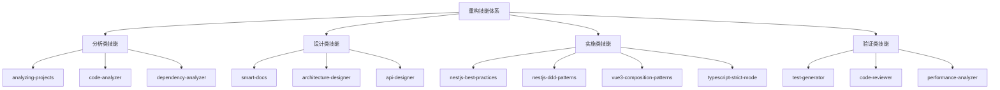

# 🎯 重构工作流技能体系设计

## 问题分析

### 当前问题

**问题描述**：
在后端重构实施阶段，如果没有 `nestjs-best-practices` 或 `nestjs-ddd-patterns` 这样的技能来约束代码输出，AI 可能会：
- ❌ 生成不符合 NestJS 最佳实践的代码
- ❌ 模块结构混乱，不遵循 DDD 分层
- ❌ 依赖注入使用不当
- ❌ 装饰器使用不规范
- ❌ 缺少必要的错误处理和日志
- ❌ 测试代码不完整或不规范

**根本原因**：
缺少**技能约束层**，导致代码输出没有标准和规范。

---

## 解决方案：构建技能体系

### 技能分类



---

## 核心技能定义

### 1. NestJS 最佳实践技能

**技能名称**: `nestjs-best-practices`

**作用**: 确保生成的 NestJS 代码符合官方最佳实践

**约束规则**:

#### 1.1 模块结构规范
```typescript
// ✅ 正确的模块结构
src/modules/drama/
├── controllers/
│   └── drama.controller.ts          // 控制器
├── services/
│   └── drama.service.ts              // 业务逻辑
├── repositories/
│   └── drama.repository.ts           // 数据访问
├── entities/
│   └── drama.entity.ts               // 实体定义
├── dto/
│   ├── create-drama.dto.ts           // 创建 DTO
│   ├── update-drama.dto.ts           // 更新 DTO
│   └── drama-response.dto.ts         // 响应 DTO
├── interfaces/
│   └── drama.interface.ts            // 接口定义
├── constants/
│   └── drama.constants.ts            // 常量定义
├── tests/
│   ├── drama.controller.spec.ts      // 控制器测试
│   └── drama.service.spec.ts         // 服务测试
└── drama.module.ts                   // 模块定义

// ❌ 错误的结构
src/drama/
├── drama.ts                          // 所有代码混在一起
└── drama-test.ts
```

#### 1.2 依赖注入规范
```typescript
// ✅ 正确的依赖注入
@Injectable()
export class DramaService {
  constructor(
    @InjectRepository(Drama)
    private readonly dramaRepository: Repository<Drama>,
    private readonly logger: Logger,
    private readonly configService: ConfigService,
  ) {}
}

// ❌ 错误的依赖注入
export class DramaService {
  private dramaRepository = new Repository(); // 直接 new
}
```

#### 1.3 装饰器使用规范
```typescript
// ✅ 正确的装饰器使用
@Controller('dramas')
@ApiTags('dramas')
@UseGuards(JwtAuthGuard)
export class DramaController {
  @Post()
  @ApiOperation({ summary: 'Create drama' })
  @ApiResponse({ status: 201, type: DramaResponseDto })
  @UsePipes(new ValidationPipe())
  async create(@Body() dto: CreateDramaDto): Promise<DramaResponseDto> {
    return this.dramaService.create(dto);
  }
}

// ❌ 错误的装饰器使用
export class DramaController {
  create(dto: any) { // 缺少装饰器和类型
    return this.dramaService.create(dto);
  }
}
```

#### 1.4 异常处理规范
```typescript
// ✅ 正确的异常处理
@Injectable()
export class DramaService {
  async findOne(id: string): Promise<Drama> {
    const drama = await this.dramaRepository.findOne({ where: { id } });
    
    if (!drama) {
      throw new NotFoundException(`Drama with ID ${id} not found`);
    }
    
    return drama;
  }
  
  async create(dto: CreateDramaDto): Promise<Drama> {
    try {
      return await this.dramaRepository.save(dto);
    } catch (error) {
      this.logger.error(`Failed to create drama: ${error.message}`, error.stack);
      throw new InternalServerErrorException('Failed to create drama');
    }
  }
}

// ❌ 错误的异常处理
async findOne(id: string) {
  return await this.dramaRepository.findOne({ where: { id } }); // 不检查 null
}
```

#### 1.5 日志规范
```typescript
// ✅ 正确的日志使用
@Injectable()
export class DramaService {
  private readonly logger = new Logger(DramaService.name);
  
  async create(dto: CreateDramaDto): Promise<Drama> {
    this.logger.log(`Creating drama: ${dto.title}`);
    
    try {
      const drama = await this.dramaRepository.save(dto);
      this.logger.log(`Drama created successfully: ${drama.id}`);
      return drama;
    } catch (error) {
      this.logger.error(`Failed to create drama: ${error.message}`, error.stack);
      throw error;
    }
  }
}

// ❌ 错误的日志使用
async create(dto: CreateDramaDto) {
  console.log('creating...'); // 使用 console.log
  return await this.dramaRepository.save(dto);
}
```

#### 1.6 配置管理规范
```typescript
// ✅ 正确的配置管理
@Injectable()
export class DramaService {
  constructor(
    private readonly configService: ConfigService,
  ) {}
  
  getStoragePath(): string {
    return this.configService.get<string>('STORAGE_PATH');
  }
}

// ❌ 错误的配置管理
const STORAGE_PATH = '/data/storage'; // 硬编码
```

---

### 2. NestJS DDD 模式技能

**技能名称**: `nestjs-ddd-patterns`

**作用**: 确保代码遵循 DDD 分层架构

**约束规则**:

#### 2.1 分层架构
```
API 层 (Presentation Layer)
├── Controllers          # 处理 HTTP 请求
├── DTOs                # 数据传输对象
└── Pipes/Guards        # 验证和授权

应用层 (Application Layer)
├── Services            # 业务逻辑编排
├── Use Cases           # 用例实现
└── Application DTOs    # 应用层 DTO

领域层 (Domain Layer)
├── Entities            # 领域实体
├── Value Objects       # 值对象
├── Domain Services     # 领域服务
├── Repositories        # 仓储接口
└── Domain Events       # 领域事件

基础设施层 (Infrastructure Layer)
├── Repositories Impl   # 仓储实现
├── Database            # 数据库配置
├── External Services   # 外部服务
└── Adapters            # 适配器
```

#### 2.2 实体定义规范
```typescript
// ✅ 正确的实体定义（领域层）
@Entity('dramas')
export class Drama {
  @PrimaryGeneratedColumn('uuid')
  id: string;

  @Column()
  title: string;

  @Column('text')
  description: string;

  @Column({ type: 'enum', enum: DramaStatus })
  status: DramaStatus;

  @CreateDateColumn()
  createdAt: Date;

  @UpdateDateColumn()
  updatedAt: Date;

  // 领域方法
  publish(): void {
    if (this.status !== DramaStatus.DRAFT) {
      throw new DomainException('Only draft dramas can be published');
    }
    this.status = DramaStatus.PUBLISHED;
  }

  archive(): void {
    this.status = DramaStatus.ARCHIVED;
  }
}

// ❌ 错误的实体定义
export class Drama {
  id: string;
  title: string;
  // 缺少装饰器、缺少领域方法
}
```

#### 2.3 仓储模式
```typescript
// ✅ 正确的仓储模式

// 1. 定义仓储接口（领域层）
export interface IDramaRepository {
  findById(id: string): Promise<Drama | null>;
  findAll(options: FindOptions): Promise<Drama[]>;
  save(drama: Drama): Promise<Drama>;
  delete(id: string): Promise<void>;
}

// 2. 实现仓储（基础设施层）
@Injectable()
export class DramaRepository implements IDramaRepository {
  constructor(
    @InjectRepository(Drama)
    private readonly repository: Repository<Drama>,
  ) {}

  async findById(id: string): Promise<Drama | null> {
    return this.repository.findOne({ where: { id } });
  }

  async save(drama: Drama): Promise<Drama> {
    return this.repository.save(drama);
  }
}

// 3. 在服务中使用接口（应用层）
@Injectable()
export class DramaService {
  constructor(
    @Inject('IDramaRepository')
    private readonly dramaRepository: IDramaRepository,
  ) {}
}

// ❌ 错误的仓储模式
@Injectable()
export class DramaService {
  constructor(
    @InjectRepository(Drama)
    private readonly repository: Repository<Drama>, // 直接依赖 TypeORM
  ) {}
}
```

#### 2.4 服务分层
```typescript
// ✅ 正确的服务分层

// 领域服务（Domain Service）- 处理领域逻辑
@Injectable()
export class DramaDomainService {
  validateDramaTitle(title: string): boolean {
    return title.length >= 3 && title.length <= 100;
  }

  calculateDramaDuration(scenes: Scene[]): number {
    return scenes.reduce((total, scene) => total + scene.duration, 0);
  }
}

// 应用服务（Application Service）- 编排业务流程
@Injectable()
export class DramaService {
  constructor(
    @Inject('IDramaRepository')
    private readonly dramaRepository: IDramaRepository,
    private readonly dramaDomainService: DramaDomainService,
    private readonly eventBus: EventBus,
  ) {}

  async create(dto: CreateDramaDto): Promise<Drama> {
    // 1. 验证
    if (!this.dramaDomainService.validateDramaTitle(dto.title)) {
      throw new BadRequestException('Invalid drama title');
    }

    // 2. 创建实体
    const drama = new Drama();
    drama.title = dto.title;
    drama.description = dto.description;

    // 3. 保存
    const savedDrama = await this.dramaRepository.save(drama);

    // 4. 发布领域事件
    this.eventBus.publish(new DramaCreatedEvent(savedDrama.id));

    return savedDrama;
  }
}

// ❌ 错误的服务分层
@Injectable()
export class DramaService {
  async create(dto: any) {
    // 所有逻辑混在一起
    const drama = await this.repository.save(dto);
    return drama;
  }
}
```

---

### 3. Vue 3 组合式 API 模式技能

**技能名称**: `vue3-composition-patterns`

**作用**: 确保 Vue 3 代码使用组合式 API 最佳实践

**约束规则**:

#### 3.1 组合式函数（Composables）
```typescript
// ✅ 正确的 Composable
// composables/useDrama.ts
export function useDrama() {
  const dramas = ref<Drama[]>([]);
  const loading = ref(false);
  const error = ref<Error | null>(null);

  const fetchDramas = async () => {
    loading.value = true;
    error.value = null;
    
    try {
      const response = await dramaApi.getAll();
      dramas.value = response.data;
    } catch (e) {
      error.value = e as Error;
    } finally {
      loading.value = false;
    }
  };

  const createDrama = async (dto: CreateDramaDto) => {
    loading.value = true;
    try {
      const response = await dramaApi.create(dto);
      dramas.value.push(response.data);
      return response.data;
    } catch (e) {
      error.value = e as Error;
      throw e;
    } finally {
      loading.value = false;
    }
  };

  return {
    dramas: readonly(dramas),
    loading: readonly(loading),
    error: readonly(error),
    fetchDramas,
    createDrama,
  };
}

// 在组件中使用
<script setup lang="ts">
const { dramas, loading, error, fetchDramas } = useDrama();

onMounted(() => {
  fetchDramas();
});
</script>

// ❌ 错误的方式
export default {
  data() {
    return {
      dramas: [],
    };
  },
  methods: {
    fetchDramas() {
      // 使用 Options API
    },
  },
};
```

#### 3.2 TypeScript 类型定义
```typescript
// ✅ 正确的类型定义
// types/drama.ts
export interface Drama {
  id: string;
  title: string;
  description: string;
  status: DramaStatus;
  createdAt: string;
  updatedAt: string;
}

export enum DramaStatus {
  DRAFT = 'draft',
  PUBLISHED = 'published',
  ARCHIVED = 'archived',
}

export interface CreateDramaDto {
  title: string;
  description: string;
}

// 在组件中使用
<script setup lang="ts">
import type { Drama, CreateDramaDto } from '@/types/drama';

const drama = ref<Drama | null>(null);
const form = reactive<CreateDramaDto>({
  title: '',
  description: '',
});
</script>

// ❌ 错误的类型定义
const drama = ref(null); // 没有类型
const form = reactive({  // 没有类型
  title: '',
  description: '',
});
```

---

### 4. TypeScript 严格模式技能

**技能名称**: `typescript-strict-mode`

**作用**: 确保 TypeScript 代码使用严格模式

**约束规则**:

#### 4.1 tsconfig.json 配置
```json
{
  "compilerOptions": {
    "strict": true,
    "strictNullChecks": true,
    "strictFunctionTypes": true,
    "strictBindCallApply": true,
    "strictPropertyInitialization": true,
    "noImplicitAny": true,
    "noImplicitThis": true,
    "alwaysStrict": true,
    "noUnusedLocals": true,
    "noUnusedParameters": true,
    "noImplicitReturns": true,
    "noFallthroughCasesInSwitch": true
  }
}
```

#### 4.2 类型安全
```typescript
// ✅ 正确的类型安全
function findDrama(id: string): Drama | null {
  const drama = dramas.find(d => d.id === id);
  return drama ?? null;
}

const drama = findDrama('123');
if (drama) {
  console.log(drama.title); // 类型守卫
}

// ❌ 错误的类型安全
function findDrama(id: any): any {
  return dramas.find(d => d.id === id);
}

const drama = findDrama('123');
console.log(drama.title); // 可能为 undefined
```

---

## 技能实施方案

### 方案 1: 创建技能文档（Steering Files）

在 `.kiro/steering/` 目录下创建技能约束文档：

```
.kiro/steering/
├── nestjs-best-practices.md
├── nestjs-ddd-patterns.md
├── vue3-composition-patterns.md
├── typescript-strict-mode.md
└── code-quality-standards.md
```

每个文档包含：
1. 技能说明
2. 约束规则
3. 代码示例（正确 vs 错误）
4. 检查清单

### 方案 2: 在 Spec 中引用技能

在创建 Spec 时，明确指定使用的技能：

```markdown
# Drama Module - Design

## 技术约束

本模块必须遵循以下技能规范：

### 1. NestJS 最佳实践
参考: `.kiro/steering/nestjs-best-practices.md`

- ✅ 使用依赖注入
- ✅ 使用装饰器
- ✅ 使用异常过滤器
- ✅ 使用日志系统
- ✅ 使用配置管理

### 2. DDD 分层架构
参考: `.kiro/steering/nestjs-ddd-patterns.md`

- ✅ Entity 在领域层
- ✅ Repository 接口在领域层
- ✅ Repository 实现在基础设施层
- ✅ Service 在应用层
- ✅ Controller 在 API 层

### 3. TypeScript 严格模式
参考: `.kiro/steering/typescript-strict-mode.md`

- ✅ 所有函数有明确的返回类型
- ✅ 所有参数有明确的类型
- ✅ 不使用 any 类型
- ✅ 处理 null 和 undefined

## 代码生成要求

生成代码时，必须：
1. 检查是否符合上述技能规范
2. 包含完整的类型定义
3. 包含错误处理
4. 包含日志记录
5. 包含单元测试
```

### 方案 3: 代码审查清单

在每个 Spec 的 tasks.md 中添加审查任务：

```markdown
# Tasks

## Phase 1: 实现功能
- [ ] 1.1 创建 Drama Entity
- [ ] 1.2 创建 Drama Repository
- [ ] 1.3 创建 Drama Service
- [ ] 1.4 创建 Drama Controller

## Phase 2: 代码审查（技能合规性检查）
- [ ] 2.1 检查 NestJS 最佳实践合规性
  - [ ] 依赖注入正确使用
  - [ ] 装饰器正确使用
  - [ ] 异常处理完整
  - [ ] 日志记录完整
- [ ] 2.2 检查 DDD 分层架构合规性
  - [ ] Entity 在正确的层
  - [ ] Repository 模式正确
  - [ ] 服务分层正确
- [ ] 2.3 检查 TypeScript 严格模式合规性
  - [ ] 无 any 类型
  - [ ] 类型定义完整
  - [ ] Null 安全处理

## Phase 3: 测试
- [ ] 3.1 单元测试覆盖率 > 80%
- [ ] 3.2 集成测试通过
```

---

## 执行流程

### 步骤 1: 创建技能文档

```
@kiro 创建 NestJS 最佳实践技能文档

内容包括：
1. 模块结构规范
2. 依赖注入规范
3. 装饰器使用规范
4. 异常处理规范
5. 日志规范
6. 配置管理规范

每个规范包含：
- 说明
- 正确示例
- 错误示例
- 检查清单

保存到: .kiro/steering/nestjs-best-practices.md
```

### 步骤 2: 创建 Spec 时引用技能

```
@kiro 创建 Drama Module 的 Spec

技术约束：
- 必须遵循 .kiro/steering/nestjs-best-practices.md
- 必须遵循 .kiro/steering/nestjs-ddd-patterns.md
- 必须遵循 .kiro/steering/typescript-strict-mode.md

在 design.md 中明确列出技能约束
在 tasks.md 中添加技能合规性检查任务
```

### 步骤 3: 执行任务时强调技能约束

```
@kiro 执行 backend-drama-module spec 的任务 1.1

要求：
1. 严格遵循 .kiro/steering/nestjs-best-practices.md 的规范
2. 严格遵循 .kiro/steering/nestjs-ddd-patterns.md 的规范
3. 生成代码后，自动检查是否符合技能约束
4. 如果不符合，自动修正
```

### 步骤 4: 代码审查

```
@kiro 审查 Drama Entity 的代码

检查项：
1. 是否符合 .kiro/steering/nestjs-best-practices.md
2. 是否符合 .kiro/steering/nestjs-ddd-patterns.md
3. 是否符合 .kiro/steering/typescript-strict-mode.md

输出：
- 合规性报告
- 不合规项列表
- 修正建议
```

---

## 技能文档模板

```markdown
# [技能名称]

## 技能说明

[技能的作用和目标]

## 约束规则

### 规则 1: [规则名称]

**说明**: [规则描述]

**正确示例**:
\`\`\`typescript
// ✅ 正确的代码
[代码示例]
\`\`\`

**错误示例**:
\`\`\`typescript
// ❌ 错误的代码
[代码示例]
\`\`\`

**检查清单**:
- [ ] [检查项 1]
- [ ] [检查项 2]

### 规则 2: [规则名称]
...

## 验证方法

[如何验证代码是否符合技能规范]

## 参考资料

- [官方文档链接]
- [最佳实践文章]
```

---

## 总结

通过构建技能体系，我们可以：

1. ✅ **标准化代码输出** - 所有代码遵循统一规范
2. ✅ **提高代码质量** - 自动应用最佳实践
3. ✅ **减少错误** - 避免常见的反模式
4. ✅ **可追溯性** - 每个技能都有文档支撑
5. ✅ **可验证性** - 有明确的检查清单

**下一步行动**：
1. 创建核心技能文档（nestjs-best-practices, nestjs-ddd-patterns 等）
2. 在 Spec 中引用技能约束
3. 执行任务时强调技能合规性
4. 代码审查时检查技能合规性

---

*文档版本: v1.0*  
*创建时间: 2026-02-06*  
*维护者: Refactor Team*
